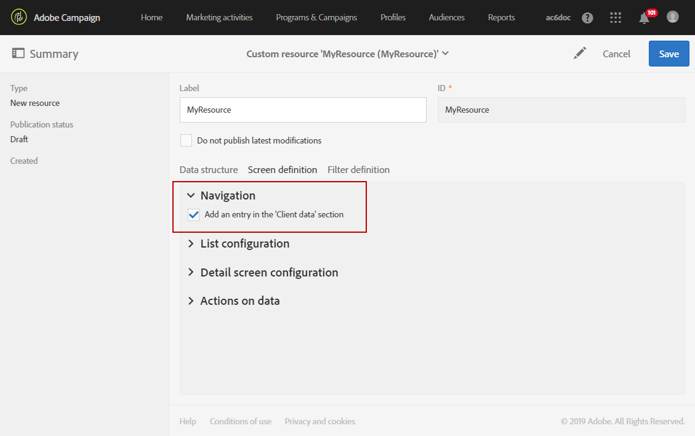

# Configuración de la definición de pantalla{#configuring-the-screen-definition}

Al crear un recurso o al agregar campos nuevos a un recurso existente, puede definir cómo desea que aparezcan en la interfaz.

Este paso no es obligatorio, ya que aún podrá rellenar el recurso y acceder a sus datos a través de flujos de trabajo, audiencias y REST API.

En la **[!UICONTROL Screen definition]** ficha, puede:

* Añadir el acceso al recurso personalizado en el panel de navegación
* Personalice la forma en que se presenta la lista de elementos que conforman el recurso
* Definir la forma en que se muestra la vista de detalles de cada elemento del recurso

## Habilitación del acceso desde el menú de navegación {#enabling-access-from-the-navigation-menu}

Si desea que el recurso tenga una pantalla dedicada, puede ponerla a disposición en el menú de navegación.

1. Desde la **[!UICONTROL Screen definition]** ficha del recurso, despliegue la **[!UICONTROL Navigation]** sección.
1. Marque la **[!UICONTROL Add an entry in the 'Client data' section]** casilla para permitir el acceso a este recurso desde el panel de navegación.

   

El recurso aparecerá como una subentrada dentro de la **[!UICONTROL Client data]** sección.

## Definición de la configuración de lista predeterminada {#defining-the-default-list-configuration}

La **[!UICONTROL List configuration]** sección de la definición de pantalla permite definir las columnas y la información que se mostrarán de forma predeterminada en la descripción general de un recurso.

1. Marque la **[!UICONTROL Customize the list configuration]** casilla para definir la forma en que se muestran las columnas del recurso.
1. Utilice el **[!UICONTROL Create element]** botón para seleccionar un campo de los que ha creado.
1. El campo creado se muestra en la lista. Puede editar su etiqueta y su ancho.

   

1. En la **[!UICONTROL Simple search]** sección, marque la casilla **[!UICONTROL Specify the fields to be taken into account in the search]** para definir qué campos se incluirán en la búsqueda.

   >[!IMPORTANT]
   >
   >Esta configuración reemplaza los campos utilizados en la búsqueda predeterminada.

1. En la **[!UICONTROL Advanced filtering]** sección, marque la **[!UICONTROL Add search fields]** casilla para agregar campos adicionales más allá del campo de búsqueda simple. Por ejemplo, si selecciona el campo &quot;fecha&quot; de los campos que ha creado, el usuario podrá realizar una búsqueda que solo haga referencia a la fecha.
1. Puede modificar el orden de los campos para los dos tipos de búsqueda.
1. Para una búsqueda avanzada, puede agregar campos que se vinculen a un recurso vinculado. Estos filtros aparecen en el **[!UICONTROL Search]** menú de la pantalla generada.

La pantalla de información general del recurso ya está definida.

## Definición de la configuración de la pantalla de detalles {#defining-the-detail-screen-configuration}

La **[!UICONTROL Detail screen configuration]** sección de la definición de pantalla permite definir las columnas y la información que se mostrarán en la pantalla de detalles de cada elemento del recurso.

1. Despliegue la **[!UICONTROL Detail screen configuration]** sección y marque la casilla de verificación **[!UICONTROL Define a detail screen]** para configurar la pantalla que corresponde a cada elemento del recurso. Si no marca esta casilla, no se podrá acceder a la vista detallada de los elementos de este recurso.
1. Puede agregar todos los campos del recurso personalizado con un solo clic. Para ello, haga clic en el  icono o utilice el **[!UICONTROL Add an element]** botón .
1. Seleccione un elemento de los creados para este recurso y especifique un tipo de campo:

   * **[!UICONTROL Input field]**:: es un campo editable.
   * **[!UICONTROL Value]**:: es un campo de sólo lectura.
   * **[!UICONTROL List]**:: es una tabla.
   * **[!UICONTROL Separator]**:: divide los elementos en categorías.
   

1. El elemento agregado se muestra en la lista. Puede editar su etiqueta.

   

1. Añada tantos **[!UICONTROL Separator]** como sea necesario para dividir los elementos en distintas categorías.

   Esto le permite mostrar el separador para organizar mejor las ventanas.

   

La pantalla de detalles del recurso ya está configurada.

## Acciones en la sección de datos {#actions-on-data-section}

Esta configuración le permite mostrar una barra de control en la pantalla de recursos personalizada. Hay tres opciones disponibles:

* **[!UICONTROL Authorize creating]**:: esta opción le permite activar la creación de elementos del recurso. Por lo tanto, el usuario puede agregar registros adicionales.

   >[!NOTE]
   >
   >Primero debe activar la pantalla de detalles vinculada al recurso para que esta opción esté disponible.

* **[!UICONTROL Authorize duplicating]**:: esta opción le permite activar registros duplicados vinculados al recurso personalizado.
* **[!UICONTROL Authorize deleting]**:: esta opción le permite activar la eliminación de registros vinculados al recurso personalizado.
