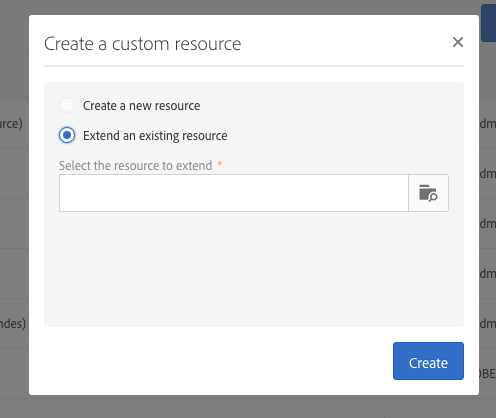

# Creación o ampliación del recurso{#creating-or-extending-the-resource}

Los administradores pueden crear un nuevo recurso desde cero o crear una extensión de un recurso existente si necesita trabajar en datos que no forman parte del modelo de datos integrado.

Solo se pueden ampliar los siguientes recursos integrados:

* **[!UICONTROL Campaign (campaign)]**
* **[!UICONTROL Deliveries (delivery)]**
* **[!UICONTROL Landing page (Landingpage)]**
* **[!UICONTROL Profiles (profile)]**
* **[!UICONTROL Program (program)]**
* **[!UICONTROL Service (service)]**
* **[!UICONTROL Subscriptions to an application (appSubscriptionRcp)]**
* **[!UICONTROL Test profiles (seedMember)]**
* **[!UICONTROL Workflow (workflow)]**

Para crear o ampliar un recurso:

1. En **[!UICONTROL Administration]** > **[!UICONTROL Development]** > **[!UICONTROL Custom Resources]**, haga clic en el botón **[!UICONTROL Create]**.
1. Elija la acción que desea realizar:

   * **[!UICONTROL Create a new resource]**: escriba los campos **[!UICONTROL Label]** y **[!UICONTROL ID]**. El campo **[!UICONTROL ID]** es obligatorio. Si deja vacío el campo Label, se rellenará automáticamente a partir del ID.

     

     >[!NOTE]
     >
     >Utilice un máximo de 30 caracteres.

   * **[!UICONTROL Extend an existing resource]**: seleccione el recurso que desea ampliar.

     

1. Haga clic en **[!UICONTROL Create]** para crear el recurso, que luego adoptará el estado **[!UICONTROL Draft]** en caso de que se cree un nuevo recurso o el estado **[!UICONTROL Editing]** en caso de que se produzca la extensión.

El nuevo recurso se crea y ahora se puede configurar. Para obtener más información sobre la configuración de recursos, consulte [Configuración de la estructura de datos del recurso](../../developing/using/configuring-the-resource-s-data-structure.md).
