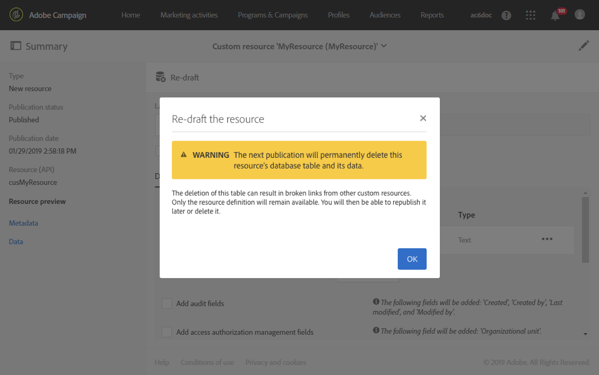

# Eliminación de un recurso{#deleting-a-resource}

Para eliminar un recurso, este debe ser un **[!UICONTROL Draft]**. El recurso se encuentra en estado **[!UICONTROL Draft]** si:

* Acaba de crearse y aún no se ha publicado.
* Si ya se ha publicado, el recurso debe volver a redactarse.

>[!IMPORTANT]
>
>Volver a redactar y eliminar un recurso personalizado son operaciones delicadas que pueden afectar a otros recursos. Estas acciones solo las debe realizar un usuario experto.

Para volver a redactar y eliminar un recurso publicado:

1. Seleccione el recurso que desea volver a redactar.
1. Haga clic en el botón **[!UICONTROL Re-draft]** de la barra de acciones.

   

1. Haga clic **[!UICONTROL Ok]**.

   >[!IMPORTANT]
   >
   >Esta acción es definitiva: la tabla o columnas de la base de datos del recurso y sus datos se eliminarán permanentemente cuando se publique la modificación, lo que puede provocar la rotura de vínculos de otros recursos personalizados. Solo la definición del recurso permanecerá disponible.

   

   >[!NOTE]
   >
   >Si vuelve a redactar una extensión del recurso predeterminado **Perfiles (perfil)**, también debe volver a redactar cualquier extensión de **perfil de prueba (seedMember)** que haya definido. Para obtener más información sobre cómo ampliar el recurso de perfil, consulte [esta sección](../../developing/using/extending-the-profile-resource-with-a-new-field.md).

1. Publicar el recurso. Para ver los pasos más detallados, consulte [Publicación de un recurso personalizado](../../developing/using/updating-the-database-structure.md#publishing-a-custom-resource).

   A continuación, el recurso pasa al modo **Draft** y su estado de activación es **[!UICONTROL Inactive]**.

1. En el modo **[!UICONTROL List]**, compruebe el recurso que desea eliminar y haga clic en el icono  **[!UICONTROL Delete element]**.

   

El recurso se eliminará del modelo de datos.

>[!NOTE]
>
>Si se modifica o elimina un campo de un recurso personalizado utilizado en un evento, se cancela la publicación del evento correspondiente de manera automática. Consulte [Cancelar la publicación de un evento transaccional](../../channels/using/publishing-transactional-event.md#unpublishing-an-event).
