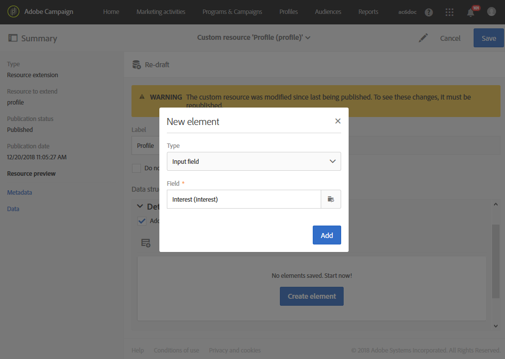

# Ampliación del recurso de perfil con un nuevo campo{#extending-the-profile-resource-with-a-new-field}

## Acerca de la ampliación de perfiles {#about-extending-profiles}

Este caso de uso explica cómo ampliar un perfil y un perfil de prueba con un campo dedicado.

Queremos actualizar nuestros perfiles con el nuevo campo usando una página de aterrizaje y, luego, dirigiéndonos a destinatarios con una newsletter específica según sus intereses.

Para ello, siga los pasos a continuación:

* [Paso 1: Ampliación del recurso de perfil](#step-1--extend-the-profile-resource)
* [Paso 2: Ampliación del perfil de prueba](#step-2--extend-the-test-profile)
* [Paso 3: Publish como recurso personalizado](#step-3--publish-your-custom-resource)
* [Paso 4: Actualización y definición de perfiles con un flujo de trabajo](#step-4--update-and-target-profiles-with-a-workflow)

A continuación, se añadirá el siguiente campo a nuestros perfiles, que se puede definir como objetivo en un envío:

Temas relacionados:

* [Acerca de los recursos personalizados](../../developing/using/data-model-concepts.md)
* [Administración de perfiles](../../audiences/using/about-profiles.md)
* [Administración de perfiles de prueba](../../audiences/using/managing-test-profiles.md)

## Paso 1: Ampliación del recurso de perfil {#step-1--extend-the-profile-resource}

Para crear el nuevo campo **Interés** para nuestros perfiles, primero debe ampliar el recurso listo para usar **[!UICONTROL Profiles (profile)]**.

1. En el menú avanzado, en el logotipo de Adobe Campaign, seleccione **[!UICONTROL Administration]** > **[!UICONTROL Development]** y, a continuación, **[!UICONTROL Custom resources]**.
1. Si aún no ha ampliado el recurso **[!UICONTROL Profiles]**, haga clic en **[!UICONTROL Create]**.
1. Elija la opción **[!UICONTROL Extend an existing resource]**.
1. Seleccione el recurso **[!UICONTROL Profile (profile)]**.
1. Haga clic en **[!UICONTROL Create]**.

   

1. En la categoría **[!UICONTROL Fields]** de la pestaña **[!UICONTROL Data structure]**, haga clic en **[!UICONTROL Create element]**.

   >[!NOTE]
   >
   >Tenga en cuenta que si ya amplió el recurso **[!UICONTROL Profile]** anteriormente, puede empezar desde este paso haciendo clic en **[!UICONTROL Add field]**.

   

1. Agregue una **[!UICONTROL Label]** y **[!UICONTROL ID]**. Seleccione el tipo de **[!UICONTROL Text]** y haga clic en **[!UICONTROL Add]**.

   

1. Para configurar el campo, en la pestaña **[!UICONTROL Data structure]** debajo de la lista desplegable **[!UICONTROL Fields]**, haga clic en  y después en  desde el campo creado anteriormente.
1. En este ejemplo queremos añadir valores específicos; para ello, haga clic en **[!UICONTROL Specify a list of authorized values]**.

   

1. Haga clic en **[!UICONTROL Add an element]** y, a continuación, añada todos los valores que sean necesarios añadiendo una **[!UICONTROL Label]** y **[!UICONTROL ID]**, y haciendo clic en **[!UICONTROL Add]**.

   En este ejemplo, cree los valores Libros, Exposiciones, Películas y N/D para que los perfiles elijan entre estas opciones.

   

1. Para añadir este campo en la pantalla **[!UICONTROL Profile]**, haga clic en la pestaña **[!UICONTROL Screen definition]**.
1. En la lista desplegable **[!UICONTROL Detail screen configuration]**, haga clic en **[!UICONTROL Add a personalized fields section]** y en **[!UICONTROL Create element]**.

   

1. Seleccione un **[!UICONTROL Type]**. Aquí queremos añadir un campo de entrada. A continuación, seleccione el campo creado anteriormente y haga clic en **[!UICONTROL Add]**.

   

1. Para añadir un separador para organizar mejor la ventana de perfil, haga clic en **[!UICONTROL Create an element]** y seleccione **[!UICONTROL Separator]** en la lista desplegable **[!UICONTROL Type]**.

   

Así, se configurará el campo. Ahora, tenemos que ampliarlo al perfil de prueba.

>[!NOTE]
>
>Si no necesita ampliar el recurso de perfil de prueba, puede ir al paso Publicación.

## Paso 2: Ampliación del perfil de prueba {#step-2--extend-the-test-profile}

Para comprobar si el nuevo campo creado está correctamente configurado, puede probarlo entregando el envío a los perfiles de prueba. En primer lugar, el nuevo campo también debe llevarse a cabo en los perfiles de prueba.

1. En el menú avanzado, en el logotipo de Adobe Campaign, seleccione **[!UICONTROL Administration]** > **[!UICONTROL Development]** y, a continuación, **[!UICONTROL Custom resources]**.
1. Si aún no ha ampliado el recurso **[!UICONTROL Profiles]**, haga clic en **[!UICONTROL Create]**.
1. Elija la opción **[!UICONTROL Extend an existing resource]**.
1. Seleccione el recurso **[!UICONTROL Test profile (seedMember)]**.
1. Haga clic en **[!UICONTROL Create]**.

   

1. En la pestaña **[!UICONTROL Data structure]**, haga clic en **[!UICONTROL Create element]**.

   

1. Seleccione el campo de recurso creado anteriormente y haga clic en **[!UICONTROL Add]**.

   

1. Siga los mismos pasos (del paso 11 al 13) que el tutorial de ampliación de perfil anterior para añadir este campo a la pantalla **[!UICONTROL Test profile]**.
1. Haga clic en **[!UICONTROL Save]**.

Tanto los perfiles como los perfiles de prueba tendrán ahora su nuevo campo disponible. Para que todo esté correctamente configurado, debe publicar el recurso personalizado.

## Paso 3: Publish como recurso personalizado {#step-3--publish-your-custom-resource}

Para aplicar los cambios realizados en los recursos y poder utilizarlos, debe actualizar la base de datos.

1. En el menú avanzado, seleccione **Administración** > **Desarrollo** y, a continuación, **Publicación**.
1. De forma predeterminada, la opción **[!UICONTROL Determine modifications since the last publication]** está marcada, lo que significa que solo se aplicarán los cambios realizados desde la última actualización.

   

1. Haga clic en **[!UICONTROL Prepare publication]** para iniciar el análisis que actualizará la base de datos.
1. Una vez realizada la publicación, haga clic en el botón **Publicar** para aplicar las nuevas configuraciones.

   

1. Una vez realizada la publicación, el panel **Resumen** de cada recurso indica que el estado se ha **publicado** y especifica la fecha de la última publicación.

   

1. Seleccione la pestaña **[!UICONTROL Profiles]** y haga clic en **[!UICONTROL New]** para ver si los cambios se han implementado correctamente.

   

El nuevo campo de recursos ya está listo para utilizarse y segmentarse, por ejemplo, en un envío.

## Paso 4: Actualización y definición de perfiles con un flujo de trabajo {#step-4--update-and-target-profiles-with-a-workflow}

Para actualizar perfiles con datos para el nuevo campo personalizado, puede crear una página de aterrizaje con la plantilla **[!UICONTROL Profile acquisition]**. Para obtener más información sobre las páginas de aterrizaje, consulte esta [página](../../channels/using/getting-started-with-landing-pages.md).

En este caso, queremos definir un destino en perfiles de flujo de trabajo que no hayan rellenado este campo. Recibirán un correo electrónico que les pedirá que actualicen sus perfiles para recibir newsletters y ofertas personalizados. Cada perfil recibirá una newsletter personalizada en función de sus intereses.

Primero, necesitamos crear una página de aterrizaje que actualice los campos **Intereses** de los perfiles objetivo:

1. En **[!UICONTROL Marketing activities]**, haga clic en **[!UICONTROL Create]** y seleccione **[!UICONTROL Landing page]**.
1. Seleccione un tipo de página de aterrizaje. Dado que queremos actualizar nuestros perfiles, seleccione **[!UICONTROL Profile acquisition]**.
1. Haga clic en **[!UICONTROL Create]**.
1. Haga clic en el bloque **[!UICONTROL Content]** para editar en inicio el contenido de la página de aterrizaje.

   

1. Personalice la página de aterrizaje según sea necesario.
1. Haga clic en el campo configurado para los perfiles con el fin de elegir entre la selección de intereses. En el panel izquierdo, seleccione el recurso personalizado **Interés** creado anteriormente.

   

1. Guarde la página de aterrizaje y pruébela para comprobar que los campos están correctamente configurados.
1. Haga clic en **[!UICONTROL Publish]** cuando la página de aterrizaje esté lista.

Su página de aterrizaje ya estará lista. Para actualizar los perfiles, puede crear un flujo de trabajo que enviará una oferta especial en función del interés seleccionado.

1. En la pestaña **[!UICONTROL Marketing activities]**, haga clic en **[!UICONTROL Create]** y seleccione **[!UICONTROL Workflow]**.
1. Arrastre y suelte una actividad **[!UICONTROL Query]** para dirigirse a los perfiles o las audiencias que necesite.
1. Arrastre y suelte una actividad **[!UICONTROL Email delivery]** para empezar a configurar el correo electrónico, que contendrá un vínculo a la página de aterrizaje. Seleccione **[!UICONTROL Add an outbound transition with the population]**.

   

1. Cree y diseñe su correo electrónico según sea necesario. Para obtener más información sobre la personalización de correos electrónicos, consulte esta [página](../../designing/using/quick-start.md).
1. Añada un botón en el correo electrónico que redirija los perfiles a su página de aterrizaje.
1. Seleccione el botón añadido y haga clic en  en la **[!UICONTROL Link]** sección del panel izquierdo.

   

1. En la ventana **[!UICONTROL Insert link]**, seleccione **[!UICONTROL Landing page]** en la lista desplegable **[!UICONTROL Link type]** y, a continuación, seleccione la página de aterrizaje creada anteriormente.

   

1. Haga clic en **[!UICONTROL Save]**. El correo electrónico ya estará listo, por lo que puede volver al flujo de trabajo.
1. Añada una actividad **[!UICONTROL Wait]** para que sus perfiles puedan rellenar la página de aterrizaje.
1. Añada una actividad **[!UICONTROL Segmentation]** para dividir la transición de salida según sus **intereses**.
1. Cree un segmento de salida para cada **interés**.

   

1. Añada una actividad **[!UICONTROL Email delivery]** después de cada transición y cree un correo electrónico personalizado en función del **interés** seleccionado.
1. Inicie el flujo de trabajo cuando se haya completado la configuración.

   

Ahora, los perfiles recibirán un correo electrónico en el que se les pedirá que rellenen el campo de interés, seguido de un correo electrónico personalizado en función del valor elegido.
