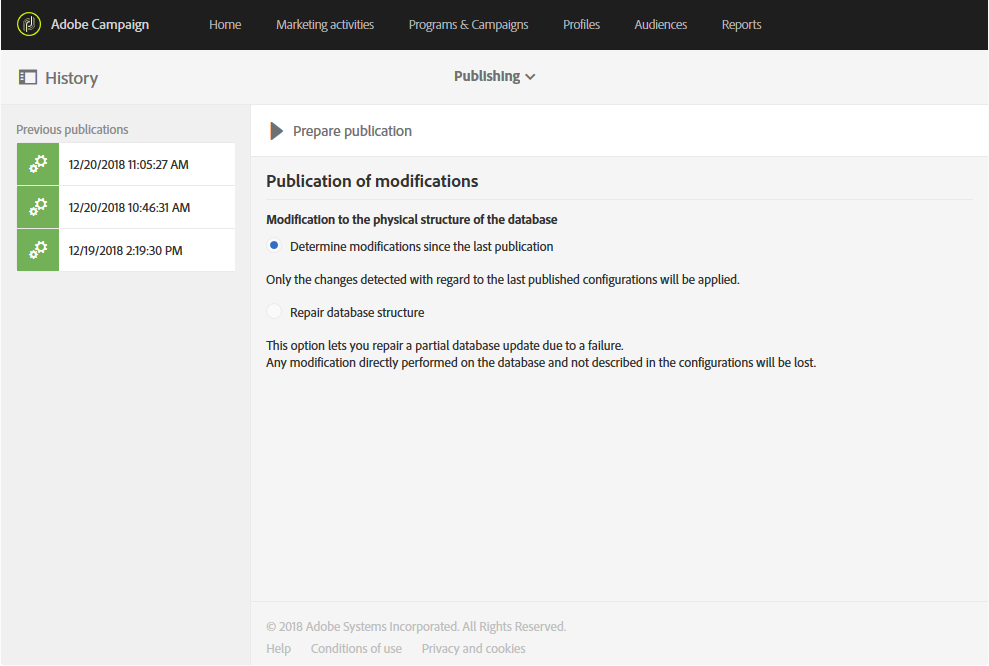
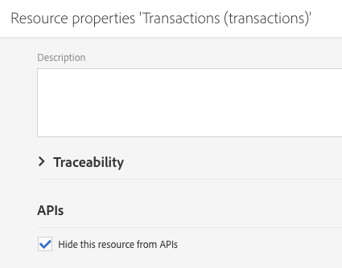

# Actualización de la estructura de la base de datos{#updating-the-database-structure}

Para que las modificaciones del modelo de datos sean efectivas y puedan utilizarse, es necesario actualizar la estructura de la base de datos.

>[!NOTE]
>
>Los recursos personalizados se actualizan automáticamente durante las actualizaciones automáticas realizadas por Adobe.

## Publicación de un recurso personalizado {#publishing-a-custom-resource}

Para aplicar los cambios realizados en los recursos, debe actualizar la base de datos.

>[!NOTE]
>
>Si se modifica o elimina un campo de un recurso personalizado utilizado en un evento, se cancela la publicación del evento correspondiente de manera automática. Consulte [Cancelación de la publicación de un evento transaccional](../../channels/using/publishing-transactional-event.md#unpublishing-an-event).

1. En el menú avanzado, en el logotipo de Adobe Campaign, seleccione **[!UICONTROL Administration]** > **[!UICONTROL Development]** y, a continuación, **[!UICONTROL Publishing]**.
1. De forma predeterminada, la opción **[!UICONTROL Determine modifications since the last publication]** está marcada, lo que significa que solo se aplicarán los cambios realizados desde la última actualización.

   >[!NOTE]
   >
   >**[!UICONTROL Repair database structure]** restablece una configuración correcta si la publicación no llega a completarse. Se elimina cualquier modificación que se haya realizado directamente en la base de datos y que no utilice recursos personalizados.

   

1. Haga clic en el botón **[!UICONTROL Prepare publication]** para ejecutar el análisis. Tenga en cuenta que las grandes actualizaciones de la tabla deben realizarse cuando la instancia no esté muy ocupada por los flujos de trabajo.

   Para obtener más información sobre la acción que se realiza en la API de perfiles y servicios, consulte [Publicación de un recurso con extensión de API](#publishing-a-resource-with-api-extension).

   

   >[!NOTE]
   >
   >Como los índices duplicados hacen que la publicación falle, el paso de preparación comprueba si el índice definido para el recurso ya existe con el mismo nombre para otro recurso. Si esto sucede, aparece un mensaje de error en el que se le pide que cambie el nombre del índice. Consulte [Definición de índices](configuring-the-resource-s-data-structure.md#defining-indexes).

1. Una vez realizada la publicación, haga clic en el botón **[!UICONTROL Publish]** para aplicar las nuevas configuraciones.
1. Una vez publicado, el panel **[!UICONTROL Summary]** de cada recurso indica que el estado es ahora **[!UICONTROL Published]** y especifica la fecha de la última publicación.

   >[!NOTE]
   >
   >Si realiza cambios en un recurso, debe repetir esta operación para aplicarlos.

   Si los recursos tienen el estado **[!UICONTROL Pending re-draft]** antes de publicarlos, aparece un mensaje adicional que le invita a revisarlo todo, ya que la publicación genera cambios definitivos (elimina columnas, tablas…). Para ayudarle a realizar este último cambio, hay una pestaña **[!UICONTROL SQL Script]** disponible. Proporciona el comando SQL que se ejecuta durante la publicación.

   

   >[!NOTE]
   >
   >Para detener el proceso de nuevo borrador, haga clic en el botón **[!UICONTROL Cancel re-draft]**. Esta acción revierte el estado del recurso a su estado original.

1. Si se produce un error en la publicación, siempre puede volver a la publicación anterior haciendo clic en **[!UICONTROL Back to latest successful publication]**.

   Tenga en cuenta que, si deja la publicación en un estado de error, se abre una ventana emergente en cuanto inicie sesión en la instancia para recordarle que debe corregir esta publicación. Su instancia no se actualiza con nuevas versiones de productos hasta que se corrija la publicación.

   

## Publicación de un recurso con la extensión de API {#publishing-a-resource-with-api-extension}

Puede crear la API de perfil y servicios en los siguientes casos:

* Al ampliar los recursos personalizados **[!UICONTROL Profiles]** o **[!UICONTROL Services]**, puede realizar una actualización de la API de perfiles y servicios para integrar los campos declarados en la extensión de recursos personalizados.
* Cuando define un recurso personalizado y crea un vínculo entre los recursos **[!UICONTROL Profiles]** o **[!UICONTROL Services]** y el recurso personalizado, puede realizar una actualización para incluir el nuevo recurso en la API.

Puede seleccionar esta opción en la pantalla de publicación.

* Si la API aún no se ha publicado (es decir, si nunca ha ampliado el recurso o si no ha marcado esta opción aún para este u otro recurso), tiene la opción de crearla o no.

   

* Si la API ya se ha publicado (es decir, si ya ha ampliado el recurso y ha marcado esta opción una vez), se fuerza la actualización de la API.

   De hecho, una vez creada, la API se actualiza automáticamente cada vez que se vuelve a publicar. Esto sirve para evitar dañar el perfil o el recurso de servicio de esta API y dañar la instancia.

Tenga en cuenta que, de forma predeterminada, el recurso personalizado está integrado, pero, para un comportamiento específico, si no desea publicar este recurso, puede seleccionar la opción **[!UICONTROL Hide this resource from APIs]** disponible en las **[!UICONTROL Resource Properties]**.

Después del paso **[!UICONTROL Prepare Publication]**, Adobe Campaign muestra el delta entre la versión actual de la API y la versión futura después de la publicación en la pestaña **[!UICONTROL Profiles & Services API Preview]**. Si amplía la API por primera vez, el delta compara la definición de recurso personalizado disponible con la extensión.

La información mostrada en la pestaña se divide en tres secciones: elementos añadidos, eliminados y modificados.

La análisis del delta es un paso obligatorio, ya que el paso de publicación modifica el comportamiento de la API y probablemente afecte al desarrollo circundante en un efecto dominó.

>[!NOTE]
>
>Esta publicación actualiza la API de **[!UICONTROL profilesAndServicesExt]**. La API de **[!UICONTROL profilesAndServices]** no se ha actualizado.

Para obtener más información sobre las API de Adobe Campaign Standard, consulte [esta sección](../../api/using/get-started-apis.md).
