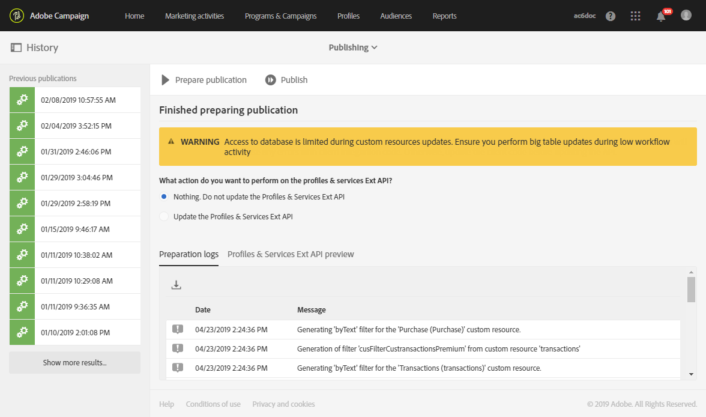

# Actualización de la estructura de la base de datos{#updating-the-database-structure}

Para que las modificaciones del modelo de datos sean efectivas y puedan utilizarse, es necesario actualizar la estructura de la base de datos.

>[!NOTE]
>
>Los recursos personalizados se actualizan automáticamente durante las actualizaciones automáticas realizadas por Adobe.

## Publicación de un recurso personalizado {#publishing-a-custom-resource}

Para aplicar los cambios realizados en los recursos, debe realizar una actualización de la base de datos.

>[!NOTE]
>
>Si se modifica o elimina un campo de un recurso personalizado utilizado en un evento, el evento correspondiente se cancelará automáticamente la publicación. See [Configuring Transactional messaging](../../administration/using/configuring-transactional-messaging.md).

1. En el menú avanzado, a través del logotipo de Adobe Campaign, seleccione **[!UICONTROL Administration]** &gt; **[!UICONTROL Development]** y, a continuación, **[!UICONTROL Publishing]**.
1. De forma predeterminada, la opción **[!UICONTROL Determine modifications since the last publication]** está marcada, lo que significa que solo se aplicarán los cambios realizados desde la última actualización.

   >[!NOTE]
   >
   >El **[!UICONTROL Repair database structure]** restablece una configuración correcta si la publicación falló antes de completarse. Se eliminará cualquier modificación que se haya realizado directamente en la base de datos y que no utilice recursos personalizados.

   

1. Haga clic en el **[!UICONTROL Prepare publication]** botón para iniciar el análisis. Tenga en cuenta que las actualizaciones de tablas grandes deben realizarse cuando los flujos de trabajo no ocupen la instancia de forma intensiva.

   Para obtener más información sobre la acción que se debe realizar en la API de perfiles y servicios, consulte [Publicación de un recurso con extensión](#publishing-a-resource-with-api-extension)API.

   

1. Una vez realizada la publicación, haga clic en el **[!UICONTROL Publish]** botón para aplicar las nuevas configuraciones.
1. Una vez publicada, el **[!UICONTROL Summary]** panel de cada recurso indica que el estado es ahora **[!UICONTROL Published]** y especifica la fecha de la última publicación.

   >[!NOTE]
   >
   >Si realiza nuevos cambios en un recurso, debe repetir esta operación para que se apliquen los cambios.

   Si los recursos tienen el **[!UICONTROL Pending re-draft]** estado antes de publicar, aparecerá un mensaje adicional invitándole a comprobar sus acciones porque la publicación generará cambios definitivos (eliminando columnas, tablas...). Para ayudarle a realizar este último cambio, hay una **[!UICONTROL SQL Script]** ficha disponible. Proporciona el comando SQL que se ejecutará durante la publicación.

   

   >[!NOTE]
   >
   >Para detener el proceso de reborrador, haga clic en el **[!UICONTROL Cancel re-draft]** botón . Esta acción revertirá el estado del recurso a su estado original.

1. Si la publicación falla, siempre puede volver a la publicación anterior haciendo clic en **[!UICONTROL Back to latest successful publication]**.

   Tenga en cuenta que, si deja la publicación en un estado de error, se abrirá una ventana emergente en cuanto inicie sesión en la instancia para recordarle que debe corregir esta publicación. Su instancia no se actualizará con nuevas versiones de productos hasta que se corrija la publicación.

   

## Publicación de un recurso con la extensión API {#publishing-a-resource-with-api-extension}

Puede crear la API de perfil y servicios en los siguientes casos:

* Al ampliar los recursos personalizados **[!UICONTROL Profiles]** o **[!UICONTROL Services]**, puede actualizar la API de perfiles y servicios para integrar los campos declarados en la extensión de recursos personalizados.
* Cuando define un recurso personalizado y crea un vínculo entre los recursos **[!UICONTROL Profiles]** o **[!UICONTROL Services]** y el recurso personalizado, puede realizar una actualización para incluir el nuevo recurso en la API.

Puede seleccionar esta opción en la pantalla de publicación.

* Si la API aún no se ha publicado (es decir, si nunca ha ampliado el recurso o si nunca ha marcado esta opción para este recurso u otro recurso), tiene la opción de crearla o no.

   

* Si la API ya se ha publicado (es decir, si ya ha ampliado el recurso y ha marcado esta opción una vez), se forzará la actualización de la API.

   De hecho, una vez creada, la API se actualiza automáticamente cada vez que se vuelve a publicar. Esto sirve para evitar que se rompa el perfil o el recurso de servicio de esta API y que se dañe la instancia.

Tenga en cuenta que, de forma predeterminada, el recurso personalizado está integrado, pero, para un comportamiento específico, si no desea publicar este recurso, puede seleccionar la opción **[!UICONTROL Hide this resource from APIs]** disponible en la **[!UICONTROL Resource Properties]**.

Después del **[!UICONTROL Prepare Publication]** paso, Adobe Campaign muestra el delta entre la versión actual de la API y la versión futura después de la publicación en la ficha **[!UICONTROL Profiles & Services API Preview]**. Si amplía la API por primera vez, el delta compara la definición de recurso personalizada con la extensión.

La información mostrada en la ficha se divide en tres secciones: elementos agregados, eliminados y modificados.

El análisis del delta es un paso obligatorio, ya que el paso de publicación modificará el comportamiento de la API y probablemente afectará el desarrollo circundante en un efecto dominó.

>[!NOTE]
>
>Esta publicación actualiza la **[!UICONTROL profilesAndServicesExt]** API. La **[!UICONTROL profilesAndServices]** API no se ha actualizado.

Para obtener más información sobre la API de Adobe Campaign, consulte la documentación dedicada de Adobe Campaign en la E/S [de](https://docs.campaign.adobe.com/doc/standard/en/adobeio.html)Adobe.
