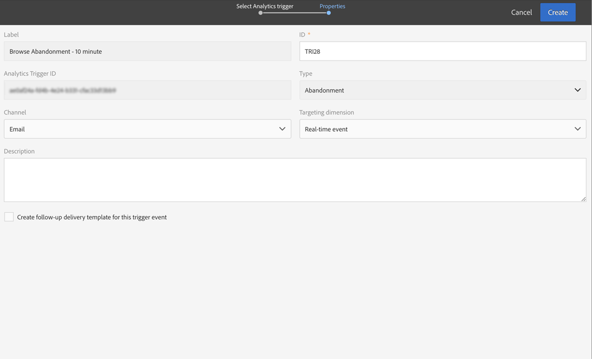

# Casos de uso de activadores de abandono{#abandonment-triggers-use-cases}

Esta sección presenta diferentes casos de uso que se pueden implementar mediante la integración entre Adobe Campaign y los activadores de Experience Cloud. A continuación, tiene dos ejemplos de casos de uso:

* [Activador de abandono de exploración](#browse-abandonment-trigger): envíe una comunicación a los clientes que abandonaron la visita en el sitio web.
* [Activador de abandono de búsqueda](#search-abandonment-trigger): vuelva a interactuar con visitantes que hayan realizado una búsqueda en su sitio web, pero que no hayan realizado una compra.

>[!NOTE]
>
>Los casos de uso descritos en esta sección se basan en el ID de visitante de Experience Cloud. También es posible implementarlos con el ID declarado de Experience Cloud. También se admiten los ID declarados con hash y cifrados. Puede enviar correos electrónicos o mensajes SMS a un perfil que no existe en Campaign descifrando directamente la dirección de correo electrónico o el número de teléfono móvil cifrados. Pero en este caso, no se puede utilizar la personalización mediante datos de perfil.

## Requisitos previos {#pre-requisites}

Para que estos casos de uso se implementen, debe tener acceso a las siguientes soluciones o servicios principales:

* Adobe Campaign
* Adobe Analytics Ultimate, Premium, Foundation, OD, Select, Prime, Mobile Apps, Select o Standard.
* Servicio principal de los activadores de Experience Cloud
* Servicio principal de DTM de Experience Cloud
* El ID de visitante de Experience Cloud y el servicio principal People de Experience Cloud

También necesita tener un sitio web de trabajo.

Para obtener más información, consulte [Configuración de soluciones y servicios](../../integrating/using/configuring-triggers-in-experience-cloud.md#configuring-solutions-and-services).

## Déclencheur de abandono de exploración {#browse-abandonment-trigger}

En este caso de uso, vamos a crear un activador simple que se activa cada vez que un cliente abandone una visita en el sitio web. En este ejemplo se supone que ya dispone de la DTM para recopilar y enviar datos a Adobe Analytics y que tiene todos los eventos creados.

### Creación de un Déclencheur de Experience Cloud {#creating-an-experience-cloud-trigger}

1. Seleccione **[!UICONTROL Manage Triggers]** en el menú del servicio principal de activación de Experience Cloud.

   

1. Elija un tipo de activador (**[!UICONTROL Abandonment]** en nuestro caso de uso).

   

1. Para este caso de uso, necesitamos un activador de abandono simple. El objetivo comercial es identificar a los visitantes que navegan por nuestro sitio web de reservas de viajes, ven la página “Ofertas”, pero no reservan ningún viaje. Una vez que identificamos este público, queremos volver a contactarlos en un corto periodo de tiempo. En este ejemplo, elegimos enviar el activador después de un periodo de 10 minutos.

   

### Uso del déclencheur en Adobe Campaign {#using-the-trigger-in-adobe-campaign}

Ahora que hemos creado un activador de Experience Cloud, vamos a utilizarlo en Adobe Campaign.

En Adobe Campaign, debe crear un activador vinculado al que ha creado en Experience Cloud.

1. Para crear el Déclencheur en Adobe Campaign, haga clic en el logotipo de **Adobe**, en la esquina superior izquierda, y luego seleccione **[!UICONTROL Marketing plans]** > **[!UICONTROL Transactional messages]** > **[!UICONTROL Experience Cloud triggers]**.

   

1. Haga clic en **[!UICONTROL Create]**.
1. Seleccione el activador que ha creado anteriormente y haga clic en **[!UICONTROL Next]**.

   

1. Seleccione el canal **[!UICONTROL Email]** y la dimensión de segmentación **[!UICONTROL Real-time event]** y haga clic en **[!UICONTROL Create]**.

   

1. Publique el activador en Adobe Campaign. Este proceso crea automáticamente una plantilla de mensaje transaccional.

   

1. Para mostrar la plantilla de mensaje, haga clic en el botón **[!UICONTROL More]**, en la parte superior derecha, y luego haga clic en **[!UICONTROL Trigger Transactional Template]**.

1. Personalice el contenido y los detalles del remitente.

   

1. Publique la plantilla de mensaje. El activador ahora está activo y en funcionamiento.

   

### Ejecución del escenario {#running-the-scenario}

1. Este caso de uso comienza con un correo electrónico que se ha enviado al público correspondiente con Adobe Campaign.

   

1. El destinatario abre el correo electrónico.

   

1. El destinatario hace clic en un vínculo que le lleva al sitio web. En este ejemplo, el banner lleva el destinatario a la página de inicio del sitio web de reservas de viajes.

   

1. El destinatario va a la página &quot;Ofertas&quot;, pero de repente detiene su visita. Después de un periodo de 10 minutos, Adobe Campaign inicia el envío del mensaje transaccional.

   

1. En cualquier momento, puede comprobar los registros de Experience Cloud para ver cuántas veces se ha activado el activador.

   

1. También puede consultar el informe del activador en Adobe Campaign.

   

## Déclencheur de abandono de búsqueda {#search-abandonment-trigger}

En este caso de uso, vamos a crear un activador para volver a conectar con visitantes que fueron a nuestro sitio web de reservas de viajes, buscaron un destino, no encontraron resultados y no reservaron nada después. El proceso general es el mismo que en el caso de uso anterior (consulte [Activador de abandono de exploración](#browse-abandonment-trigger)). Nos centraremos aquí en cómo personalizar el mensaje de correo electrónico de marketing.

### Creación de un Déclencheur de Experience Cloud {#creating-an-experience-cloud-trigger-1}

Siga los pasos descritos en el caso de uso anterior para crear un activador de Experience Cloud. Consulte [Creación de un activador de Experience Cloud](#creating-an-experience-cloud-trigger). La diferencia principal es la definición del activador.

La sección **[!UICONTROL Include Meta Data]** le permite pasar cualquier dato recopilado de Analytics a la carga del activador. En este ejemplo, creamos una eVar personalizada (por ejemplo, eVar 3) para recopilar el término de búsqueda que introduce el visitante. Este término se utiliza en el mensaje de correo electrónico transaccional enviado al mismo visitante.

### Uso del déclencheur en Adobe Campaign {#using-the-trigger-in-adobe-campaign-1}

1. Siga los pasos descritos en el caso de uso anterior para crear el activador en Adobe Campaign. Consulte [Uso del activador en Adobe Campaign](#using-the-trigger-in-adobe-campaign). La principal diferencia es cómo accedemos y utilizamos, en Adobe Campaign, los metadatos insertados en la carga del activador.
1. En el activador de abandono de búsqueda que ha creado en Adobe Campaign, haga clic en el icono **[!UICONTROL Event content and enrichment]** para ver la carga insertada en Adobe Campaign.

   

1. Como puede ver, la eVar personalizada se pasa en la carga del activador y se asigna a la tabla **Contexto de evento** (ctx). Ahora podemos acceder para personalizar el mensaje transaccional.

   

1. En este ejemplo, elegimos incluir el término de búsqueda de destino tanto en la línea de asunto como en el cuerpo del correo electrónico.

   

1. Al seleccionar un campo personalizado, busque los metadatos de carga en la tabla **Evento transaccional** (rtEvent) y, a continuación, en la tabla secundaria **Contexto de evento** (ctx).

   

### Ejecución del escenario {#running-the-scenario-1}

1. El visitante va al sitio web de reservas de viajes y busca un destino. En este ejemplo, el visitante está buscando un viaje a Japón pero no encuentra ningún resultado. Esta es una oportunidad para que volvamos a este visitante y le recomendemos un plan de viaje alternativo.

   

   >[!NOTE]
   >
   >En este caso de uso, suponemos que el visitante/destinatario ya ha abierto y ha hecho clic en un mensaje de correo electrónico procedente del mismo sitio web. Esto nos permite usar y recopilar el VisitorID (ID de visitante) y asignarlo al destinatario. Solo tenemos que hacerlo una vez.

1. Unos momentos después, el mismo visitante/destinatario recibe un mensaje de marketing. El mensaje incluye el destino de búsqueda reciente.

   
