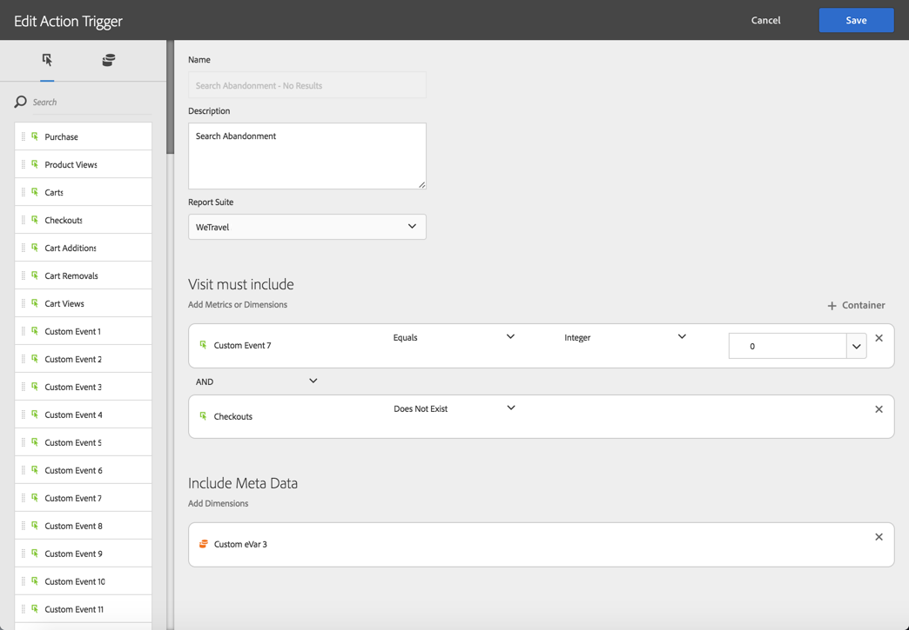

# Abandonment Triggers use cases{#abandonment-triggers-use-cases}

Esta sección presenta distintos casos de uso que se pueden implementar mediante la integración entre Adobe Campaign y Experience Cloud Triggers. Encontrará dos ejemplos de casos de uso:

* [Activar el activador de abandono](../../integrating/using/abandonment-triggers-use-cases.md#browse-abandonment-trigger): enviar una comunicación a los clientes que abandonaron su visita en el sitio web.
* [Desencadenador de abandono de búsqueda](../../integrating/using/abandonment-triggers-use-cases.md#search-abandonment-trigger): reinteractuar con los visitantes que realizaron una búsqueda en el sitio web pero no realizaron ninguna compra.

>[!NOTE]
>
>Los casos de uso descritos en esta sección dependen del ID de visitante de Experience Cloud. También es posible implementarlos con el ID declarado de Experience Cloud. También se admiten los ID declarados y cifrados. Puede enviar correos electrónicos o SMS a un perfil que no exista en Campaign descifrando directamente el número de dirección de correo electrónico cifrado/móvil. No obstante, en este caso no se puede utilizar la personalización con datos de perfil.

## Pre-requisites {#pre-requisites}

Para poder implementar estos casos de uso, debe tener acceso a las siguientes soluciones/servicios principales:

* Adobe Campaign
* Adobe Analytics Ultimate, Premium, Foundation, OD, Select, Prime, Mobile Apps, Select o Standard.
* Experience Cloud Triggers Core Service
* Servicio principal de Experience Cloud DTM
* ID del visitante de Experience Cloud y servicio principal de personas de Experience Cloud

También necesita tener un sitio web de trabajo.

For more information, refer to [Configuring solutions and services](../../integrating/using/configuring-triggers-in-experience-cloud.md#configuring-solutions-and-services).

## Browse abandonment Trigger {#browse-abandonment-trigger}

En este caso de uso, vamos a crear un activador simple que se activará cada vez que un cliente abandone una visita en el sitio Web. Este ejemplo asume que ya tiene la DTM recopilando e insertando datos en Adobe Analytics y que todos los eventos se han creado.

### Creating an Experience Cloud Trigger {#creating-an-experience-cloud-trigger}

1. Select **[!UICONTROL Manage Triggers]** from the Experience Cloud Activation Core Service menu.

   

1. Choose a trigger type ( **[!UICONTROL Abandonment]** in our use case).

   

1. Para este caso de uso, necesitamos un simple activador de abandono. El propósito comercial es identificar a los visitantes que exploran nuestro sitio web de reservación de viajes, ver la página "Ofertas" pero no reservar ningún viaje. Una vez identificado esta audiencia, queremos regresar a ellos en un corto período de tiempo. En este ejemplo, decidimos enviar el activador después de un período de 10 minutos.

   

### Using the trigger in Adobe Campaign {#using-the-trigger-in-adobe-campaign}

Ahora que hemos creado un activador de Experience Cloud, utilícelo en Adobe Campaign.

En Adobe Campaign, debe crear un activador vinculado con el creado en Experience Cloud.

1. To create the Trigger in Adobe Campaign, click the **[!UICONTROL Adobe Campaign]** logo, in the top left corner, then select **[!UICONTROL Marketing plans]** &gt; **[!UICONTROL Transactional messages]** &gt; **[!UICONTROL Experience Cloud triggers]**.

   

1. Click **[!UICONTROL Create]**.
1. Select the Trigger you created earlier and click **[!UICONTROL Next]**.

   

1. Select the **[!UICONTROL Email]** channel and the **[!UICONTROL Real-time event]** targeting dimension and click **[!UICONTROL Create]**.

   

1. Publicar el activador en Adobe Campaign. Este proceso creará automáticamente una plantilla de mensaje transaccional.

   

1. To dislay the message template, click the **[!UICONTROL More]** button, on the top right, then click **[!UICONTROL Trigger Transactional Template]**.
1. Personalice su contenido y los detalles del remitente.

   

1. Publique la plantilla de mensaje. El activador ahora es activo y funcional.

   

### Running the scenario {#running-the-scenario}

1. Este caso de uso comienza con un correo electrónico inicial enviado a su audiencia con Adobe Campaign.

   

1. El destinatario abre el correo electrónico.

   

1. Hace clic en un vínculo que lo lleva al sitio web. En este ejemplo, la pancarta lleva al destinatario a la página principal del sitio web de reservación del viaje.

   

1. El destinatario va a la página "Ofertas" pero repentinamente detiene su visita. Después de un período de 10 minutos, Adobe Campaign activa el envío del mensaje transaccional.

   

1. En cualquier momento, puede comprobar los registros de Experience Cloud para ver cuántas veces activó el activador.

   

1. También puede mostrar el informe Desencadenador de Adobe Campaign.

   

## Search abandonment Trigger {#search-abandonment-trigger}

En este caso de uso, vamos a crear un activador para reinteractuar con los visitantes que visitaron nuestro sitio web de reservación de viajes, buscando un destino, no encontraron resultados correctos y no hicimos nada después de ello. The general process is the same as in the previous use case (see [Browse abandonment Trigger](../../integrating/using/abandonment-triggers-use-cases.md#browse-abandonment-trigger)). Nos centraremos en cómo personalizar el mensaje de correo electrónico de remercadotecnia.

### Creating an Experience Cloud Trigger {#creating-an-experience-cloud-trigger-1}

Siga los pasos descritos en el caso de uso anterior para crear el activador Experience Cloud. See [Creating an Experience Cloud Trigger](../../integrating/using/abandonment-triggers-use-cases.md#creating-an-experience-cloud-trigger). La diferencia principal es la definición del activador.

The **[!UICONTROL Include Meta Data]** section allows you to pass any data collected from Analytics to the Trigger payload. En este ejemplo, creamos una evar personalizada (por ejemplo, evar 3) para recopilar el término de búsqueda ingresado por el visitante. Este término se utilizará en el mensaje de correo electrónico de transacción enviado al mismo visitante.

### Using the trigger in Adobe Campaign {#using-the-trigger-in-adobe-campaign-1}

1. Siga los pasos descritos en el caso de uso anterior para crear el activador en Adobe Campaign. See [Using the trigger in Adobe Campaign](../../integrating/using/abandonment-triggers-use-cases.md#using-the-trigger-in-adobe-campaign). La diferencia principal es el acceso y uso, en Adobe Campaign, de los metadatos insertados en la carga útil Desencadenadora.
1. In the Search Abandonment trigger you created in Adobe Campaign, click on the **[!UICONTROL Event content and enrichment]** icon to view the payload pushed to Adobe Campaign.

   

1. As you can see, the custom eVar is passed in the Trigger payload and mapped to the **Event Context** table (ctx). Ahora podemos acceder a él para personalizar el mensaje transaccional.

   

1. En este ejemplo, decidimos incluir el término de búsqueda de destino en la línea de asunto así como en el cuerpo del mensaje de correo electrónico.

   

1. When selecting a personalized field, look for your payload meta data in the **Transactional event** (rtEvent) table then in the **Event context** (ctx) sub table.

   

### Running the scenario {#running-the-scenario-1}

1. El visitante se dirige al sitio web de reservación del viaje y busca un destino. En este ejemplo, el visitante busca un viaje a Japón pero no encuentra ningún resultado. Ésta es una oportunidad para regresar a este visitante y recomendar un plan de viajes alternativo.

   

   >[!NOTE]
   >
   >En este caso de uso, supongamos que el visitante o el destinatario ya se han abierto y hecho clic en un correo electrónico que se originó en el mismo sitio web. Esto nos permite utilizar y recopilar visitorid y asignarlo al destinatario. Solo debemos hacer esto una vez.

1. Unos momentos después, el mismo visitante/destinatario recibe un mensaje de remercadotecnia. El mensaje incluye el destino buscado recientemente.

   

