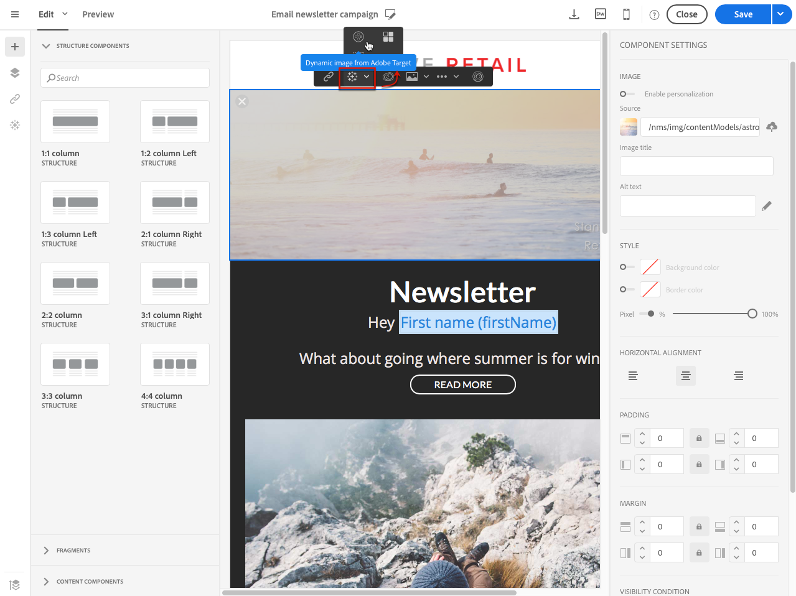

# Adición de contenido dinámico de Target{#adding-target-dynamic-content}

Con la integración de Adobe Target, se pueden añadir imágenes dinámicas a una entrega para personalizar el contenido según las experiencias.

Al editar un correo electrónico, puede insertar una imagen dinámica desde Adobe Target que cambiará según los destinatarios.

Antes de acceder a la imagen en Adobe Campaign, las siguientes tareas deben realizarse primero en Adobe Target:

* Crear una o varias [ofertas de redireccionamiento](https://experienceleague.adobe.com/docs/target/using/experiences/offers/offer-redirect.html?lang=es), en la que debe especificar la dirección URL de la imagen que desea utilizar.
* Cree una o varias [audiencias](https://experienceleague.adobe.com/docs/target/using/audiences/create-audiences/audiences.html) para definir el público objetivo de la actividad.
* Cree un [Compositor de experiencias basadas en formularios](https://experienceleague.adobe.com/docs/target/using/experiences/form-experience-composer.html) actividad , en la que debe seleccionar un &quot;rawbox&quot; y especificar varias experiencias, según el número de ofertas de redireccionamiento creadas. Para cada experiencia, debe seleccionar una de las ofertas de redireccionamiento creadas.
* Cree segmentos utilizando la información de Adobe Campaign para especificar experiencias. Para utilizar datos de Adobe Campaign en las reglas de selección de la oferta, debe especificar los datos en el “rawbox” en Adobe Target.

1. Creación de una entrega de correo electrónico.
1. Al editar el contenido de un correo electrónico o una página de aterrizaje, vaya a un bloque de imagen y, a continuación, seleccione **[!UICONTROL Dynamic image from Adobe Target]** mediante el menú contextual.

   

1. Seleccione la imagen que aparecerá de forma predeterminada en el correo electrónico. Puede especificar directamente la dirección URL de la imagen o seleccionar una imagen compartida mediante [Recursos](../../integrating/using/working-with-campaign-and-assets-core-service.md).

   La integración solo admite imágenes estáticas. El resto del contenido no se puede personalizar.

1. Introduzca el nombre del “rawbox” especificado en Adobe Target.
1. Si utiliza permisos de empresa en la configuración de Adobe Target, añada la propiedad correspondiente en este campo. Obtenga más información sobre los permisos de empresa de Target en [esta página](https://experienceleague.adobe.com/docs/target/using/administer/manage-users/enterprise/properties-overview.html?lang=es). Este campo es opcional y no es necesario si no se utilizan permisos de empresa en Target.
1. En **[!UICONTROL Additional decision parameters]**, especifique la asignación entre los campos definidos en los segmentos de Adobe Target y los campos de Adobe Campaign .

   Los campos de Adobe Campaign utilizados deben haberse especificado en el “rawbox”. En este ejemplo, defina experiencias diferentes según el sexo del destinatario.

   

1. Previsualice el correo electrónico para ver si, al seleccionar perfiles diferentes, la imagen insertada cambia según los parámetros especificados en la actividad de Adobe Target y en Adobe Campaign.

Ahora se puede enviar el envío que contenga la imagen dinámica. Sus resultados se pueden encontrar en Adobe Target.

**Temas relacionados:**

* [Portal de Adobe Target](https://experienceleague.adobe.com/docs/target/using/integrate/campaign-and-target.html?lang=es)
* [Acerca del diseño de contenido de correo electrónico](../../designing/using/designing-content-in-adobe-campaign.md)
* [Personalizar imágenes de correo electrónico en tiempo real](https://helpx.adobe.com/es/marketing-cloud/how-to/email-marketing.html) video
