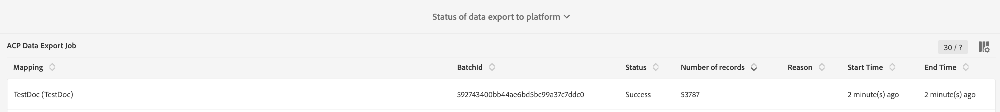

# Activación de la asignación {#mapping-activation}

>[!IMPORTANT]
>
>El conector de datos de Adobe Experience Platform se encuentra en la versión beta, por lo que puede estar sujeto a frecuentes actualizaciones sin previo aviso. Los clientes deben estar alojados en Azure (actualmente en fase beta solo para Norteamérica) para acceder a estas funciones. Póngase en contacto con el Servicio de atención al cliente de Adobe si desea acceder.

Cuando finalice la definición de la asignación, puede publicarla. Después del paso de implementación, la duplicación de datos entre Campaign Standard y Adobe Experience Platform se inicia automáticamente. En cualquier momento, puede detener la replicación haciendo clic en el botón **[!UICONTROL Stop]**.

Según las modificaciones de asignación, puede elegir reenviar todos los registros a Adobe Experience Platform.

Desde el mosaico de implementación, puede acceder al registro de publicación y a los registros de exportaciones.

En la pestaña **[!UICONTROL Export jobs]**, puede supervisar el trabajo de exportación de la asignación publicada.

Si desea supervisar todos los trabajos de exportación de datos, vaya al menú **[!UICONTROL Administration]** > **[!UICONTROL Development]** > **[!UICONTROL Platform]** > **[!UICONTROL Status of data export to platform]**.

Los estados de los trabajos de ingesta de datos son:

* **[!UICONTROL Created]**: se creó un trabajo de ingesta de datos y la ingesta de datos está en curso.
* **[!UICONTROL Failed]**: error en un trabajo de ingesta de datos. El campo reason describe el motivo del error. El error puede ser transitorio o permanente. En caso de errores transitorios, se crea un nuevo trabajo de ingesta después de un intervalo configurado. Como primer paso para la resolución de problemas, el usuario puede comprobar el campo de motivo del error. Si el motivo redirige a un usuario a la interfaz de usuario de Adobe Experience Platform, el usuario puede iniciar sesión en Adobe Experience Platform y puede comprobar el estado del lote en el conjunto de datos para determinar el motivo exacto del error.
* **[!UICONTROL Uploaded]**: un lote se crea primero en Adobe Experience Platform y los datos se incorporan al lote. El campo ID de lote muestra el ID de lote del lote en Adobe Experience Platform. Adobe Experience Platform también realiza una validación posterior en el lote. El lote se marca primero como cargado hasta que Adobe Experience Platform complete el paso posterior a la validación. Un trabajo sigue encuestando Adobe Experience Platform para ver el estado del lote después de la carga. Un lote puede ir en estado Error o Correcto después de la validación en Adobe Experience Platform.
* **[!UICONTROL Success]**: después de cargar un lote en Adobe Experience Platform, el estado del trabajo (posterior a la validación en Platform) se comprueba después de un intervalo configurado. El estado &quot;Correcto&quot; identificaba una ingesta correcta de datos en Adobe Experience Platform.

En algunos casos, puede obtener el error de validación siguiente al publicar la asignación.

Esto ocurre cuando el esquema XDM que utiliza no se ha actualizado con el campo XDM más reciente relacionado con la administración de privacidad y aún contiene el campo XDM &quot;ccpa&quot; obsoleto.

Para actualizar el esquema XDM, siga estos pasos:

1. Vaya al conjunto de datos en Adobe Experience Platform mediante el vínculo presente en la página de asignación XDM.

1. Vaya al esquema XDM.

1. Agregar el mixin **[!UICONTROL Profile Privacy]** al esquema.

   

1. Guarde el esquema y vuelva a intentar publicar la asignación. La publicación debería pasar ahora.

   
