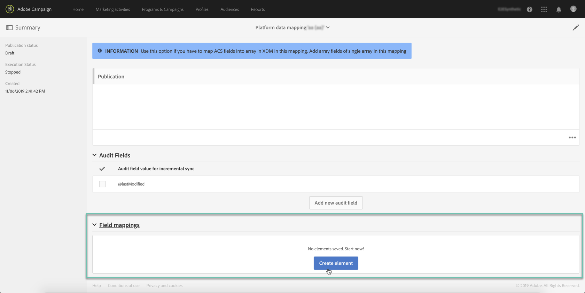

# Definición de la asignación {#mapping-definition}

>[!IMPORTANT]
>
>Adobe Experience Platform Data Connector está actualmente en fase beta, que puede estar sujeto a actualizaciones frecuentes sin previo aviso. Es necesario que los clientes estén alojados en Azure (actualmente en versión beta solo para Norteamérica) para acceder a estas capacidades. Póngase en contacto con el Servicio de atención al cliente de Adobe si desea obtener acceso.

En esta sección, descubrirá cómo asignar un campo de Campaign Standard con un campo de Experience Data Model (XDM).

Para realizar esta tarea, los requisitos previos son:

* una definición de esquema XDM a través de la interfaz o utilizando la API REST asociada a XDM
* una creación de conjunto de datos basada en la definición del esquema XDM

1. Vaya a **[!UICONTROL Administration]** > **[!UICONTROL Development]** > **[!UICONTROL Platform]** y elija la entrada **[!UICONTROL Data mappings]**.

1. Haga clic en **[!UICONTROL Create]** para iniciar una nueva asignación XDM.

   

1. Complete los campos obligatorios y seleccione:

   * a **dimensión de segmentación**: este es el esquema de Campaign Standard que se va a asignar
   * un **conjunto de datos**: este es el paquete de datos asociado a un esquema XDM en Adobe Experience Platform.

>[!NOTE]
>
>Para que un lote se incorpore en Perfil del cliente en tiempo real o Servicio de identidad, el conjunto de datos debe estar [habilitado para Perfil del cliente en tiempo real](https://docs.adobe.com/content/help/en/experience-platform/rtcdp/intro/get-started.html).
>
>Si el conjunto de datos seleccionado ya se está utilizando en una asignación de datos existente, aparece una advertencia para informarle de que los datos pueden sobrescribirse en Adobe Experience Platform. Esto puede suceder cuando hay algunos destinatarios comunes en las asignaciones de datos que utilizan un mismo conjunto de datos.

La siguiente pantalla presenta la sección **[!UICONTROL Field mappings]** donde puede crear una nueva asignación para cada campo en el esquema de Campaign Standard.

El botón **[!UICONTROL Create new field mapping]** permite seleccionar el campo Campaign Standard y la expresión de ruta de campo correspondiente en el esquema XDM.

Si no encuentra un campo de Adobe Campaign Standard, puede utilizar el campo de búsqueda para buscar el campo . Actualmente, la búsqueda solo funciona para campos abiertos en la jerarquía.

Los recursos ampliados definidos en Campaign Standard están asignados a todos los campos nativos. Se definen en la extensión _customer/default en XDM.

Puede personalizar la extensión XDM a través de la API y definir su propia extensión, lo que le permite un mejor control de la asignación.

Consulte [Tutorial de la API del Registro de Esquema](https://docs.adobe.com/content/help/es-ES/experience-platform/xdm/api/getting-started.html) para obtener más información sobre la API XDM.

Para asignar un campo de enumeración, debe utilizar el editor de expresiones para definir cada valor de enumeración correspondiente al valor XDM. Por ejemplo, el campo postalAdressfield debe definirse como:

Si el valor XDM está definido como una enumeración en el esquema XDM, puede utilizar la función EXDM nativa que sustituirá automáticamente la sintaxis **lif**.

Para editar una asignación XDM, ábrala, modifique la información deseada y guárdela.

>[!IMPORTANT]
>
>Por ahora, si edita un valor en la sección **[!UICONTROL Field mappings]** y hace clic fuera del campo, el cambio no se muestra en la interfaz hasta que hace clic en el botón **[!UICONTROL Save]**. Este comportamiento ocurre solo una vez, cuando la edición de **[!UICONTROL Field Mappings]** es la primera edición de la página.
