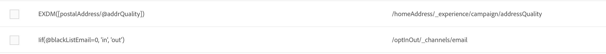

# Definición de la asignación {#mapping-definition}

>[!IMPORTANT]
>
>El conector de datos de Adobe Experience Platform se encuentra en la versión beta, por lo que puede estar sujeto a frecuentes actualizaciones sin previo aviso. Los clientes deben estar alojados en Azure (actualmente en fase beta solo para Norteamérica) para acceder a estas funciones. Póngase en contacto con el Servicio de atención al cliente de Adobe si desea acceder.

En esta sección, descubrirá cómo asignar un campo de Campaign Standard con un campo de modelo de datos de experiencia (XDM).

Para realizar esta tarea, los requisitos previos son:

* Crear una definición de esquema XDM a través de la interfaz o utilizando la API de REST asociada a XDM
* una creación de conjunto de datos basada en la definición de esquema XDM

1. Ir a **[!UICONTROL Administration]** > **[!UICONTROL Development]** > **[!UICONTROL Platform]** y elija la **[!UICONTROL Data mappings]** entrada.

1. Haga clic en **[!UICONTROL Create]** para iniciar una nueva asignación XDM.

   

1. Rellene los campos obligatorios y seleccione:

   * a **dimensión objetivo**: este es el esquema del Campaign Standard para asignar
   * a **conjunto de datos**: este es el paquete de datos asociado a un esquema XDM en Adobe Experience Platform.

>[!NOTE]
>
>Para que un lote se incorpore al perfil del cliente en tiempo real o al servicio de identidad, el conjunto de datos debe ser [habilitado para Perfil del cliente en tiempo real](https://experienceleague.adobe.com/docs/experience-platform/rtcdp/intro/get-started.html).
>
>Si el conjunto de datos seleccionado ya se está utilizando en una asignación de datos existente, aparece una advertencia para informarle de que los datos pueden sobrescribirse en Adobe Experience Platform. Esto puede ocurrir cuando hay algunos destinatarios comunes en las asignaciones de datos que utilizan un mismo conjunto de datos.

La siguiente pantalla presenta el **[!UICONTROL Field mappings]** donde puede crear una nueva asignación para cada campo del esquema del Campaign Standard.

El **[!UICONTROL Create new field mapping]** permite seleccionar el campo de Campaign Standard y la expresión de ruta de campo correspondiente en el esquema XDM.

Si no puede encontrar un campo de Adobe Campaign Standard, puede utilizar el campo de búsqueda para buscarlo. Actualmente, la búsqueda solo funciona para campos que están abiertos en la jerarquía.

Los recursos extendidos definidos en Campaign Standard se asignan como vínculos a todos los campos nativos. Se definen en la extensión _customer/default en XDM.

Puede personalizar la extensión XDM mediante la API y definir su propia extensión, lo que le permite un mejor control de la asignación.

Consulte [Tutorial de API de Registro de esquemas](https://experienceleague.adobe.com/docs/experience-platform/xdm/api/getting-started.html) para obtener más información sobre la API de XDM.

Para asignar un campo de enumeración, debe utilizar el editor de expresiones para definir cada valor de enumeración correspondiente al valor XDM. Por ejemplo, el campo postaladdress debe definirse como:

Si el valor XDM se define como una enumeración en el esquema XDM, puede utilizar la función EXDM nativa que reemplazará automáticamente al **vida** sintaxis.

Para editar una asignación XDM, ábrala, modifique la información deseada y, a continuación, guárdela.

>[!IMPORTANT]
>
>Por ahora, si edita un valor en **[!UICONTROL Field mappings]** y luego haga clic fuera del campo, el cambio no se mostrará en la interfaz hasta que haga clic en **[!UICONTROL Save]** botón. Este comportamiento solo se produce una vez, cuando se edita en **[!UICONTROL Field Mappings]** es la primera edición de la página.
