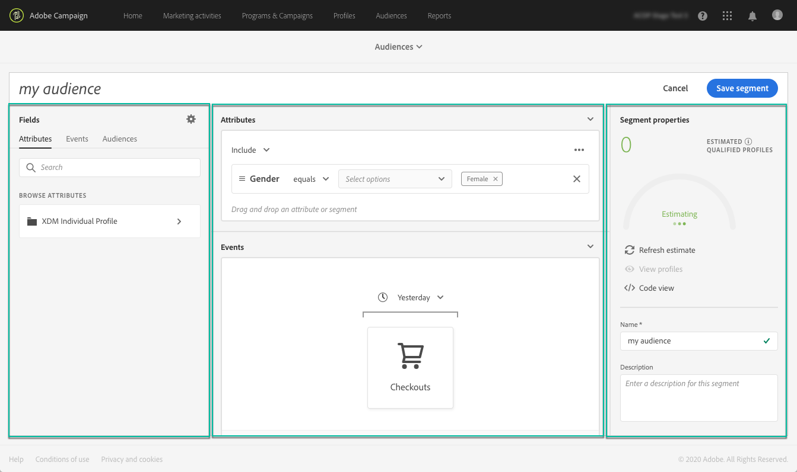
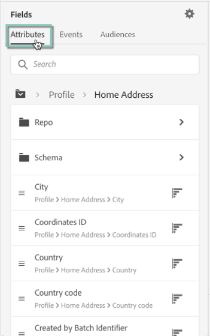

# Uso del Generador de segmentos {#using-the-segment-builder}

>[!IMPORTANT]
>
>El servicio Audience Destinations se encuentra actualmente en fase beta, por lo que puede estar sujeto a frecuentes actualizaciones sin previo aviso. Los clientes deben estar alojados en Azure (actualmente en fase beta solo para Norteamérica) para acceder a estas funciones. Si desea acceder, póngase en contacto con el Servicio de atención al cliente de Adobe.

El Generador de segmentos le permite crear audiencias definiendo reglas basadas en datos procedentes de [Perfil del cliente en tiempo real](https://experienceleague.adobe.com/docs/experience-platform/profile/home.html).

Esta sección presenta conceptos globales al crear un segmento. Para obtener información detallada sobre el Generador de segmentos en sí, consulte la [guía del usuario del Generador de segmentos](https://experienceleague.adobe.com/docs/experience-platform/segmentation/ui/overview.html).

La interfaz del Generador de segmentos está compuesta de la siguiente manera:

* El panel izquierdo proporciona todos los atributos, eventos y audiencias disponibles para crear el segmento arrastrando y soltando los campos deseados en el espacio de trabajo del generador de segmentos.
* El área central proporciona un espacio de trabajo para crear el segmento definiendo y combinando reglas de los campos disponibles.
* El encabezado y el panel derecho muestran las propiedades del segmento (es decir, nombre, descripción y perfiles cualificados estimados para el segmento).

## Creación de segmentos

Para generar un segmento, siga estos pasos:

El Generador de segmentos debe mostrarse en el espacio de trabajo. Le permite crear un segmento utilizando datos de Adobe Experience Platform que finalmente se utilizarán para crear su audiencia.

1. Asigne un nombre al segmento y, a continuación, introduzca una descripción (opcional).

   

1. Asegúrese de que la política de combinación deseada está seleccionada en el panel de configuración.

   Para obtener más información sobre las políticas de combinación, consulte la sección dedicada de la [guía del usuario del Generador de segmentos](https://experienceleague.adobe.com/docs/experience-platform/segmentation/ui/overview.html).

   

1. Busque los campos deseados en el panel izquierdo y arrástrelos al espacio de trabajo central.

   

1. Configure las reglas correspondientes a los campos arrastrados.

   

1. Haga clic en el botón **[!UICONTROL Create segment]**.

## Búsqueda de los campos adecuados para un segmento

El panel izquierdo enumera todos los atributos, eventos y audiencias disponibles para su uso para construir reglas.

Los campos enumerados son atributos capturados por su compañía y están disponibles a través del sistema [Experience Data Model (XDM)](https://experienceleague.adobe.com/docs/experience-platform/xdm/home.html).

Los campos están organizados en pestañas:

* **[!UICONTROL Attributes]**: atributos de perfiles existentes que pueden originarse en la base de datos de Adobe Campaign o en Adobe Experience Platform. Hacen referencia a información estática adjunta a un perfil (por ejemplo, dirección de correo electrónico, país de residencia, estado del programa de fidelidad, etc.).

  

* **[!UICONTROL Events]**: actividades que identifican a consumidores que han tenido alguna interacción con los puntos de contacto de clientes de su empresa, como &quot;cualquier persona que haya hecho un pedido dos veces en dos semanas&quot;. Esto se puede transmitir desde Adobe Analytics o ingerir directamente en Adobe Experience Platform mediante herramientas de ETL de terceros.

  

>[!NOTE]
>
>**La segmentación de varias entidades** le permite ampliar datos de perfil con datos adicionales basados en productos, tiendas u otras clases que no sean de perfil. Una vez conectado, los datos de las clases adicionales están disponibles como si fueran nativos del esquema Profile.
>
>Para obtener más información, consulte la [documentación dedicada](https://experienceleague.adobe.com/docs/experience-platform/segmentation/multi-entity-segmentation.html).

De forma predeterminada, el Generador de segmentos muestra los campos en los que los datos ya están presentes. Para mostrar el esquema completo, incluidos los campos para los que no hay datos, habilite la opción **[!UICONTROL Show full XDM schema]** en la configuración.

El símbolo situado al final de cada campo proporciona información adicional sobre el atributo y cómo utilizarlo.

## Definición de reglas para un segmento

>[!NOTE]
>
>La sección siguiente proporciona información global sobre la definición de reglas. Para obtener más información, consulte la [guía del usuario del Generador de segmentos](https://experienceleague.adobe.com/docs/experience-platform/segmentation/ui/overview.html).

Para crear una regla, siga estos pasos:

1. Busque el campo del panel izquierdo que refleje los atributos o eventos en los que se basará la regla.

1. Arrastre el campo al espacio de trabajo central y configúrelo según la definición del segmento deseada. Para ello, hay disponibles varias funciones de cadena y fecha/hora.

   En el ejemplo siguiente, la regla se aplica a todos los perfiles cuyo sexo sea igual a &quot;Hombre&quot;.

   

   La población estimada correspondiente al segmento se recalcula automáticamente en la sección **[!UICONTROL Segment Properties]**.

1. El botón **[!UICONTROL View Profiles]** le proporciona una vista previa de los primeros 20 registros correspondientes a la regla, lo que le permite validar rápidamente el segmento.

   

   Puede agregar tantas reglas adicionales como desee para segmentar los perfiles adecuados.

   Al agregar una regla a un contenedor, se anexará a cualquier regla existente con el operador lógico AND. Si es necesario, haga clic en el operador lógico para modificarlo.

   

Una vez vinculadas, las dos reglas forman un contenedor.

## Comparación de campos

El Generador de segmentos le permite comparar dos campos para definir una regla. Por ejemplo, las mujeres cuya dirección postal está en un código postal diferente a la de su dirección de trabajo.

Para ello, siga estos pasos:

1. Arrastre el primer campo que desee comparar (por ejemplo, el código postal de la dirección postal) al espacio de trabajo central.

   

1. Seleccione el segundo campo (por ejemplo, el código postal de la dirección de trabajo) que se comparará con el primer campo.

   Arrástrela al área de trabajo central, en el mismo contenedor que el primer campo, en el cuadro **[!UICONTROL Drop here to compare operands]**.

   

1. Configure el operador entre los dos campos como desee. En este ejemplo, queremos que nuestro segmento se dirija a perfiles con una dirección de inicio diferente a la dirección de trabajo.

   

La regla está ahora configurada y lista para activarse como audiencia.
