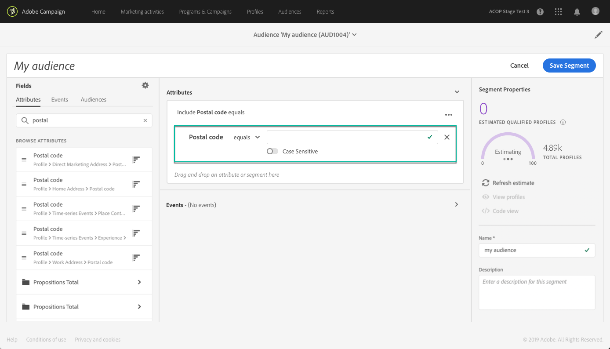

# Uso del Generador de segmentos {#using-the-segment-builder}

>[!IMPORTANT]
>
>El servicio Audience Destinations se encuentra actualmente en fase beta, por lo que puede estar sujeto a frecuentes actualizaciones sin previo aviso. Es necesario que los clientes estén alojados en Azure (actualmente en versión beta solo para Norteamérica) para acceder a estas capacidades. Si desea acceder, póngase en contacto con el Servicio de atención al cliente de Adobe.

El Generador de segmentos le permite crear audiencias definiendo reglas basadas en datos procedentes del [Perfil del cliente en tiempo real](https://experienceleague.adobe.com/docs/experience-platform/profile/home.html).

Esta sección presenta conceptos globales al crear un segmento. Para obtener información detallada sobre el propio Generador de segmentos, consulte la [Guía del usuario del Generador de segmentos](https://experienceleague.adobe.com/docs/experience-platform/segmentation/ui/overview.html).

La interfaz del Generador de segmentos se compone de la siguiente manera:

* El panel izquierdo proporciona todos los atributos, eventos y audiencias disponibles para crear el segmento arrastrando y soltando los campos deseados en el espacio de trabajo del generador de segmentos.
* El área central proporciona un espacio de trabajo para crear el segmento definiendo y combinando reglas de los campos disponibles.
* El encabezado y el panel derecho muestran las propiedades del segmento (es decir, el nombre, la descripción y los perfiles cualificados estimados para el segmento).

## Creación de segmentos

Para crear un segmento, siga estos pasos:

El Generador de segmentos debería mostrarse ahora en su espacio de trabajo. Le permite crear un segmento utilizando datos de Adobe Experience Platform que eventualmente se utilizarán para crear su audiencia.

1. Asigne un nombre al segmento e introduzca una descripción (opcional).

   

1. Asegúrese de que la política de combinación deseada esté seleccionada en el panel de configuración.

   Para obtener más información sobre las políticas de combinación, consulte la sección dedicada en la sección [Guía del usuario del Generador de segmentos](https://experienceleague.adobe.com/docs/experience-platform/segmentation/ui/overview.html).

   

1. Busque los campos deseados en el panel izquierdo y arrástrelos al espacio de trabajo central.

   

1. Configure las reglas correspondientes a los campos arrastrados.

   

1. Haga clic en el botón **[!UICONTROL Create segment]**.

## Búsqueda de los campos adecuados para un segmento

El panel izquierdo enumera todos los atributos, eventos y audiencias disponibles para usar en la construcción de reglas.

Los campos enumerados son atributos capturados por su empresa y se han puesto a disposición a través del [Sistema del Modelo de datos de experiencia (XDM)](https://experienceleague.adobe.com/docs/experience-platform/xdm/home.html).

Los campos se organizan en fichas:

* **[!UICONTROL Attributes]**: Atributos de perfil existentes que pueden proceder de la base de datos de Adobe Campaign o Adobe Experience Platform. Se refieren a información estática adjunta a un perfil (por ejemplo, dirección de correo electrónico, país de residencia, estado del programa de fidelidad, etc.).

   

* **[!UICONTROL Events]**: Actividades que identifican a los consumidores que han tenido alguna interacción con los puntos de contacto de los clientes de su empresa, como &quot;cualquier persona que haya hecho una orden dos veces en dos semanas&quot;. Esto se puede transmitir desde Adobe Analytics o ingerir directamente en Adobe Experience Platform mediante herramientas de ETL de terceros.

   

>[!NOTE]
>
>**Segmentación de varias entidades** le permite ampliar los datos de perfil con datos adicionales basados en productos, tiendas u otras clases que no sean de perfil. Una vez conectados, los datos de clases adicionales estarán disponibles como si fueran nativos del esquema de perfil.
>
>Para obtener más información, consulte la [documentación dedicada](https://experienceleague.adobe.com/docs/experience-platform/segmentation/multi-entity-segmentation.html).

De forma predeterminada, el Generador de segmentos muestra los campos en los que los datos ya están presentes. Para mostrar el esquema completo, incluidos los campos para los que no hay datos, habilite la variable **[!UICONTROL Show full XDM schema]** en la configuración.

El símbolo situado al final de cada campo proporciona información adicional sobre el atributo y cómo utilizarlo.

## Definición de reglas para un segmento

>[!NOTE]
>
>La sección siguiente proporciona información global sobre la definición de reglas. Para obtener más información, consulte [Guía del usuario del Generador de segmentos](https://experienceleague.adobe.com/docs/experience-platform/segmentation/ui/overview.html).

Para generar una regla, siga estos pasos:

1. Busque el campo en el panel izquierdo que refleja los atributos o eventos en los que se basará la regla.

1. Arrastre el campo al espacio de trabajo central y, a continuación, configúrelo según la definición de segmento que desee. Para ello, hay disponibles varias funciones de cadena y fecha/hora.

   En el ejemplo siguiente, la regla se dirigirá a todos los perfiles con un sexo igual a &quot;Hombre&quot;.

   

   La población estimada correspondiente al segmento se vuelve a calcular automáticamente en la variable **[!UICONTROL Segment Properties]** para obtener más información.

1. La variable **[!UICONTROL View Profiles]** proporciona una previsualización de los primeros 20 registros correspondientes a la regla, lo que le permite validar el segmento rápidamente.

   

   Puede agregar tantas reglas adicionales como desee para dirigirse a los perfiles adecuados.

   Al agregar una regla a un contenedor, se anexará a cualquier regla existente con el operador lógico AND. Si es necesario, haga clic en el operador lógico para modificarlo.

   

Una vez vinculadas, las dos reglas forman un contenedor.

## Comparación de campos

El Generador de segmentos le permite comparar dos campos para definir una regla. Por ejemplo, las mujeres cuya dirección principal se encuentra en un código postal diferente de su dirección de trabajo.

Para ello, siga estos pasos:

1. Arrastre el primer campo que desee comparar (por ejemplo, el código postal de la dirección principal) al espacio de trabajo central.

   

1. Seleccione el segundo campo (por ejemplo, el código postal de la dirección de trabajo) que se comparará con el primer campo.

   Arrástrela al espacio de trabajo central, en el mismo contenedor que el primer campo, en la **[!UICONTROL Drop here to compare operands]** en la ventana

   

1. Configure el operador entre los dos campos como desee. En este ejemplo, queremos que nuestro segmento se dirija a perfiles con la dirección principal diferente de la dirección de trabajo.

   

La regla ahora está configurada y lista para activarse como audiencia.
