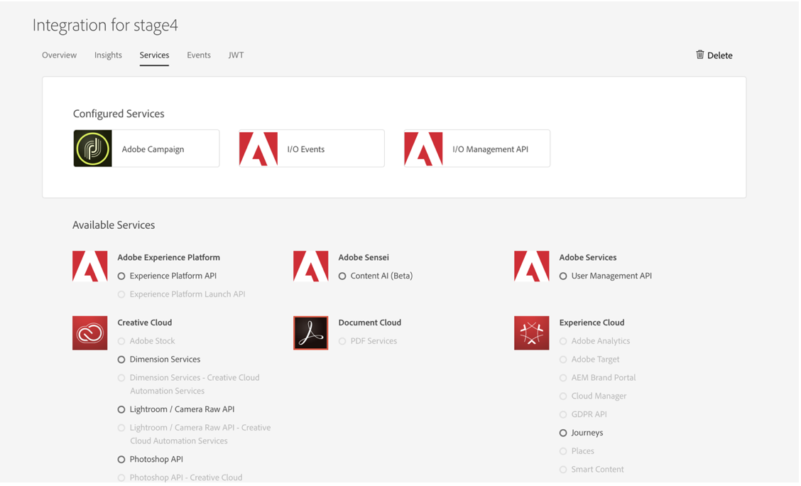

# Configuración de la integración de E/S de Adobe para Microsoft Dynamics 365

Active los datos de CRM en la comunicación entre canales: aprenda los pasos necesarios durante el postaprovisionamiento para crear una nueva integración para Microsoft Dynamics 365.

## Información general

Adobe Campaign Standard: la integración de Microsoft Dynamics 365 se describe en [esta página](../../integrating/using/working-with-campaign-standard-and-microsoft-dynamics-365.md).

Antes de realizar los pasos posteriores al aprovisionamiento de este artículo, se da por hecho que ya se le ha suministrado y que tiene acceso de administrador a la instancia de Campaign Standard de su organización.  Si esto no ha sucedido, deberá ponerse en contacto con el Servicio de atención al cliente de Adobe para completar el aprovisionamiento de Campañas.

>[!CAUTION]
>
>Un administrador debe realizar los pasos que se describen a continuación.

## Configuración

Debe configurar el acceso a la API y configurar una nueva integración para Unifi.

La configuración se realiza en la E/S de Adobe: necesita crear una nueva integración para Unifi, como se muestra en este vídeo:

>[!VIDEO](https://video.tv.adobe.com/v/27308)

### Crear una nueva integración

Para lograrlo, siga el procedimiento siguiente:

1. Vaya a la consola [de E/S de](https://console.adobe.io/home#) Adobe y seleccione su ID de organización de Adobe IMS en el menú desplegable de la parte superior izquierda (véase más abajo).

Luego haga clic en **[!UICONTROL New Integration]** en la parte superior derecha.

>[!NOTE]
>
>Si esta es la primera integración de su organización, el botón de **[!UICONTROL New Integration]** puede estar en el centro de la página.

1. Seleccione **[!UICONTROL Access an API]** y haga clic en **[!UICONTROL Continue]**.

1. Seleccione _Adobe Campaign_ en la **[!UICONTROL Experience Cloud]** sección y haga clic en **[!UICONTROL Continue]**.

1. Genere un certificado y una clave.

**Para plataformas MacOs y Linux**

Abra la aplicación terminal y ejecute el comando siguiente:

```
openssl req -x509 -sha256 -nodes -days 365 -newkey rsa:2048 -keyout private.key -out certificate_pub.crt
```

**Para plataformas Windows**

* Descargar un cliente openssl para generar certificados públicos (por ejemplo, cliente [Openssl windows](https://bintray.com/vszakats/generic/download_file?file_path=openssl-1.1.1-win64-mingw.zip))

* Extraer la carpeta del archivo zip

* Abra el símbolo del sistema de la línea de comandos y ejecute los comandos siguientes.

Reemplazar `<containing folder path>` a continuación por la ruta de la carpeta extraída (por ejemplo: C:\Users\labuser\Downloads\openssl-1.1.1-win64-mingw\openssl-1.1.1-win64-mingw):

```
set OPENSSL_CONF=<containing folder path>/openssl.cnf
 
cd <containing folder path>/
 
openssl req -x509 -sha256 -nodes -days 365 -newkey rsa:2048 -keyout private.key -out certificate_pub.crt
```

**Para todas las plataformas**

Siga las indicaciones para finalizar la solicitud de certificado:

```
Generating a 2048 bit RSA private key
 
.................+++
 
.......................................+++
 
writing new private key to 'private.key'
 
-----
 
You are about to be asked to enter information that will be incorporated
 
into your certificate request.
 
What you are about to enter is what is called a Distinguished Name or a DN.
 
There are quite a few fields but you can leave some blank
 
For some fields there will be a default value,
 
If you enter '.', the field will be left blank.
 
-----
```

Después de introducir la información, se generarán dos archivos: **[!UICONTROL certificate_pub.crt]** y **[!UICONTROL private.key]**.

* **[!UICONTROL certificate_pub.crt]** caducará en 365 días. Puede modificar el período de caducidad cambiando el valor de días en el comando openssl de arriba, pero la rotación periódica de las credenciales es una buena práctica de seguridad.

* **[!UICONTROL certificate_pub.crt]** se utilizará en la siguiente pantalla para completar la integración en la consola de Adobe I/O.

>[!NOTE]
>
> **[!UICONTROL private.key]** se utilizará más adelante durante los pasos posteriores al aprovisionamiento de Unifi.

1. Vuelva a la consola de Adobe I/O e introduzca un nombre y una descripción para la integración.

1. Cargar **[!UICONTROL certificate_pub.crt]**

1. Seleccione el perfil de producto que tiene en el título:

   * El identificador de organización de la instancia de Campaña
   * **[!UICONTROL Administrators]**

Ejemplo:  Campaign Standard - su campaña-identificador de organización - Administradores

Haga clic en **[!UICONTROL Create Integration]**.


### Configurar detalles de integración

1. Select **[!UICONTROL Continue to Integration Details]**

Revise los detalles de la integración.  Tendrá que volver a consultarlas cuando ejecute los pasos posteriores al aprovisionamiento de Unifi.


1. Haga clic en la **[!UICONTROL Services]** ficha y agregue **[!UICONTROL I/O Events]** y **[!UICONTROL I/O Management API]** servicios.  Para agregar el servicio, haga clic en el botón de opción y luego **[!UICONTROL Add service]**.  Lo hará por cada servicio por separado.

Cuando haya terminado, sus servicios deben aparecer arriba como en la imagen de abajo. No necesitará completar la sección en curso que genera un JWT y un token de acceso.



El aprovisionamiento posterior en Campaña ya se ha completado.  Continúe con los pasos [posteriores al aprovisionamiento de Microsoft Dynamics 365](../../integrating/using/configure-microsoft-dynamics-365-for-campaign-integration.md).

**Temas relacionados**

* [Adobe IO - Integración de cuentas de servicio](https://www.adobe.io/authentication/auth-methods.html#!AdobeDocs/adobeio-auth/master/AuthenticationOverview/ServiceAccountIntegration.md)
* [Campaign Standard: configuración de acceso a API](https://docs.campaign.adobe.com/doc/standard/en/api/ACS_API.html#setting-up-api-access)
* [Campaign Standard: integración de Dynamics 365](../../integrating/using/configure-microsoft-dynamics-365-for-campaign-integration.md)
