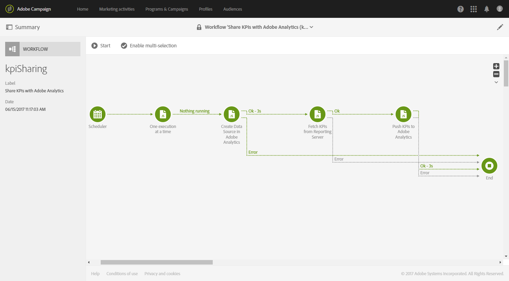

# Configuración de la integración de Campaign-Analytics{#configure-campaign-analytics-integration}

Esta integración le permite compartir sus datos de indicadores de rendimiento clave directamente desde Adobe Campaign a Adobe Analytics Standard o Premium.

Para iniciar la integración entre Adobe Campaign Standard y Adobe Analytics, primero debe configurar la cuenta externa vinculada a Adobe Analytics.

Solo el administrador funcional de la plataforma puede administrar las cuentas externas y los flujos de trabajo técnicos.

1. En el menú avanzado, en el logotipo de Adobe Campaign, seleccione **[!UICONTROL Administration > Application settings > External accounts]**.
1. Seleccione la cuenta externa **[!UICONTROL Share KPIs with Adobe Analytics]**.

   

1. Especifique sus **[!UICONTROL Web services user name]** y **[!UICONTROL Web services share secret]** en el campo **[!UICONTROL Connection]**.

   Estos parámetros se pueden encontrar en Analytics seleccionando **[!UICONTROL Admin > Company settings > Web services]**.

   

1. Haga clic en el botón **[!UICONTROL Refresh report suites]**.
1. Seleccione en la lista desplegable **[!UICONTROL Analytics default report suite]** el grupo de informes de Adobe Analytics que desee enriquecer con datos de Adobe Campaign.

   La cuenta externa ya está lista y vinculada con Adobe Analytics. Puede deshabilitarlo en cualquier momento marcando la casilla **[!UICONTROL Enabled]**.

   

El flujo de trabajo técnico **[!UICONTROL Share KPIs with Adobe Analytics]** se iniciará automáticamente y se podrá ver desde el menú avanzado seleccionando **[!UICONTROL Administration > Application settings > Workflow]**. Este flujo de trabajo técnico puede conservar broadlogs de hasta 6 meses de antigüedad. Tenga en cuenta que este flujo de trabajo es incremental y enviará datos del día anterior.

Los datos ya están disponibles en Adobe Analytics.

**Temas relacionados:**

* [Cuentas externas](../../administration/using/external-accounts.md)
* [Flujos de trabajo técnicos](../../administration/using/technical-workflows.md)
* [Compartir KPI para la creación de informes de Campaign integrada](https://helpx.adobe.com/es/marketing-cloud/how-to/email-marketing.html) vídeo
