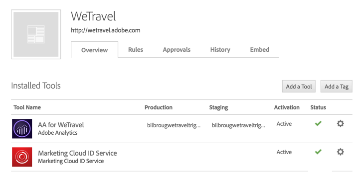
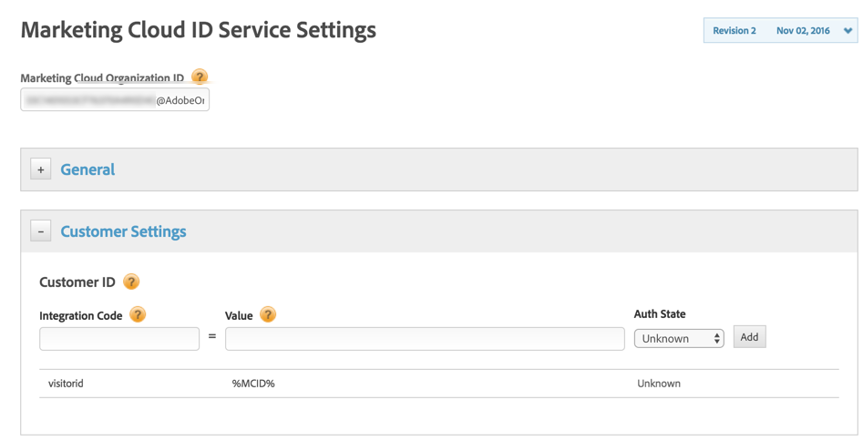
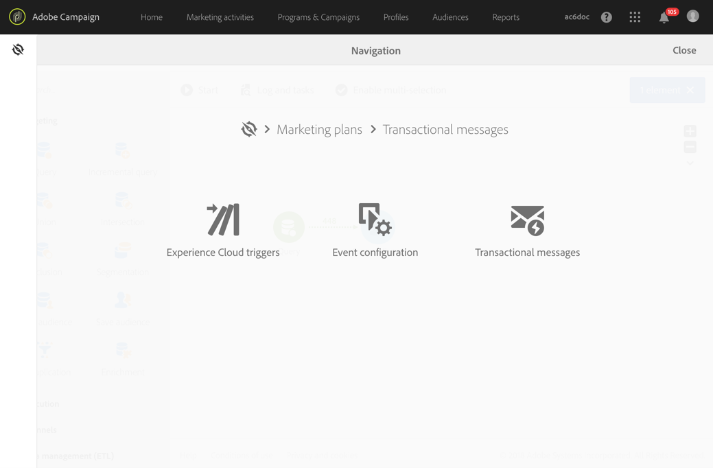

# Configuración de activadores en Experience Cloud{#configuring-triggers-in-experience-cloud}

## Activación de la funcionalidad {#activating-the-functionality}

La funcionalidad debe activarse en Adobe Campaign mediante Adobe. Póngase en contacto con el ejecutivo de su cuenta de Adobe o con su socio de servicios profesionales.

El equipo de Adobe necesitará la siguiente información para activar déclencheur:

* Nombre de la empresa del Marketing Cloud
* ID de la organización IMS
* Empresa de inicio de sesión de Analytics (puede ser el mismo que el nombre de la empresa de Marketing Cloud)

## Configuración de soluciones y servicios {#configuring-solutions-and-services}

Para utilizar esta función, debe tener acceso a las siguientes soluciones o servicios principales:

* Adobe Campaign
* Adobe Analytics Ultimate, Premium, Foundation, OD, Select, Prime, Mobile Apps, Select o Standard.
* Servicio principal de los activadores de Experience Cloud

   

* Servicio principal de DTM de Experience Cloud

   

* El ID de visitante de Experience Cloud y el servicio principal People de Experience Cloud

   

También necesita tener un sitio web de trabajo.

>[!CAUTION]
>
>La configuración del subdominio es un elemento clave de entrega. Asegúrese de que los correos electrónicos de Adobe Campaign se envíen desde el mismo dominio que el utilizado por el sitio web.

Debe configurar [Servicio principal de Experience Cloud DTM](#configuring-experience-cloud-dtm-core-service), [Servicio principal Personas Experience Cloud](#configuring-experience-cloud-people-core-service) y [Campaign](#configuring-triggers-and-aliases-in-campaign) para ejecutar estos casos de uso.

### Configuración del servicio principal DTM de Experience Cloud {#configuring-experience-cloud-dtm-core-service}

1. En el servicio principal de Experience Cloud DTM (Dynamic Tag Management), active el ID de Experience Cloud y Adobe Analytics para las páginas de su sitio web.

   

1. La reconciliación de ID entre el sitio web, Adobe Analytics y Adobe Campaign requiere utilizar el alias. Cree un alias, &quot;visitorid&quot; por ejemplo.

   

### Configuración del servicio principal Personas Experience Cloud {#configuring-experience-cloud-people-core-service}

El alias al que se hace referencia anteriormente en la DTM debe crearse en el servicio principal Personas de Experience Cloud a través de un atributo del cliente. Asegúrese de crear una nueva y hacer referencia al mismo alias de DTM en el código de integración (por ejemplo, &quot;visitorid&quot;).

>[!NOTE]
>
>Utilizaremos este atributo del cliente en la fuente de datos de Adobe Campaign (paso siguiente).

### Configuración de déclencheur y alias en Campaign {#configuring-triggers-and-aliases-in-campaign}

1. Asegúrese de que **[!UICONTROL Experience Cloud triggers]** visible en la instancia de Adobe Campaign Standard. Si no lo hace, póngase en contacto con los administradores de Adobe Campaign.

   

1. Los alias permiten que un contacto de Analytics se reconcilie con un perfil de Campaign. Debe coincidir los alias definidos en el servicio de ID de Experience Cloud con una fuente de datos compartida en Campaign. Debe configurar la resolución de alias en Adobe Campaign mediante una fuente de datos ( **[!UICONTROL Administration]** > **[!UICONTROL Application Settings]** > **[!UICONTROL Shared Data Sources]** ). Asegúrese de elegir la fuente de datos correcta en la **[!UICONTROL Data Source/Alias]** menú desplegable, que se asigna a la misma fuente de datos de Atributos del cliente creada en el paso anterior.

   

   >[!NOTE]
   >
   >Puede reconciliar sus déclencheur tanto para usuarios anónimos como para usuarios que iniciaron sesión. Para los usuarios anónimos, el perfil debe existir en Adobe Campaign y antes se ha enviado un correo electrónico al usuario. Para ello, la configuración del ID de visitante es suficiente. Sin embargo, si desea reconciliar déclencheur para usuarios que iniciaron sesión, debe configurar la fuente de datos de ID declarados. Para obtener más información, consulte [Configuración de la fuente de datos](../../integrating/using/provisioning-and-configuring-integration-with-audience-manager-or-people-core-service.md#step-2--configure-the-data-sources).

## Creación de un déclencheur en la interfaz del Experience Cloud {#creating-a-trigger-in-the-experience-cloud-interface}

Se debe crear un déclencheur de Adobe Experience Cloud para poder utilizarlo en Campaign.

Cree un nuevo déclencheur en Experience Cloud y asegúrese de seleccionar el grupo de informes utilizado en el sitio web. Asegúrese de elegir la dimensión correcta para que el déclencheur se active.

Consulte la [Documentación de Adobe Experience Cloud](https://experienceleague.adobe.com/docs/core-services/interface/activation/triggers.html) y mire esto [video](https://helpx.adobe.com/es/marketing-cloud/how-to/email-marketing.html#step-two).

## Déclencheur, prácticas recomendadas y limitaciones {#triggers-best-practices-and-limitations}

Esta es una lista de prácticas recomendadas y limitaciones para el uso de la integración Campaign - Déclencheur :

* Si tiene varias instancias de Campaign Standard, todas las instancias pueden recibir los déclencheur siempre que estén en el mismo ID de organización de IMS. Analytics también debe estar en el mismo ID de organización de IMS.
* No puede crear un déclencheur en el servicio principal de Déclencheur utilizando eventos de dos grupos de informes diferentes.
* Los déclencheur se basan en mensajes transaccionales. Los mensajes transaccionales se utilizan siempre que tenga que enviar un mensaje muy rápido. No puede poner en cola los mensajes transaccionales y luego reproducirlos en lote.
* Los déclencheur no son de naturaleza determinística. Cuando se genera un déclencheur, envía todos los alias asociados con la cookie, por lo que en el caso de exploradores compartidos como en quioscos minoristas, bibliotecas, cibercafés o dispositivos compartidos en casa (marido y mujer que inician sesión desde el mismo dispositivo), no es posible asignar al ID correcto. Todos los ID utilizados para iniciar sesión con el explorador se envían a Campaign, que envía un mensaje en función de la primera reconciliación. Si hay varios &quot;ID de correo electrónico&quot; aptos para la reconciliación, Campaign no envía un correo electrónico. Campaign no puede saber cuál es el ID de correo electrónico correcto a menos que Analytics lo capture y lo envíe.
* No se puede almacenar contenido de la carga útil en Campaign. No se pueden usar déclencheur para actualizar los datos de un perfil.
* Los Atributos del cliente no son compatibles con los Déclencheur (es decir, solo se pueden utilizar los datos del grupo de informes para definir las reglas comerciales de Déclencheur).
* La colección de colecciones no es compatible con Campaign.

>[!CAUTION]
>
>El sitio web debe ejecutarse en el mismo dominio que el servidor de Adobe Campaign. Si no es así, no puede utilizar el id de visitante para reconciliar y ponerse en contacto con los usuarios que visiten el sitio web de forma anónima.
