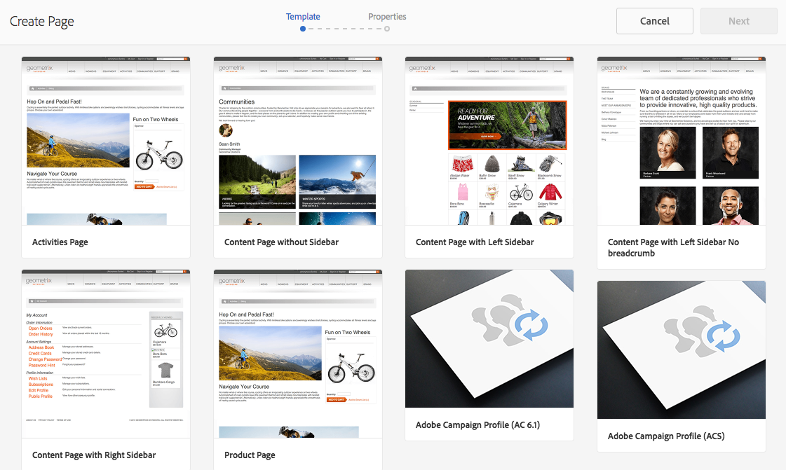

# Creación de un formulario de Campaign en Experience Manager {#creating-a-campaign-form-in-experience-manager}

AEM Puede crear &quot;formularios&quot; en los sitios de la y asignar los campos de un formulario a los campos de la base de datos de Adobe Campaign. Esto le permite crear y actualizar perfiles o administrar las suscripciones a un servicio.

Para crear un formulario de Adobe Campaign AEM en el sitio de la:

1. AEM En el sitio de la, cree una nueva página basada en la plantilla **Perfil de Adobe Campaign**.

   

1. En las propiedades de la página, seleccione el **[!UICONTROL Cloud Service]** correspondiente a su instancia de Adobe Campaign.

   

1. Seleccione el tipo de formulario del componente **[!UICONTROL Form Start]**:

   * **Adobe Campaign: guardar perfil**
   * **Adobe Campaign: suscribirse a los servicios**
   * **Adobe Campaign: cancelar la suscripción a los servicios**

1. Edite el contenido del formulario añadiendo diferentes campos y componentes que puede asignar a los campos de la base de datos de Adobe Campaign.
1. AEM Pruebe y publique el formulario para que sea accesible en el sitio de la.

Para obtener más información, consulte la [documentación detallada](https://experienceleague.adobe.com/docs/experience-manager-65/authoring/aem-adobe-campaign/adobe-campaign-forms.html).
