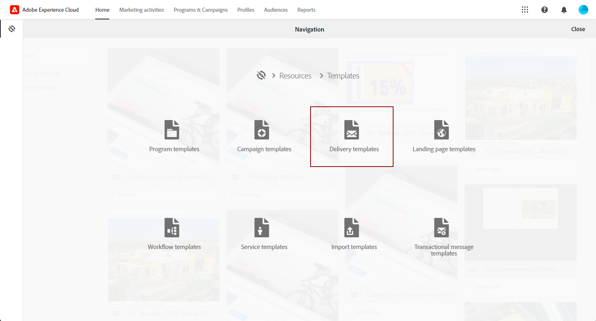

# Importación de contenido de Adobe Experience Manager en un correo electrónico de Adobe Campaign {#creating-email-aem}

Con este documento, aprenderá a crear y administrar el contenido del correo electrónico en Adobe Experience Manager y, a continuación, a utilizarlo para sus campañas de marketing importándolo en sus correos electrónicos en Adobe Campaign Standard.

Los requisitos previos son:

* Acceso a una instancia de AEM configurada para la integración.
* Acceso a una instancia de Adobe Campaign configurada para la integración.
* Una plantilla de correo electrónico de Adobe Campaign configurada para recibir contenido de AEM.

## Acceso a correos electrónicos en Adobe Experience Manager {#email-content-aem}

Inicie sesión en la instancia de creación de Adobe Experience Manager y explore el sitio para acceder a la carpeta que contiene el contenido del correo electrónico.

>[!VIDEO](https://video.tv.adobe.com/v/29996)

## Crear nuevo contenido de correo electrónico en Adobe Experience Manager {#creating-email-content-aem}

Hay disponibles varias plantillas específicas de Adobe Campaign. Debe utilizar una de estas plantillas, ya que contienen componentes predefinidos compatibles con Adobe Campaign.

De forma predeterminada, dos plantillas predefinidas le permiten crear contenido de correo electrónico para Adobe Campaign.

* **[!UICONTROL Adobe Campaign Email]**: esta plantilla contiene contenido estándar que puede personalizar. Puede elegir entre Correo electrónico de Adobe Campaign (AC6.1) y Correo electrónico de Adobe Campaign (ACS).
* **[!UICONTROL Importer Page]**: esta plantilla le permite importar un archivo ZIP que contiene un archivo HTML con contenido que podrá personalizar.

1. En Adobe Experience Manager, cree un nuevo(a) **[!UICONTROL Page]**.

1. Seleccione la plantilla **[!UICONTROL Adobe Campaign Email]**. Consulte el siguiente vídeo para ver los pasos detallados.

   >[!VIDEO](https://video.tv.adobe.com/v/29997)

1. Abra el nuevo contenido del correo electrónico.

1. En **[!UICONTROL Page properties]**, establezca **[!UICONTROL Adobe Campaign]** como **[!UICONTROL Cloud Service Configuration]**. Esto permite la comunicación entre el contenido y la instancia de Adobe Campaign.

   Para obtener más información, vea el siguiente vídeo:

   >[!VIDEO](https://video.tv.adobe.com/v/29999)

## Edición y envío de un correo electrónico {#editing-email-aem}

Puede editar el contenido del correo electrónico añadiendo componentes y recursos. Los campos personalizados se pueden utilizar para enviar un mensaje más relevante basado en los datos de los destinatarios en Adobe Campaign.

Para crear contenido de correo electrónico en Adobe Experience Manager:

1. Edite el asunto y la versión **[!UICONTROL Plain text]** de su correo electrónico. Para ello, acceda a la pestaña **[!UICONTROL Page properties]** > **[!UICONTROL Email]** desde la barra de tareas.

1. Agregar **[!UICONTROL Personalization fields]** mediante el componente **[!UICONTROL Text & Personalization]**. Cada componente corresponde a un uso específico: inserción de imágenes, adición de personalización, etc.

   Para obtener más información, vea el siguiente vídeo:

   >[!VIDEO](https://video.tv.adobe.com/v/29998)

1. En la ficha **[!UICONTROL Workflow]**, seleccione el flujo de trabajo de validación **[!UICONTROL Approve for Adobe Campaign]**. No puede enviar un correo electrónico en Adobe Campaign si utiliza un contenido que no se haya aprobado.

Para enviar el correo electrónico en Adobe Campaign Standard:

1. Una vez definidos los parámetros de contenido y envío, cree un correo electrónico basado en una plantilla de correo electrónico específica de AEM en Adobe Campaign Standard.

   +++ Más información sobre las Plantillas específicas de AEM.

   1. Desde el menú avanzado, acceda a **[!UICONTROL Resources]** `>` **[!UICONTROL Templates]** `>` **[!UICONTROL Delivery templates]**.

      

   1. Duplique o seleccione una de las plantillas de envío.

   1. En **[!UICONTROL Properties]** de su plantilla, en la lista desplegable **[!UICONTROL Content]**, seleccione **[!UICONTROL Adobe Experience Manager as Content mode]** y luego su cuenta de Adobe Experience Manager.

      

   +++

   

1. Complete las propiedades del correo electrónico y haga clic en **[!UICONTROL Create]** para poder seleccionar el contenido de AEM.

1. Obtener acceso al bloque **[!UICONTROL Content]**.

   

1. En el menú **[!UICONTROL Use Adobe Experience Manager content]**, haga clic en **[!UICONTROL Link AEM content]**.

   A continuación, seleccione el contenido que desee utilizar en el correo electrónico.

   

1. Personalice aún más el correo electrónico especificando parámetros adicionales, como audiencias de destino y programación de ejecución, a través del panel. Una vez configurada, ahora puede realizar la entrega por correo electrónico. [Más información](../../sending/using/confirming-the-send.md)

