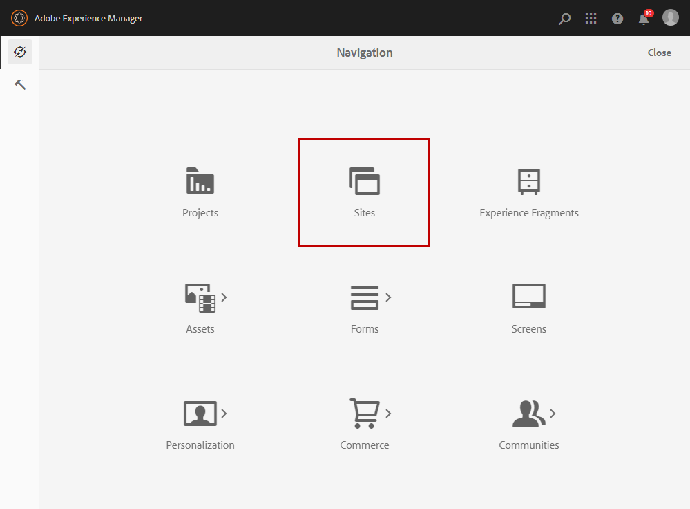
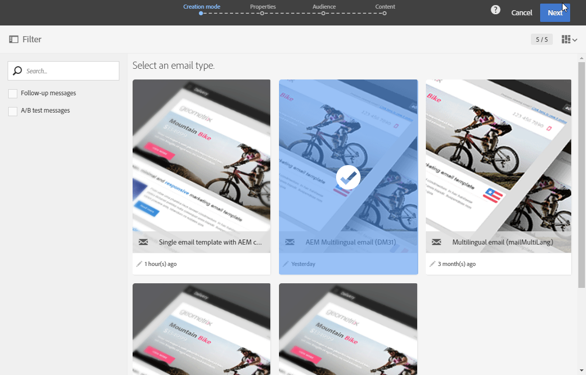

# Creación de un correo electrónico multilingüe con la integración de Adobe Experience Manager {#creating-multilingual-email-aem}

Con este documento, aprenderá a crear un correo electrónico multilingüe con contenido de Adobe Experience Manager y copias de idioma.

Los requisitos previos son:

* Acceso a una instancia de AEM configurada para la integración.
* Acceso a una instancia de Adobe Campaign configurada para la integración.
* Una plantilla de correo electrónico multilingüe de Adobe Campaign configurada para recibir AEM contenido.

## Crear nuevo contenido de correo electrónico en Adobe Experience Manager {#creating-email-content-aem}

1. En la página de inicio de Adobe Experience Manager, seleccione **[!UICONTROL Site]**.

   

1. Seleccione en qué carpeta desea crear la página y haga clic en **[!UICONTROL Create]** then **[!UICONTROL Page]**. Aquí, creamos nuestra página en la carpeta en_us , que será nuestro idioma predeterminado.

   

1. Seleccione el **[!UICONTROL Adobe Campaign Email (ACS)]** plantilla.

1. Complete las propiedades del correo electrónico y haga clic en **[!UICONTROL Create]**.

   

1. Abra el nuevo contenido del correo electrónico y personalícelo según sea necesario. Para obtener más información, consulte esta [página](../../integrating/using/creating-email-experience-manager.md#editing-email-aem).

   

1. En el **[!UICONTROL Workflow]** , seleccione **[!UICONTROL Approve for Adobe Campaign]** flujo de trabajo de validación. No puede enviar un correo electrónico en Adobe Campaign si utiliza un contenido que no se haya aprobado.

   

1. Haga clic en **[!UICONTROL Complete]** then **[!UICONTROL Newsletter review]** de la variable **[!UICONTROL Complete work item]** ventana.

1. Haga clic en **[!UICONTROL Complete]**, luego en **[!UICONTROL Newsletter approval]**. Una vez definidos los parámetros de contenido y envío, puede proceder a la aprobación, preparación y envío del correo electrónico en Adobe Campaign Standard.

   

## Creación de copias de idioma {#creating-language-copies}

Después de diseñar el contenido del correo electrónico, debe crear las copias de idioma que se sincronizarán con Adobe Campaign Standard como variantes.

1. Seleccione la página creada anteriormente, haga clic en **[!UICONTROL Create]** then **[!UICONTROL Language Copy]**.

   

1. Seleccione el contenido de correo electrónico creado anteriormente que se traducirá a los idiomas seleccionados y haga clic en **[!UICONTROL Next]**.

   

1. En el **[!UICONTROL Target language(s)]** , seleccione en qué idioma se traducirá el contenido y haga clic en **[!UICONTROL Next]**.

   

1. Haga clic en **[!UICONTROL Create]**.

Se han creado las copias de idioma, ahora puede editar el contenido en función del idioma elegido.

>[!CAUTION]
>
>Cada copia de idioma debe aprobarse mediante la variable **[!UICONTROL Approve for Adobe Campaign]** flujo de trabajo de validación. No puede enviar un correo electrónico en Adobe Campaign si utiliza un contenido que no se haya aprobado.

## Creación de contenido multilingüe en Adobe Campaign Standard {#multilingual-acs}

1. En la página de inicio de Adobe Campaign Standard, haga clic en **[!UICONTROL Create an email]**.

   

1. Seleccione la plantilla de correo electrónico multilingüe de Adobe Campaign configurada para recibir contenido de Adobe Experience Manager. Para obtener más información sobre cómo crear una plantilla vinculada a la instancia de Adobe Experience Manager, consulte esta [página](../../integrating/using/configure-experience-manager.md#config-acs).

   >[!NOTE]
   >
   >En este caso, deberá duplicar la plantilla integrada . **[!UICONTROL Multilingual email (mailMultiLang)]** para poder enviar su correo electrónico multilingüe.

   

1. Complete la variable **[!UICONTROL Properties]** y **[!UICONTROL Audience]** del correo electrónico y haga clic en **[!UICONTROL Create]**.

1. En el **[!UICONTROL Edit properties]**, asegúrese de que la cuenta de Adobe Experience Manager esté correctamente configurada en la variable **[!UICONTROL Content]** lista desplegable.

   

1. Haga clic en **[!UICONTROL Language copy creation]**.

   

1. Seleccione el contenido de Adobe Experience Manager creado anteriormente y haga clic en **[!UICONTROL Confirm]**. El contenido de Adobe Experience Manager que se muestra aquí solo es contenido validado y se puede filtrar en su **[!UICONTROL Label]** y **[!UICONTROL Path]**.

   >[!NOTE]
   >
   >La copia de idioma elegida se establecerá de forma predeterminada; más adelante, puede cambiarla en el **[!UICONTROL Content variant]** bloque.

   

1. Haga clic en **[!UICONTROL Create variants]** para vincular el contenido multilingüe. Adobe Campaign Standard vinculará automáticamente las copias en otros idiomas a este contenido. Las variantes creadas tendrán la misma etiqueta y el mismo lenguaje de código que las seleccionadas en Adobe Experience Manager.

   

1. Haga clic en el **[!UICONTROL Content variant]** para cambiar la variante predeterminada si es necesario y haga clic en **[!UICONTROL Confirm]**.

   

1. Si el contenido o las variantes se actualizan en Adobe Experience Manager, puede sincronizarlo directamente en Adobe Campaign Standard con la variable **[!UICONTROL Refresh AEM contents]** botón.

1. El correo electrónico ya está listo para enviarse. Para obtener más información, consulte esta [página](../../sending/using/get-started-sending-messages.md).

   >[!NOTE]
   >
   >No podrá enviar un correo electrónico en Adobe Campaign si utiliza un contenido AEM que no se haya aprobado.

Su audiencia recibirá su correo electrónico según el **[!UICONTROL Preferred languages]** configurado en su **[!UICONTROL Profiles]**. Para obtener más información sobre cómo editar perfiles y idiomas preferidos, consulte esta [página](../../audiences/using/editing-profiles.md).
