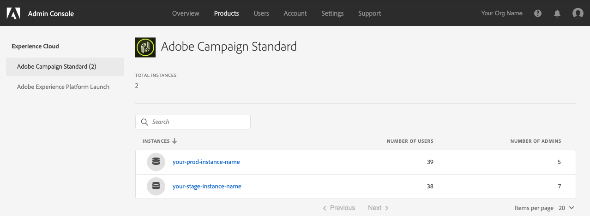

# Acceso a la integración de Adobe Campaign Standard con la aplicación de autoservicio de Microsoft Dynamics 365

Esta configuración requiere que trabaje con un administrador Experience Cloud (EC) para su organización. Estos son los pasos iniciales necesarios para acceder a la interfaz de la aplicación de integración de autoservicio. Una vez que tenga acceso a la herramienta, configurará las conexiones a los datos y el flujo de datos entre Adobe Campaign y Microsoft Dynamics 365.

>[!NOTE]
>
>Debe ponerse en contacto con su representante de Adobe y proporcionar la organización de Adobe Campaign Standard y los nombres de instancia. Se registrará un ticket para solicitar que la aplicación de integración se habilite para su organización.

## Añadir un perfil de producto

En esta sección, aprenderá a otorgar acceso a la integración de Adobe Campaign Standard con la aplicación de autoservicio de Microsoft Dynamics 365. Los usuarios que tengan acceso a su organización en Adobe Experience Cloud no tendrán acceso a la aplicación de autoservicio de integración, a menos que siga los pasos a continuación para concederles acceso.

>[!IMPORTANT]
>
> Estos pasos requieren la función **Administrator** en el Experience Cloud de su organización.

1. Vaya a https://experience.adobe.com/ e inicie sesión en el Adobe Experience Cloud.
1. Acceda al **Admin Console**.

   

1. Haga clic en **[!UICONTROL Products]** para acceder a las soluciones de Experience Cloud.

   

   >[!IMPORTANT]
   >
   >Los pasos restantes de esta sección se realizarán para cada una de las instancias de Campaña (dev, texto, producción).

1. Haga clic en la primera instancia para configurarla.

   

   La página de instancia debería tener este aspecto:

   

1. Haga clic en el botón **[!UICONTROL New Profile]** y agregue una nueva entrada denominada: **Campaign Standard - su-nombre-instancia-prod - Integración con D365/ACS**

   * Si ve esta entrada en la lista, no es necesario continuar. Haga clic en **Adobe Campaign Standard** en el menú de la izquierda y compruebe las demás instancias de Campaña.

   * Asegúrese de reemplazar &quot;your-prod-instance-name&quot; por el nombre real de su instancia.

1. Puede dejar la lista desplegable **[!UICONTROL Permission Group]** con el valor predeterminado.

1. Si las entradas son similares a las siguientes, haga clic en el botón **[!UICONTROL Done]**.

   

   Se ha agregado el nuevo perfil de producto.

   

## Conceder acceso a los usuarios {#add-users-to-profile}

En la página **[!UICONTROL Products]**, seleccione la instancia de Campaña y siga los pasos a continuación:

1. Haga clic en el nuevo perfil que ha creado anteriormente:  **Campaign Standard - su-nombre-instancia-prod - Integración con D365/ACS**

   

1. Haga clic en la pestaña **[!UICONTROL Developers]**. 

   

1. Haga clic en el botón **[!UICONTROL Add Developer]**

1. Escriba el nombre o la dirección de correo electrónico del usuario que desee agregar.  Seleccione el resultado que coincida con el usuario.

   Si es la primera vez que se agrega al usuario a la organización, introduzca los detalles.

1. Haga clic en **[!UICONTROL Save]** para confirmar.
