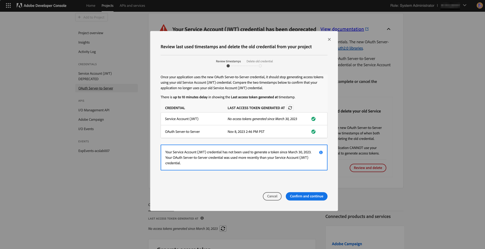

# Migración de credenciales de JWT a OAuth de servidor a servidor

La credencial de cuenta de servicio (JWT) ha quedado obsoleta en favor de la nueva credencial de servidor a servidor OAuth. La nueva credencial facilita el mantenimiento de las aplicaciones de Adobe. También elimina la necesidad de rotar los certificados periódicamente y funciona de forma predeterminada mediante bibliotecas OAuth2 estándar.

Aunque las credenciales de la cuenta de servicio (JWT) se han marcado como obsoletas, seguirán funcionando hasta el 1 de enero de 2025. Por lo tanto, debe migrar la integración para utilizar la nueva credencial de servidor a servidor OAuth antes del 1 de enero de 2025. Compruebe [escalas de tiempo de obsolescencia](https://developer.adobe.com/developer-console/docs/guides/authentication/ServerToServerAuthentication/migration/#deperecation-timelines) para obtener más información

## Pasos para migrar credenciales de JWT a OAuth servidor a servidor

La migración a las credenciales de servidor a servidor de OAuth es un proceso sencillo que permite realizar una migración sin tiempo de inactividad para la aplicación. Puede seguir los pasos a continuación para migrar las credenciales.

1. Inicie sesión en [Adobe Developer Console](https://developer.adobe.com/console)
2. En el menú de filtrado de la izquierda, seleccione la opción Tiene credencial de cuenta de servicio (JWT). De este modo, se muestran todos los proyectos que tienen una credencial de cuenta de servicio (JWT). En la lista de proyectos, haga clic en el proyecto que desea migrar.

   

3. Abra la pestaña Credencial de la cuenta de servicio (JWT) en el panel de navegación izquierdo y vea la tarjeta de migración. En la tarjeta de migración, haga clic en el botón **Agregar nueva credencial** para agregar una credencial de servidor a servidor OAuth equivalente. Si agrega una credencial de servidor a servidor OAuth al proyecto, se iniciará la migración.
   
4. La nueva credencial **OAuth Server-to-Server** se agregará a la navegación del lado izquierdo.
   * Haga clic en Cancelar migración si desea cancelar la migración.
   * No haga clic en el botón Revisar y eliminar hasta comprobar si la nueva credencial de servidor a servidor OAuth funciona.
     

5. Actualizar las credenciales en la aplicación de Microsoft Dynamics 365 a Adobe Campaign Standard
   * Inicie sesión en la aplicación de integración y navegue hasta la página Configuración.
   * Seleccione OAuth como tipo de autenticación.
   * Dado que la nueva credencial de servidor a servidor OAuth utiliza las mismas credenciales que la credencial de cuenta de servicio (JWT) anterior, la mayoría de los campos ya se rellenarán.
   * Introduzca el ID de cliente y el secreto de cliente. Se pueden encontrar en el proyecto en Adobe Developer Console.
   * Haga clic en Guardar para guardar la configuración.
     

6. Compruebe si las nuevas credenciales funcionan
   * Inicie sesión en la aplicación de integración y navegue hasta la página Flujos de trabajo.
   * Detener los flujos de trabajo activos. Espere hasta que se detengan los flujos de trabajo.
   * Inicie los flujos de trabajo. Espere hasta que los flujos de trabajo estén en estado RUNNING.
   * Monitorice los flujos de trabajo durante unos minutos para asegurarse de que funcionan correctamente. También puede comprobar los datos en Adobe Campaign Standard y Microsoft Dynamics 365 para asegurarse de que los datos se sincronizan correctamente.

7. Elimine la credencial JWT para completar la migración
   * Inicie sesión en [Adobe Developer Console](https://developer.adobe.com/console)
   * Haga clic en los proyectos y seleccione el proyecto que ha migrado.
   * Haga clic en la pestaña Credencial de la cuenta de servicio (JWT) en el panel de navegación del lado izquierdo.
   * Haga clic en el botón Revisar y eliminar.
     
   * Revise la marca de tiempo del último acceso o del último menú utilizado para comprobar si la aplicación de integración está generando tokens de acceso con la nueva credencial de OAuth o sigue utilizando la credencial JWT antigua.
     
   * Una vez que se verifique que la aplicación de integración está usando la nueva credencial de OAuth y ya no usa la credencial JWT, continúe con la eliminación de la credencial antigua haciendo clic en el botón **Confirmar y continuar**, con lo que se completará la migración.
     
