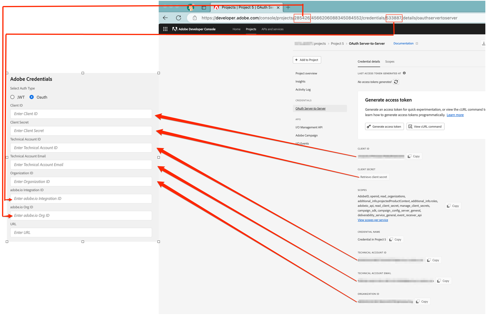

# Conexión de sistemas con la aplicación de integración

## Añadir credenciales a la aplicación de integración

La pantalla **[!UICONTROL Settings]** le permite especificar las credenciales de la API de Microsoft Dynamics 365 y Adobe. También puede definir las opciones relacionadas con la instancia SFTP de Adobe Campaign.

### Credenciales de Microsoft Dynamics 365

Las credenciales de Microsoft Dynamics 365 otorgan permiso a la aplicación de integración para extraer los datos de Microsoft Dynamics 365.  Primero debe seguir los pasos de la pantalla [Configuración de Microsoft Dynamics 365 para la integración de Campaign](../../integrating/using/d365-acs-configure-d365.md) para generar los valores que se pegarán en esta pantalla. Las entradas que se describen a continuación harán referencia a esta pantalla.

* **[!UICONTROL Client ID]**: Aprenda a hacer referencia a su ID de cliente en [esta sección](../../integrating/using/d365-acs-configure-d365.md#register-a-new-app)

* **[!UICONTROL Client Secret]**: aprenda a generar su secreto de cliente en [esta sección](../../integrating/using/d365-acs-configure-d365.md#generate-a-client-secret)

* **[!UICONTROL Tenant]**: Aprenda a encontrar su ID de inquilino en [esta sección](../../integrating/using/d365-acs-configure-d365.md#get-the-tenant-id)

* **[!UICONTROL URL]**: la dirección URL tendrá el formato `https://&lt;servername&gt;.api.crm.dynamics.com/`

### Credenciales de API de Adobe

Las credenciales de Adobe Campaign se generan mediante [Adobe I/O](https://www.adobe.io/). Tendrás que visitar la pantalla [Configurar Adobe I/O](../../integrating/using/d365-acs-configure-adobe-io.md) y seguir las instrucciones antes de poder completar las entradas de esta sección.

* Seleccione el tipo de autenticación como Oauth, ya que la autenticación basada en JWT está obsoleta.
* La siguiente imagen explica en detalle la asignación entre Adobe I/O y las entradas de la pantalla de configuración.

* *URL*: Este valor se ajustará al patrón https\://mc.adobe.io/&lt;campaign-instance-name>. El encabezado de la aplicación de integración incluye &quot;Org&quot; e &quot;Instance&quot;. La parte &quot;campaign-instance-name&quot; de la dirección URL sería simplemente el nombre encontrado en este valor de instancia.

## Configuración de SFTP de Adobe Campaign {#ac-smtp-settings}

Esta configuración es opcional. Debe definirlos si planea utilizar la instancia SFTP de Adobe Campaign para generar registros de salida desde el conector. Esto resulta útil si experimenta problemas cuando la integración se está ejecutando y necesita depurar por qué el resultado no cumple sus expectativas.

El otro motivo para configurar el servidor SFTP sería si planea ejecutar el flujo de trabajo de inclusión/exclusión y hay un flujo de datos de Adobe Campaign a Microsoft Dynamics 365, ya sea **[!UICONTROL Unidirectional (Campaign to Microsoft Dynamics 365)]** o **[!UICONTROL Bidirectional]**.

>[!IMPORTANT]
>
>Usted es responsable de la información a la que accede y descarga desde las carpetas SFTP. Si la información contiene datos personales, usted es responsable de cumplir con las leyes y regulaciones de privacidad aplicables. [Más información](../../integrating/using/d365-acs-notices-and-recommendations.md#acs-msdyn-manage-privacy).
>

Para definir la configuración SFTP de Campaign para la integración con Microsoft Dynamics 365, acceda a la siguiente sección:

Debe especificar lo siguiente:

* **Host SFTP**: este campo contendrá &lt;campaign-instance-name>.campaign.adobe.com. El encabezado de la aplicación de integración incluye **Org** e **Instance**. La parte &quot;campaign-instance-name&quot; de la dirección URL sería simplemente el nombre encontrado en este valor de instancia.

* **Usuario SFTP**: Si tiene el usuario SFTP, agréguelo aquí. De lo contrario, consulte [esta sección](#ac-control-panel-settings). Como parte del proceso, se le mostrará el nombre de usuario.

* **Clave SFTP**: Si tiene una clave SSH, agréguela aquí. De lo contrario, consulte [esta sección](#ac-control-panel-settings).

* Se necesitarán **intervalos de IP** para incluirlos en la configuración del SFTP de Adobe Campaign. Deberán estar incluidos en la lista de permitidos para que la integración pueda utilizar el punto final SFTP.

* **¿Desea exportar los registros a su SFTP de Adobe Campaign?** le permite determinar si la integración generará información de registro en el extremo SFTP. Se puede usar para depurar si Adobe Campaign o Microsoft Dynamics 365 no muestran la información que espera.

## Configuración de SFTP en Adobe Campaign {#ac-control-panel-settings}

Descubra la administración de SFTP con [Panel de control de Campaign de campaña](https://experienceleague.adobe.com/docs/control-panel/using/control-panel-home.html?lang=es) en estas secciones:

* [Acerca de la administración SFTP](https://experienceleague.adobe.com/docs/control-panel/using/sftp-management/about-sftp-management.html?lang=es#sftp-management)

* [Administración de almacenamiento SFTP](https://experienceleague.adobe.com/docs/control-panel/using/sftp-management/key-management.html?lang=es#installing-ssh-key)

* [Agregar intervalos de IP](https://experienceleague.adobe.com/docs/control-panel/using/sftp-management/ip-range-allow-listing.html?lang=es#sftp-management)

* [Administrar claves](https://experienceleague.adobe.com/docs/control-panel/using/sftp-management/key-management.html?lang=es#sftp-management)

* [Inicie sesión en su servidor SFTP](https://experienceleague.adobe.com/docs/control-panel/using/sftp-management/logging-into-sftp-server.html?lang=es#sftp-management)

Una vez completada la configuración, inicie sesión en el servidor SFTP con la clave privada y cree el directorio &quot;d365_loads/exports&quot;.

[Visite esta página](https://experienceleague.adobe.com/docs/campaign-standard-learn/control-panel/sftp-management/monitoring-server-capacity.html?lang=es#sftp-management) para obtener información sobre el servidor SFTP de Adobe Campaign Standard.
