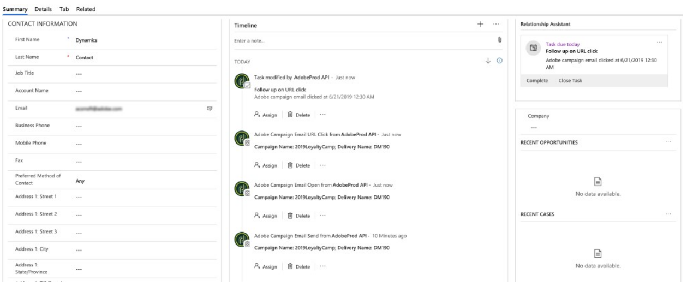

# Uso de la integración con Microsoft Dynamics 365

La integración de Adobe Campaign Standard con Microsoft Dynamics 365 realiza varios flujos de datos. Estos flujos se detallan en [esta página](../../integrating/using/d365-acs-self-service-app-workflows.md).

Encontrará más detalles sobre los flujos de datos más abajo en este documento en la sección [Flujos de datos](#data-flows).

## Experiencia del usuario de Adobe Campaign Standard

Cuando se crea, modifica o elimina un contacto (si se elimina está habilitado) en Microsoft Dynamics 365, se envía a Campaign Standard. Estos contactos se pueden ver en la pantalla Perfiles de Campaign y se pueden segmentar en las campañas de marketing. Consulte la pantalla Perfiles a continuación.

Cuando se modifica un atributo de exclusión en Campaign, se reflejará en Dynamics 365 si ha seleccionado la configuración de exclusión **Unidireccional (de Campaign a Microsoft Dynamics 365)** o **Bidireccional**, y si tiene ese atributo en particular asignado correctamente.

## Experiencia del usuario de Microsoft Dynamics 365

Para la salida, los siguientes eventos de marketing por correo electrónico se envían de Campaign a Dynamics 365 y se muestran en la vista Cronología de Microsoft Dynamics 365 como actividades personalizadas:

* Envío de correo electrónico de Adobe Campaign

* Apertura de correo electrónico Adobe Campaign

* Clic en URL de correo electrónico de Adobe Campaign

* Adobe Campaign Email Bounce

Para ver la cronología de un contacto, vaya a la lista de contactos haciendo clic en Sales Hub en el menú desplegable de Dynamics 365. A continuación, haga clic en Contactos en la barra de menú de la izquierda y seleccione un contacto.

>[!NOTE]
>
>La aplicación **Adobe Campaign para Microsoft Dynamics 365** en AppSource deberá instalarse en la instancia de Microsoft Dynamics 365 para poder ver estos eventos. [Más información](../../integrating/using/d365-acs-configure-d365.md#install-appsource-app).

A continuación puede ver una instantánea de la pantalla de contacto de &quot;Usuario de Dynamics&quot;. En la vista Cronología, verá que se ha enviado al usuario de Dynamics un correo electrónico asociado al nombre de campaña &quot;2019LoyaltyCamp&quot; y al nombre de entrega &quot;DM190&quot;. El usuario de Dynamics abrió el correo electrónico y también hizo clic en una dirección URL del mismo. Ambas acciones crearon eventos que también se muestran a continuación. Si mira a la esquina derecha, verá la tarjeta Asistente de relaciones (RA); actualmente, contiene una tarea para realizar un seguimiento de la dirección URL en la que se hizo clic.

Consulte a continuación un resumen de la vista Cronología del usuario de Dynamics.

A continuación se muestra un primer plano de la tarjeta Asistente de relaciones (RA). La aplicación AppSource contiene un flujo de trabajo que observa un evento de clic en la URL del correo electrónico de Adobe. Cuando se produce este evento, se crea una tarea y se establece una fecha de vencimiento. Esto permite que la tarea aparezca en la tarjeta de RA, lo que le proporciona visibilidad adicional. Hay un flujo de trabajo similar para los eventos de rechazo de correo electrónico de Adobe, lo que agrega una tarea para reconciliar la dirección de correo electrónico no válida. Estos flujos de trabajo se pueden desactivar en la solución.

Si hace clic en el asunto del evento de envío, verá un formulario similar al de abajo. Los formularios para los eventos de apertura y devolución son similares.

El formulario para eventos de clic en URL de correo electrónico agrega un atributo adicional para la URL en la que se hizo clic:

A continuación se muestra una lista de los atributos y una descripción:

* **Asunto**: asunto del evento; compuesto por el ID de campaña y el ID de entrega del envío de correo electrónico

* **Propietario**: el usuario de la aplicación que se creó en los pasos posteriores al aprovisionamiento

* **Con respecto a**: El nombre del contacto

* **Nombre de campaña**: El identificador de campaña en Campaign Standard

* **Nombre de entrega**: El identificador de entrega en Campaign Standard

* **Fecha de envío/apertura/clic/rechazo**: Fecha/hora en que se creó el evento

* **URL de seguimiento**: URL donde se hizo clic

* **URL de la página espejo**: La URL de la página espejo del correo electrónico enviado, abierto, en el que se hizo clic o se rebotó. El periodo de caducidad de la página espejo de correo electrónico se puede modificar en la pantalla de configuración de la actividad del canal de correo electrónico de Campaign correspondiente. [Más información](../../administration/using/configuring-email-channel.md#validity-period-parameters).

>[!NOTE]
>
>Para la exclusión, cuando se modifica un atributo de exclusión en Microsoft Dynamics 365, se reflejará en Campaign si ha seleccionado la configuración de exclusión **Unidireccional (de Campaign a Microsoft Dynamics 365)** o **Bidireccional**, y si tiene ese atributo en particular asignado correctamente.

## Flujos de datos {#data-flows}

### Entrada de contacto y entidad personalizada

Los registros nuevos, actualizados y eliminados (Nota: los registros eliminados deben estar habilitados) se envían de la tabla de contactos de Microsoft Dynamics 365 a la tabla de perfiles de Campaign.

Las asignaciones de tablas se pueden configurar en la interfaz de usuario de la aplicación de integración para asignar atributos de tablas de Microsoft Dynamics 365 a atributos de tablas de Campaign. Las asignaciones de tabla se pueden modificar para agregar o quitar atributos, según sea necesario.

La ejecución inicial del flujo de datos está diseñada para transferir todos los registros asignados, incluidos los marcados como &quot;inactivos&quot;; posteriormente, la integración solo procesará las actualizaciones incrementales. La excepción a esto es si los datos se reproducen o si se configura un filtro; se pueden configurar reglas básicas de filtrado basadas en atributos para determinar qué registros se sincronizan con Campaign.

En la interfaz de usuario de la aplicación de integración se pueden configurar reglas de reemplazo básicas para reemplazar un valor de atributo con un valor diferente (por ejemplo, &quot;verde&quot; para &quot;#00FF00&quot;, &quot;F&quot; para 1, etc.).

Según el volumen de registros, es posible que el almacenamiento SFTP de Campaign deba utilizarse para la transferencia inicial de datos. [Más información](#initial-data-transfer).

El atributo externalId de la tabla de perfil de Campaign debe rellenarse con el atributo de contacto contactId de Dynamics 365 para que funcione la entrada de contactos. Las entidades personalizadas de Campaign también deben rellenarse con un atributo de ID único de Dynamics 365. Sin embargo, este atributo se puede almacenar en cualquier atributo de entidad personalizada de Campaign (es decir, no tiene que ser externalId).

>[!NOTE]
>
>Para el ingreso de entidades personalizadas, el seguimiento de cambios debe estar habilitado en Dynamics 365 para entidades personalizadas sincronizadas.

#### Entidades personalizadas

La [integración de Microsoft Dynamics 365-Adobe Campaign Standard](../../integrating/using/d365-acs-get-started.md) admite entidades personalizadas, lo que permite que las entidades personalizadas de Dynamics 365 se sincronicen con los recursos personalizados correspondientes en Campaign.

Los nuevos datos de los recursos personalizados se pueden utilizar para varios fines, incluida la segmentación y la personalización.

La integración admite tablas vinculadas y no vinculadas. La vinculación es compatible con hasta tres niveles (es decir, nivel1->nivel2->nivel3).

>[!IMPORTANT]
>
>Si algún registro de recurso personalizado de Campaign contiene información personal, se aplican recomendaciones específicas. Obtenga más información [en esta sección](../../integrating/using/d365-acs-notices-and-recommendations.md#acs-msdyn-manage-data).
>

Al configurar flujos de datos de entidad personalizados, es importante tener en cuenta lo siguiente:

* La creación y modificación de recursos personalizados de Campaign son operaciones sensibles que deben realizar únicamente los usuarios expertos.
* Para los flujos de datos de entidad personalizados, el seguimiento de cambios debe habilitarse en Dynamics 365 para entidades personalizadas sincronizadas.
* Si se crea un registro principal y un registro secundario vinculado casi a la misma hora en Dynamics 365, debido al procesamiento paralelo de la integración, existe una pequeña posibilidad de que se pueda escribir un nuevo registro secundario en Campaign antes de su registro principal.

* Si el elemento principal y el secundario están vinculados en el lado de la campaña mediante la opción **1 de vínculo simple de cardinalidad**, el registro secundario permanecerá oculto e inaccesible (a través de la interfaz de usuario o la API) hasta que el registro principal llegue a Campaign.

* (Suponiendo que la cardinalidad **1 es un vínculo simple** en Campaign). Si el registro secundario se actualiza o elimina en Dynamics 365 y ese cambio se escribe en Campaign antes de que el registro principal aparezca en Campaign (no es probable, pero es una posibilidad remota), esa actualización o eliminación no se procesará en Campaign y se generará un error. En caso de actualización, el registro en cuestión deberá actualizarse de nuevo en Dynamics 365 para sincronizar el registro actualizado. En caso de eliminación, el registro en cuestión deberá tratarse por separado en el lado de la campaña, ya que ya no hay un registro en Dynamics 365 para eliminar o actualizar.

* Si se encuentra con una situación en la que cree que tiene registros secundarios ocultos y no hay forma de acceder a ellos, puede cambiar temporalmente el tipo de vínculo de cardinalidad a **0 o 1 vínculo simple de cardinalidad** para acceder a esos registros.

Se puede encontrar una descripción general más completa de los recursos personalizados de Campaign [en esta sección](../../developing/using/key-steps-to-add-a-resource.md).

### Flujo de eventos de marketing por correo electrónico{#email-marketing-event-flow}

Los eventos de marketing por correo electrónico se envían desde Campaign a Microsoft Dynamics 365 para que aparezcan en la vista Cronología.

Tipos de eventos de marketing admitidos:
* Enviar: correo electrónico enviado al destinatario
* Abierto: correo electrónico abierto por el destinatario
* Clic: URL del correo electrónico en el que el destinatario hizo clic
* Devolución: el correo electrónico al destinatario ha experimentado una devolución grave

Los siguientes atributos de evento se muestran en Dynamics 365:
* Nombre de campaña de marketing
* Nombre de envío de correo electrónico
* Marca de tiempo
* URL de página espejo de correo electrónico
* URL en la que se hizo clic (solo eventos de clic)

Los eventos de marketing por correo electrónico se pueden habilitar o deshabilitar por tipo (enviar, abrir, hacer clic, devolver), de modo que solo los tipos de eventos que seleccione se pasarán a Dynamics 365.

### Flujo de exclusión {#opt-out-flow}

Los valores de exclusión (por ejemplo, la lista de bloqueados de la) se sincronizan entre sistemas. Puede elegir entre las siguientes opciones al incorporarlos:

* **Unidireccional (de Microsoft Dynamics 365 a Campaign)**: Dynamics 365 es la fuente fiable para las exclusiones. Los atributos de exclusión se sincronizarán en una dirección desde Dynamics 365 a Campaign Standard&quot;
* **Unidireccional (de Campaign a Microsoft Dynamics 365)**: Campaign Standard es la fuente fiable de las exclusiones. Los atributos de exclusión se sincronizarán en una dirección desde Campaign Standard hasta Dynamics 365
* **Bidireccional**: Dynamics 365 Y Campaign Standard son fuentes de verdad. Los atributos de exclusión se sincronizarán bidireccionalmente entre Campaign Standard y Dynamics 365

Alternativamente, si tiene un proceso independiente para administrar la sincronización de exclusión entre los sistemas, se puede desactivar el flujo de datos de exclusión de la integración.

>[!NOTE]
>
>En la interfaz de usuario de la aplicación de integración, los casos de uso **Unidireccional (de Microsoft Dynamics 365 a Campaign)** y **Bidireccional** de exclusión se configuran en un flujo de trabajo de exclusión independiente. [Más información](../../integrating/using/d365-acs-self-service-app-data-sync.md#opt-in-out-wf).
>
>El caso de uso de exclusión **Unidireccional (de Campaign a Microsoft Dynamics 365)** es una excepción; se configura dentro del flujo de trabajo de entrada (de contacto a perfil).
>

El cliente debe especificar la asignación de flujo de exclusión, ya que los requisitos empresariales pueden diferir entre empresas. En el lado de la campaña, solo se pueden utilizar los atributos de exclusión OOTB para la asignación de exclusión:

* lista de bloqueados de
* denyListEmail
* denyListFax
* denyListMobile
* denyListPhone
* denyListPostalMail
* denyListPushnotification
* ccpaOptOut

En Dynamics 365, la mayoría de los campos de exclusión tienen el prefijo &quot;no&quot;; sin embargo, también puede utilizar otros atributos para fines de exclusión si los tipos de datos son compatibles.

### Transferencia de datos inicial {#initial-data-transfer}

La transferencia de datos inicial puede tardar unos minutos en función de la cantidad de registros que esté introduciendo desde Microsoft Dynamics 365. Después de la transferencia de datos inicial, la integración recoge las actualizaciones incrementales.
