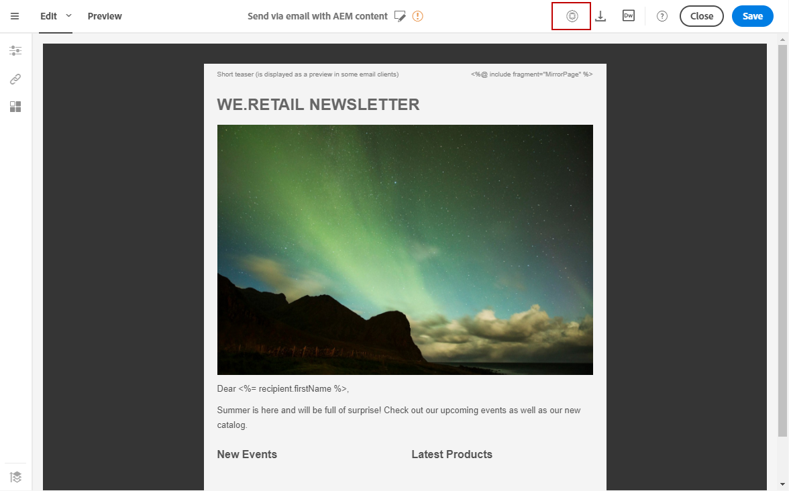

# Integrating with Experience Manager{#integrating-with-experience-manager}

Esta integración entre Adobe Campaign Standard y Adobe Experience Manager le permite utilizar contenido creado en Adobe Experience Manager en los correos electrónicos de Adobe Campaign.

Por lo tanto, puede aprovechar al máximo las funcionalidades de edición de contenido de Adobe Experience Manager, así como las capacidades de entrega de datos y entrega de Adobe Campaign.

>[!NOTE]
>
>No puede realizar pruebas A/B para contenido importado desde Adobe Experience Manager.

Adobe Campaign Standard es compatible con Adobe Experience Manager 6.1, 6.2, 6.3 y 6.4. Las secciones siguientes presentan una descripción general de las acciones que se pueden ejecutar. For more information, refer to the sections dedicated to [configuration](https://helpx.adobe.com/experience-manager/6-4/sites/administering/using/campaignstandard.html) and the [use](https://helpx.adobe.com/experience-manager/6-4/sites/authoring/using/campaign.html) of the integration.

## Prerequisites {#prerequisites}

Debe asegurarse de que dispone de los siguientes elementos de antemano:

* An Adobe Experience Manager **authoring** instance
* An Adobe Experience Manager **publishing** instance
* Una instancia de Adobe Campaign

## Use case {#use-case}

Para crear un contenido de correo electrónico en Adobe Experience Manager:

1. Cree un contenido de correo electrónico con una plantilla creada específicamente para Adobe Campaign.
1. In the content properties, select the **[!UICONTROL Cloud Service]** corresponding to your Adobe Campaign instance.
1. Edite el contenido insertando texto, imágenes, personalización, etc.
1. Valide el contenido.

For more information, refer to the [detailed documentation](https://docs.adobe.com/docs/en/aem/6-2/author/personalization/adobe-campaign/campaign.html).

Para recuperar el contenido de Adobe Campaign:

1. Cree un correo electrónico basado en una plantilla de contenido de tipo de Adobe Experience Manager.
1. Vincule un contenido creado con Adobe Experience Manager mediante la pantalla de definición de contenido de correo electrónico de Adobe Campaign.

## Configuration {#configuration}

Para utilizar estas dos soluciones juntos, debe configurarlas para conectarse entre sí.

1. Configure Adobe Campaign. Para ello:

   * Configure una cuenta externa de tipo Adobe Experience Manager.
   * Configure the **AEMResourceTypeFilter** option, which recognizes the content types created in Adobe Experience Manager for Adobe Campaign.
   * Cree una plantilla de correo electrónico especificando que es contenido de Adobe Experience Manager y vincule la cuenta externa creada anteriormente con esta plantilla.

1. Configure Adobe Experience Manager. Para ello:

   * Configure la replicación entre las instancias de creación y publicación de Adobe Experience Manager.
   * Connect Adobe Experience Manager to Adobe Campaign by configuring a dedicated **[!UICONTROL Cloud Service]**.

