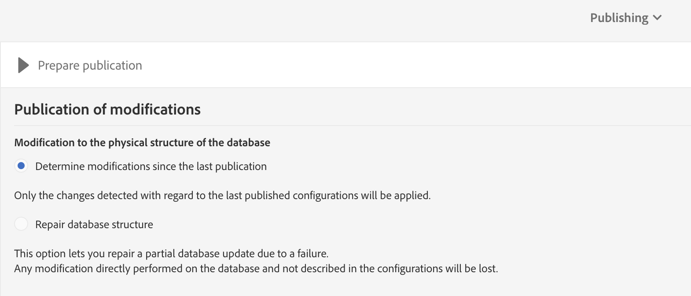

# Asignar recursos personalizados de Campaña y entidades personalizadas de Dynamics 365

Obtenga información sobre cómo asignar recursos personalizados y entidades personalizadas en el contexto de la integración entre Adobe Campaign Standard y Microsoft Dynamics 365.

## Requisitos previos

La nueva versión de la integración [de](../../integrating/using/working-with-campaign-standard-and-microsoft-dynamics-365.md) Microsoft Dynamics 365-Adobe Campaign Standard ofrece compatibilidad con las entidades personalizadas.  Esto permite replicar las entidades personalizadas de Dynamics 365 en los recursos personalizados correspondientes en la Campaña.

Una vez replicados, los nuevos datos de los recursos personalizados pueden utilizarse para varios fines, incluida la segmentación y personalización.

>[!CAUTION]
>
>Si algún registro de recursos personalizados de Campaña contiene información personal, aplicable al uso de la Campaña por parte de un cliente, dicho registro debe vincularse a un registro de perfiles de Campaña correspondiente (ya sea directamente o a través de otro recurso personalizado) de modo que una eliminación relacionada con la privacidad en el registro de perfil también pueda eliminar el registro de recursos personalizados vinculado que contenga información personal; las opciones de vinculación y eliminación entre las entidades deben configurarse para permitir esta eliminación en cascada de los registros vinculados. La información personal no debe introducirse en un recurso personalizado que no esté vinculado al perfil.

En este vínculo se puede encontrar una descripción general más completa de los recursos personalizados de Campaña.

Para configurar la integración de las entidades personalizadas, póngase en contacto con [adobe-support@unifisoftware.com](mailto:adobe-support@unifisoftware.com) para solicitar que se realice.  Unifi requerirá los nombres de las tablas de entidades personalizadas en ambos sistemas, así como las asignaciones de atributos deseadas.  Unifi creará los trabajos y programas correspondientes.

En la sección [Caso de](../../integrating/using/map-campaign-custom-resources-and-dynamics-365-custom-entities.md#UC)uso se puede ver un ejemplo de la compatibilidad con entidades personalizadas.

>[!CAUTION]
>
>* Los recursos personalizados publicados antes de la versión 19.4 de Campaign Standard **deben volver a publicarse** para poder utilizarse con la integración.
>* La creación y modificación de recursos personalizados Campaign Standard son operaciones sensibles que deben realizar únicamente los usuarios expertos.

## Ejemplo de uso

### Estado inicial

El cliente tiene un vehículo de entidad personalizado predefinido en Dynamics 365 y un vehículo de recurso personalizado correspondiente predefinido en Campaign Standard.  El cliente ha proporcionado detalles personalizados de asignación de entidades a Unifi, y Unifi ha configurado los trabajos y programas para el recurso personalizado Vehicle en Unifi.

|   | Microsoft Dynamics 365 | Adobe Campaign Standard | Notas |
|---|---|---|---|
| Entidad de nivel superior | Contacto | Perfil | Entidades estándar integradas |
| Entidad vinculada | Vehículo - nueva entidad personalizada | Vehículo - nuevo recurso personalizado | Nuevas entidades personalizadas |
| Tipo de vínculo | Vínculos parentales con contacto con N:1 | Similar a Dynamics 365 - consulte la sección de Campañas más abajo para obtener más detalles |   |

### Configuración en Dynamics 365

Las entidades personalizadas de este cliente en Dynamics 365 se pueden ver en el Panel de ventas haciendo clic en la lista desplegable situada junto a Dynamics 365.  Las entidades personalizadas de este cliente se agrupan en **[!UICONTROL Extensions]**.

Para ver los datos del vehículo, haga clic en la entidad **[!UICONTROL vehicle]** personalizada.  Véase la lista de los vehículos a continuación.

La relación de la **[!UICONTROL vehicle]** entidad con la **[!UICONTROL Contact]** entidad puede verse a continuación. **[!UICONTROL Parental]** ha sido elegido para el **[!UICONTROL Type of Behavior]**.

### Configuración en Campaign Standard

En Campaña, los recursos personalizados del cliente se pueden ver haciendo clic **[!UICONTROL Adobe Campaign]** en la esquina superior izquierda y luego seleccionando **[!UICONTROL Client data]**.

### Asignación de recursos personalizados y entidades personalizadas

El cliente debería haber predefinido previamente el recurso personalizado y debería aparecer en los datos del cliente; **[!UICONTROL vehicle]** sin embargo, seguiremos los pasos para crear este **[!UICONTROL vehicle]** recurso personalizado.

Haga clic en **[!UICONTROL Adobe Campaign]** en la esquina superior izquierda y luego haga clic en **[!UICONTROL Administration > Development > Custom Resources]**.

1. Haga clic en **[!UICONTROL Custom Resources]**.
1. Haga clic en el botón **[!UICONTROL Create]**.  Se abrirá una ventana emergente.
1. Seleccione **[!UICONTROL Create a new resource]** e introduzca **[!UICONTROL Vehicle]** como etiqueta e ID.
1. Haga clic **[!UICONTROL Create]**.

La Campaña mostrará las estructuras de datos y la página de vínculos.  Se pueden ver varios campos agregados.

* El identificador del vehículo es el identificador único de la **[!UICONTROL Vehicle]** entidad; su ID debe ser exactamente **[!UICONTROL externalId]**, como se muestra a continuación, para que la integración funcione.
* Perfil asociado es la identificación del perfil al que está vinculado el registro del vehículo; cuando se vincule, se vinculará al **[!UICONTROL externalId]** campo de la tabla de Perfil.
* VIN y el nombre del vehículo son campos para capturar información sobre el vehículo.

>[!CAUTION]
>
>Cada recurso personalizado debe tener un campo único con una ID de externalId (exactamente).  Este campo se asignará al campo de ID del recurso personalizado en Dynamics 365 (véase más adelante).

### Definir las claves de identificación

El siguiente paso es definir las claves de identificación.  Primero, cree las claves de identificación, como se muestra a continuación.

En la pantalla Definición de clave, asegúrese de seleccionar el **[!UICONTROL externalId]** campo.

>[!CAUTION]
>
>Cada recurso personalizado debe tener una clave de identificación con una ruta de &quot;externalId&quot; (exactamente).

### Definir el filtro

El siguiente paso es especificar la definición del filtro.

En **[!UICONTROL Filter Definition]**, haga clic en **[!UICONTROL Add an element]**.\
Asigne un nombre a la etiqueta y a la ID **[!UICONTROL ExternalId]**.
Haga clic **[!UICONTROL Add]**.

Ahora, haga clic en editar en el elemento de filtro recién agregado y configure el filtro según la imagen de abajo.  Si introduce **[!UICONTROL externalId]** en el **[!UICONTROL Parameters]** campo y hace clic en el signo más, **[!UICONTROL externalId_parameter]** aparecerá.  Seleccione este parámetro.

### Definir el vínculo

A continuación, especificaremos la vinculación del recurso personalizado.  En este caso, elegimos vincular de la entidad **[!UICONTROL Vehicles]** personalizada (origen) a la entidad perfiles (destinatario) mediante un **[!UICONTROL 1 cardinality simple link]**.

1. En la **[!UICONTROL Link definitions]** pantalla, elija la opción Eliminar: **[!UICONTROL Deleting the target record implies deleting records referenced by the link]**. Elegimos esta opción para que cuando se elimine un perfil, también se eliminen todos **[!UICONTROL Vehicle]** los registros vinculados a ese perfil.
1. En **[!UICONTROL Join Definitions]**, seleccione **[!UICONTROL Define specific join conditions]**.
1. A continuación, haga clic en **[!UICONTROL Add an element]**.

Para la definición de combinación, escribimos los valores siguientes.

Tenga en cuenta que la **[!UICONTROL @externalId]** entrada es el campo externalId de la tabla de perfiles y que la **[!UICONTROL ProfileExternalId]** entrada es la ID del campo correspondiente en el recurso personalizado de vehículos.  Cuando se introduce el valor externoId de un registro de perfil en el **[!UICONTROL ProfileExternalId]** campo de un registro de vehículo, los dos registros se vincularán.

Confirme los cambios y guarde la entidad personalizada.

### Publicar y buscar actualizaciones

El paso final es publicar el recurso personalizado.

1. Haga clic en **[!UICONTROL Adobe Campaign]** en la esquina superior izquierda, haga clic en **[!UICONTROL Administration > Development > Publishing]**.
1. Mantener la opción predeterminada: **[!UICONTROL Determine modifications since the last publication]**.
1. Haga clic **[!UICONTROL Prepare Publication]** y espere a que se complete.

A continuación, haga clic **[!UICONTROL Publish]** y espere a que se complete.

### Programación de ingreso de Unifi

Suponiendo que el cliente ya ha rellenado la entidad personalizada del vehículo en Dynamics 365 y que Unifi ha configurado los trabajos y programas de la entidad personalizada del vehículo, el cliente debe poder iniciar el programa de ingreso de la entidad del vehículo.

Una vez finalizado el trabajo de ingreso, los datos del vehículo ahora se pueden ver en Campaña en el nuevo recurso personalizado **[!UICONTROL Vehicle]** rellenado.

**Temas relacionados**

* Uso de Adobe Campaign Standard - Microsoft Dynamics 365
* Pasos clave para agregar un recurso personalizado en la Campaña
