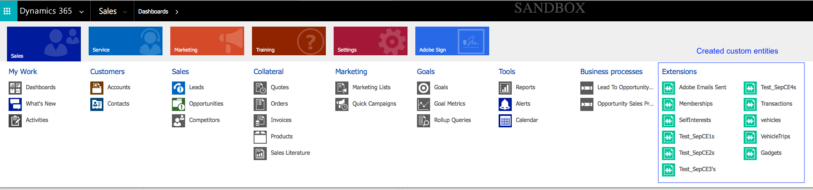
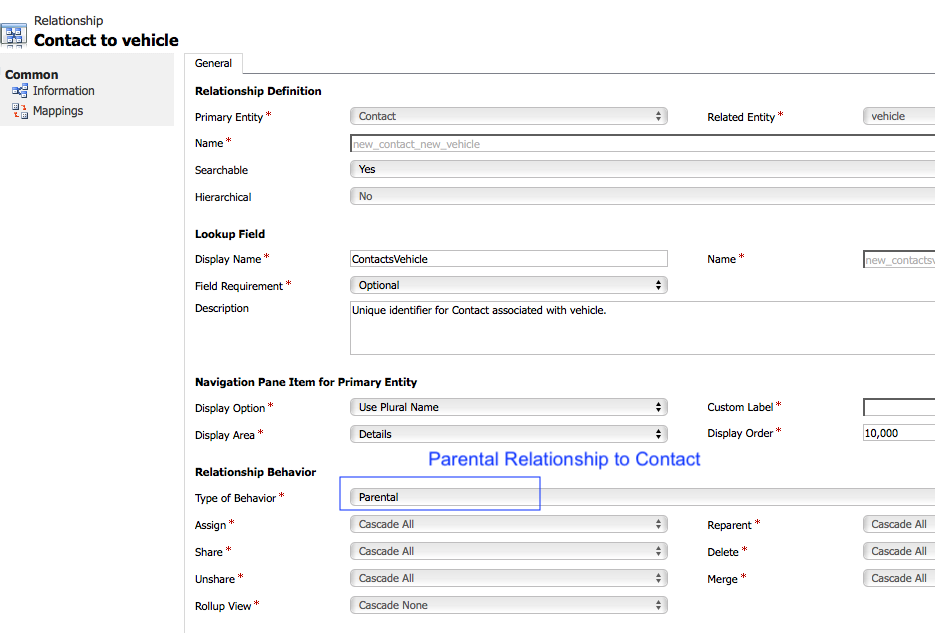

# Asignar recursos personalizados de Campaña y entidades personalizadas de Dynamics 365

Obtenga información sobre cómo asignar recursos personalizados y entidades personalizadas en el contexto de la integración entre Adobe Campaign Standard y Microsoft Dynamics 365.

## Requisitos previos

The new version of the [Microsoft Dynamics 365-Adobe Campaign Standard integration](../../integrating/using/working-with-campaign-standard-and-microsoft-dynamics-365.md) brings support for custom entities.  This allows for custom entities in Dynamics 365 to be replicated over to corresponding custom resources in Campaign.

Once replicated, the new data in the custom resources can be used for several purposes, including segmentation and personalization.

>[!CAUTION]
>
>Si algún registro de recursos personalizados de Campaña contiene información personal, aplicable al uso de la Campaña por parte de un cliente, dicho registro debe vincularse a un registro de perfiles de Campaña correspondiente (ya sea directamente o a través de otro recurso personalizado) de modo que una eliminación relacionada con la privacidad en el registro de perfil también pueda eliminar el registro de recursos personalizados vinculado que contenga información personal; las opciones de vinculación y eliminación entre las entidades deben configurarse para permitir esta eliminación en cascada de los registros vinculados. Personal information should not be entered into a custom resource that is not linked to the profile.

En este vínculo se puede encontrar una descripción general más completa de los recursos personalizados de Campaña.

Para configurar la integración de las entidades personalizadas, póngase en contacto con [adobe-support@unifisoftware.com](mailto:adobe-support@unifisoftware.com) para solicitar que se realice.  Unifi requerirá los nombres de las tablas de entidades personalizadas en ambos sistemas, así como las asignaciones de atributos deseadas.  Unifi will then create the corresponding jobs and schedules.

A continuación se muestra un ejemplo de la compatibilidad con entidades personalizadas.

>[!CAUTION]
>
>* Los recursos personalizados publicados antes de la versión 19.4 de Campaign Standard **deben volver a publicarse** para poder utilizarse con la integración.
>* La creación y modificación de recursos personalizados Campaign Standard son operaciones sensibles que deben realizar únicamente los usuarios expertos.

## Ejemplo de uso

### Estado inicial

El cliente tiene un vehículo de entidad personalizado predefinido en Dynamics 365 y un vehículo de recurso personalizado correspondiente predefinido en Campaign Standard.  El cliente ha proporcionado detalles personalizados de asignación de entidades a Unifi, y Unifi ha configurado los trabajos y programas para el recurso personalizado Vehicle en Unifi.

|   | Microsoft Dynamics 365 | Adobe Campaign Standard | Notas |
|---|---|---|---|
| Top level entity | Contacto | Perfil | Entidades estándar integradas |
| Entidad vinculada | Vehículo - nueva entidad personalizada | Vehículo - nuevo recurso personalizado | Nuevas entidades personalizadas |
| Tipo de vínculo | Vínculos parentales con contacto con N:1 | Similar a Dynamics 365 - consulte la sección de Campañas más abajo para obtener más detalles |   |

### Configuración en Dynamics 365

Las entidades personalizadas de este cliente en Dynamics 365 se pueden ver en el Panel de ventas haciendo clic en la lista desplegable situada junto a Dynamics 365.  Las entidades personalizadas de este cliente se agrupan en **[!UICONTROL Extensions]**.

Para ver los datos del vehículo, haga clic en la entidad **[!UICONTROL vehicle]** personalizada.  Véase la lista de los vehículos a continuación.

La relación de la **[!UICONTROL vehicle]** entidad con la **[!UICONTROL Contact]** entidad puede verse a continuación. **[!UICONTROL Parental]** ha sido elegido para el **[!UICONTROL Type of Behavior]**.

### Configuración en Campaign Standard

In Campaign, the customer&#39;s custom resources can be viewed by clicking **[!UICONTROL Adobe Campaign]** in the upper left corner, then selecting **[!UICONTROL Client data]**.

### Map custom resources and custom entities

The **[!UICONTROL vehicle]** custom resource should have been previously predefined by the customer and should show show up in Client data; however, we&#39;ll walk through the steps of creating this **[!UICONTROL vehicle]** custom resource below.

Click on **[!UICONTROL Adobe Campaign]** in the upper left corner, then click on **[!UICONTROL Administration > Development > Custom Resources]**.

1. Click on **[!UICONTROL Custom Resources]**.
1. Haga clic en el botón **[!UICONTROL Create]**.  This will open a pop-up window.
1. Seleccione **[!UICONTROL Create a new resource]** e introduzca **[!UICONTROL Vehicle]** como etiqueta e ID.
1. Haga clic **[!UICONTROL Create]**.

Campaign will then display data structures and link page.  You can see that several fields have been added.

* Vehicle ID is the unique identifier for the **[!UICONTROL Vehicle]** entity; its ID must be exactly **[!UICONTROL externalId]**, as shown below, for the integration to work.
* Associated Profile is the ID of the profile the Vehicle record is linked to; when this is linked, it will be linked to the **[!UICONTROL externalId]** field of the Profile table.
* VIN and Vehicle name are fields to capture information about the vehicle.

>[!CAUTION]
>
>Each custom resource must have a unique field with an ID of externalId (exactly).  This field will map to the ID field of the custom resource in Dynamics 365 (see below).

### Define the identification keys

The next step is to define the identification keys.  Primero, cree las claves de identificación, como se muestra a continuación.

In the Key definition screen, make sure to select the **[!UICONTROL externalId]** field.

>[!CAUTION]
>
>Each custom resource must have an identification key with a Path of &quot;externalId&quot; (exactly).

### Define the filter

The next step is to specify the filter definition.

Under **[!UICONTROL Filter Definition]**, click **[!UICONTROL Add an element]**.\
Give the label and ID the name **[!UICONTROL ExternalId]**.
Haga clic **[!UICONTROL Add]**.

Now, click edit on the newly added filter element and configure the filter per the image below.  If you enter **[!UICONTROL externalId]** in the **[!UICONTROL Parameters]** field and click the plus sign, **[!UICONTROL externalId_parameter]** will appear.  Select this as the parameter.

### Define the link

Next we will specify the linking of the custom resource.  In this case, we chose to link from the **[!UICONTROL Vehicles]** custom entity (source) to the profiles entity (target) using a **[!UICONTROL 1 cardinality simple link]**.

1. In the **[!UICONTROL Link definitions]** screen, choose the delete option: **[!UICONTROL Deleting the target record implies deleting records referenced by the link]**. Elegimos esta opción para que cuando se elimine un perfil, también se eliminen todos **[!UICONTROL Vehicle]** los registros vinculados a ese perfil.
1. En **[!UICONTROL Join Definitions]**, seleccione **[!UICONTROL Define specific join conditions]**.
1. A continuación, haga clic en **[!UICONTROL Add an element]**.

Para la definición de combinación, escribimos los valores siguientes.

Tenga en cuenta que la **[!UICONTROL @externalId]** entrada es el campo externalId de la tabla de perfiles y que la **[!UICONTROL ProfileExternalId]** entrada es la ID del campo correspondiente en el recurso personalizado de vehículos.  Cuando se introduce el valor externoId de un registro de perfil en el **[!UICONTROL ProfileExternalId]** campo de un registro de vehículo, los dos registros se vincularán.

Confirme los cambios y guarde la entidad personalizada.

### Publicar y buscar actualizaciones

El paso final es publicar el recurso personalizado.

1. Haga clic en **[!UICONTROL Adobe Campaign]** en la esquina superior izquierda, haga clic en **[!UICONTROL Administration > Development > Publishing]**.
1. Mantener la opción predeterminada: **[!UICONTROL Determine modifications since the last publication]**.
1. Haga clic **[!UICONTROL Prepare Publication]** y espere a que se complete.

A continuación, haga clic **[!UICONTROL Publish]** y espere a que se complete.

### Programación de ingreso de Unifi

Suponiendo que el cliente ya ha rellenado la entidad personalizada del vehículo en Dynamics 365 y que Unifi ha configurado los trabajos y programas de la entidad personalizada del vehículo, el cliente debe poder iniciar el programa de ingreso de la entidad del vehículo.

Una vez finalizado el trabajo de ingreso, los datos del vehículo ahora se pueden ver en Campaña en el nuevo recurso personalizado **[!UICONTROL Vehicle]** rellenado.

**Temas relacionados**

* [Uso de Adobe Campaign Standard - Microsoft Dynamics 365](../../integrating/using/working-with-campaign-standard-and-microsoft-dynamics-365.md)
* [Pasos clave para agregar un recurso personalizado en la Campaña](../../developing/using/key-steps-to-add-a-resource.md)
