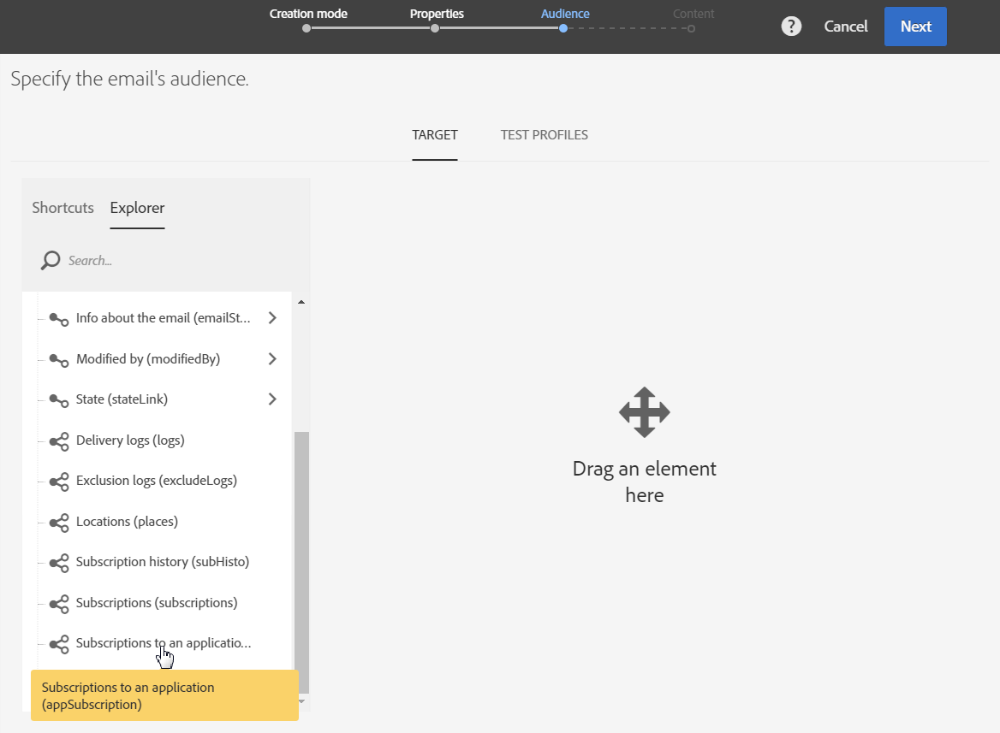
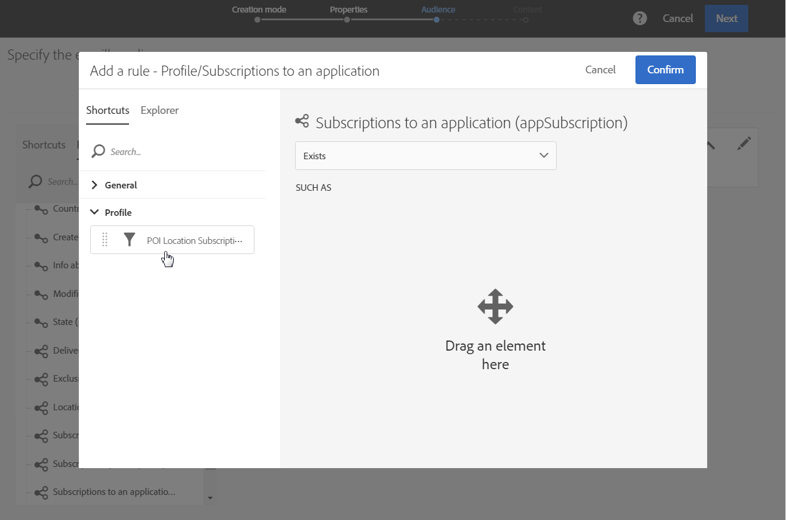

# Personalización de mensajes de Campaign con datos de Puntos de interés{#personalizing-campaign-messages-with-point-of-interest-data}

En Adobe Campaign, puede utilizar los datos de puntos de interés recopilados de los suscriptores de su aplicación móvil para enviarles mensajes de marketing personalizados, como un correo electrónico.

Solo puede reaccionar en los datos del punto de interés con los envíos estándar. [Mensajes transaccionales](../../channels/using/getting-started-with-transactional-msg.md) no puede utilizar datos de ubicación.

Lo más temprano que puedes reaccionar es de unos 10 minutos.

En este caso, decide enviar un correo electrónico a todos los suscriptores que hayan visitado su tienda de Boston en las últimas dos semanas.

1. Cree una actividad de marketing por correo electrónico.
1. Al definir la audiencia de la entrega, arrastre y suelte la **[!UICONTROL Subscriptions to an application]** en el espacio de trabajo.

   

   La administración de audiencias se detalla en la sección [Definición de audiencias](../../audiences/using/creating-audiences.md) para obtener más información.

1. En el **[!UICONTROL Add a rule - Profile/Subscriptions to an application]** , arrastre y suelte la **[!UICONTROL POI Location Subscription]** en el espacio de trabajo.

   

1. En el **[!UICONTROL Add a rule - POI Location Subscription]** , introduzca la etiqueta del punto de interés que desea utilizar.

   

1. En el campo **[!UICONTROL Filter type]**, seleccione **[!UICONTROL Relative]**.
1. Marque la **[!UICONTROL Preceding days]** y escriba **[!UICONTROL 15]** en el campo correspondiente.
1. Defina el número de veces que el usuario debe haber visitado el punto de interés.
1. Haga clic en **[!UICONTROL Confirm]** para guardar la audiencia.

   

1. Añada contenido al correo electrónico.

   

1. Confirme la creación de la actividad para ver el panel del correo electrónico.
1. Envíe su mensaje.

El correo electrónico con la oferta de 10 % de descuento se envía a los suscriptores que:

* Visitó su tienda de Boston al menos una vez en las últimas dos semanas.
* Tenía la aplicación móvil en primer plano al menos una vez durante la visita.

**Temas relacionados:**

* [Creación de un correo electrónico](../../channels/using/creating-an-email.md)
* [Definición del contenido](../../designing/using/personalization.md#example-email-personalization)
* [Envío de mensajes](../../sending/using/confirming-the-send.md)
