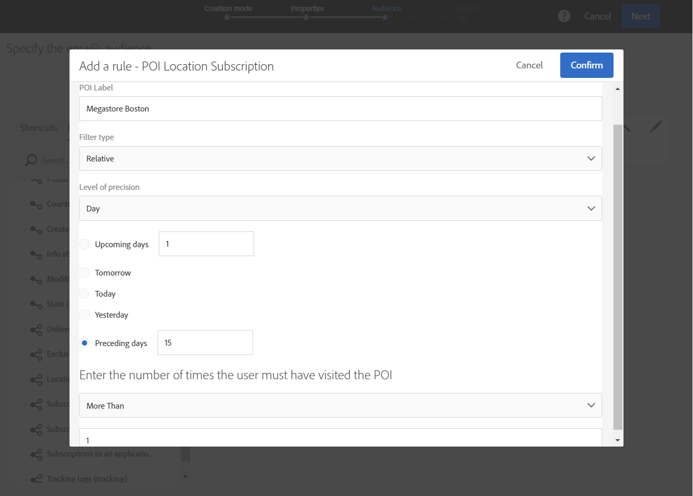

# Personalización de mensajes de Campaign con datos de Puntos de interés{#personalizing-campaign-messages-with-point-of-interest-data}

En Adobe Campaign, puede utilizar los datos de puntos de interés recopilados de los suscriptores de la aplicación móvil para enviarles mensajes de marketing personalizados, como un correo electrónico.

Solo puede reaccionar con los datos del punto de interés con envíos estándar. [Los mensajes transaccionales](../../channels/using/getting-started-with-transactional-msg.md) no pueden usar datos de ubicación.

Lo más pronto que puede reaccionar es de unos 10 minutos.

En este caso, decide enviar un correo electrónico a todos los suscriptores que hayan visitado su tienda de Boston en las últimas dos semanas.

1. Cree una actividad de marketing por correo electrónico.
1. Al definir la audiencia de la entrega, arrastre y suelte el elemento **[!UICONTROL Subscriptions to an application]** en el espacio de trabajo.

   

   La administración de audiencias se detalla en la sección [Definición de audiencias](../../audiences/using/creating-audiences.md).

1. En la ventana **[!UICONTROL Add a rule - Profile/Subscriptions to an application]**, arrastre y suelte el elemento **[!UICONTROL POI Location Subscription]** en el área de trabajo.

   

1. En la ventana **[!UICONTROL Add a rule - POI Location Subscription]**, escriba la etiqueta del punto de interés que desea utilizar.

   

1. En el campo **[!UICONTROL Filter type]**, seleccione **[!UICONTROL Relative]**.
1. Marque la opción **[!UICONTROL Preceding days]** e introduzca **[!UICONTROL 15]** en el campo correspondiente.
1. Defina el número de veces que el usuario debe haber visitado el punto de interés.
1. Haga clic **[!UICONTROL Confirm]** para guardar la audiencia.

   

1. Añada contenido al correo electrónico.

   

1. Confirme la creación de la actividad para ver el tablero del correo electrónico.
1. Envíe su mensaje.

El correo electrónico con la oferta de descuento del 10 % se envía a los suscriptores que:

* Visitó su tienda de Boston al menos una vez en las últimas dos semanas.
* La aplicación móvil estaba en primer plano al menos una vez durante la visita.

**Temas relacionados:**

* [Creación de un correo electrónico](../../channels/using/creating-an-email.md)
* [Definición del contenido](../../designing/using/personalization.md#example-email-personalization)
* [Envío de mensajes](../../sending/using/confirming-the-send.md)
