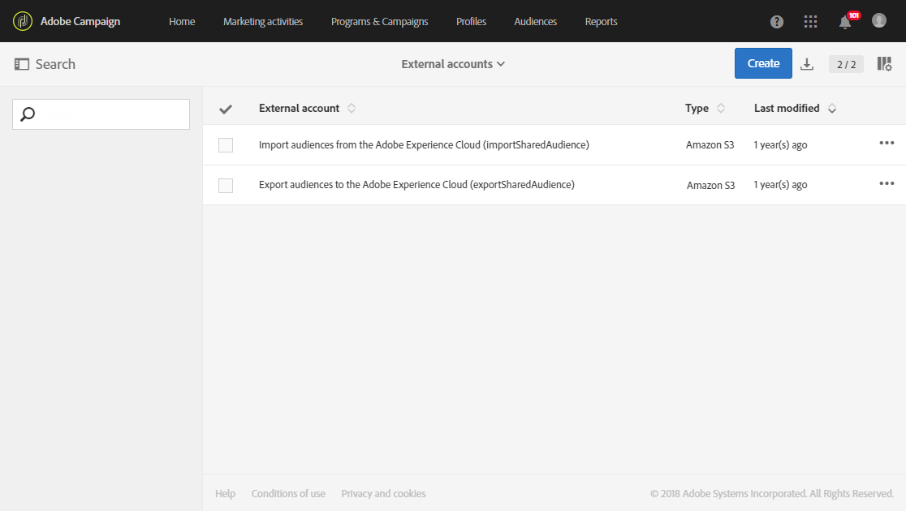

# Aprovisionamiento y configuración de la integración con Audience Manager o el servicio principal People{#provisioning-and-configuring-integration-with-audience-manager-or-people-core-service}

El aprovisionamiento y la configuración de Audience Manager y People core en Adobe Campaign llevan a cabo dos pasos: [Envío de la solicitud al Adobe](#submitting-request-to-adobe) y luego [Configuración de la integración en Adobe Campaign](#configuring-the-integration-in-adobe-campaign).

## Envío de la solicitud a Adobe {#submitting-request-to-adobe}

La integración de Audience Manager (AAM) o servicio principal People permite importar y exportar audiencias o segmentos en Adobe Campaign.

Esta integración debe configurarse primero. Para solicitar esta integración, escriba un correo electrónico a [Digital-Request@adobe.com](mailto:Digital-Request@adobe.com) con la siguiente información:

<table> 
 <tbody> 
  <tr> 
   <td> <strong>Tipo de solicitud:</strong>  </td> 
   <td> Configuración de la integración AAM/servicio principal Personas de Campaign </td> 
  </tr> 
  <tr> 
   <td> <strong>Nombre de la organización</strong>  </td> 
   <td> Nombre de su organización </td> 
  </tr> 
  <tr> 
   <td> <strong>ID de organización IMS</strong>  </td> 
   <td> Su ID de la organización IMS.   Puede encontrar la ID de la organización IMS en Experience Cloud, en el menú Administration. También se proporciona al conectarse por primera vez a Adobe Experience Cloud. </td> 
  </tr> 
  <tr> 
   <td> <strong>Entorno:</strong>  </td> 
   <td> Ejemplo: Producción </td> 
  </tr> 
  <tr> 
   <td> <strong>AAM o servicio Personas</strong>  </td> 
   <td> Ejemplo: Adobe Audience Manager. Asegúrese de mencionar al equipo de aprovisionamiento si posee o no una licencia de Audience Manager.</td> 
  </tr> 
  <tr> 
   <td> <strong>ID declarada o ID de visitante</strong>  </td> 
   <td> Ejemplo: ID declarado </td> 
  </tr> 
  <tr> 
   <td> <strong>Información adicional</strong>  </td> 
   <td> Cualquier información o comentario útil que pueda tener </td> 
  </tr> 
 </tbody> 
</table>

## Configuración de la integración en Adobe Campaign {#configuring-the-integration-in-adobe-campaign}

Después de enviar esta solicitud, el Adobe procederá al aprovisionamiento de la integración para usted y se pondrá en contacto con usted para proporcionar los detalles y la información que necesita para finalizar la configuración:

* [Paso 1: Configuración o verificación de las cuentas externas en Adobe Campaign](#step-1--configure-or-check-the-external-accounts-in-adobe-campaign)
* [Paso 2: Configuración de las fuentes de datos](#step-2--configure-the-data-sources)
* [Paso 3: Configuración del servidor de seguimiento de Campaign](#step-3--configure-campaign-tracking-server)
* [Paso 4: Configuración del servicio de ID de visitante](#step-4--configure-the-visitor-id-service)

### Paso 1: Configuración o verificación de las cuentas externas en Adobe Campaign {#step-1--configure-or-check-the-external-accounts-in-adobe-campaign}

Primero es necesario configurar o comprobar las cuentas externas en Adobe Campaign. Estas cuentas deberían haber sido configuradas por el Adobe y la información necesaria debería haber sido comunicada a usted.

Para ello:

1. En el menú avanzado, seleccione **Administration > Application settings > External accounts**.

   Seleccione una de las siguientes cuentas externas disponibles para esta integración:

   

1. Escriba **[!UICONTROL Receiver server]** en el siguiente formato
1. Introduzca **[!UICONTROL AWS Access Key ID]**, **[!UICONTROL Secret Access Key]** y **[!UICONTROL AWS Region]**.

Sus cuentas externas ya están configuradas para esta integración.

### Paso 2: Configuración de las fuentes de datos {#step-2--configure-the-data-sources}

Las dos fuentes de datos siguientes se crean dentro de Audience Manager: Adobe Campaign (MID) y Adobe Campaign (DeclaredId). Al mismo tiempo, estas dos fuentes de datos están disponibles en Adobe Campaign:

* **[!UICONTROL Recipient - Visitor ID (Defaultdatasources)]**: Constituye una fuente de datos de serie y configurada de forma predeterminada para la ID del visitante. Los segmentos creados con Campaign forman parte de esta fuente de datos.
* **Fuente de** datos de ID declarada: Esta fuente de datos debe crearse y asignarse al Audience Manager con la definición de fuente de  **[!UICONTROL DeclaredId]** datos.

Tenga en cuenta que en el caso de varios sitios web con dominios diferentes, Adobe Campaign no admite la reconciliación basada en ECID.

Para configurar la fuente de datos **[!UICONTROL Recipient - Visitor ID (Defaultdatasources)]**:

1. En **[!UICONTROL Administration]** > **[!UICONTROL Application settings]** > **[!UICONTROL Shared Data Sources]**, seleccione **[!UICONTROL Recipient - Visitor ID (Defaultdatasources)]**.

   

1. Elija **[!UICONTROL Adobe Campaign]** en la lista desplegable **[!UICONTROL Data Source/ Alias]**.
1. Introduzca el **[!UICONTROL AAM Destination ID]** proporcionado por el Adobe.

   

1. En la categoría **[!UICONTROL Reconciliation process]**, se recomienda no cambiar los criterios de reconciliación y utilizar siempre **[!UICONTROL Visitor ID]**.
1. Haga clic en **[!UICONTROL Save]**.

Para crear la fuente de datos **[!UICONTROL Declared ID]**:

1. En **[!UICONTROL Administration]** > **[!UICONTROL Application settings]** > **[!UICONTROL Shared Data Sources]**, haga clic en el botón **[!UICONTROL Create]**.
1. Edite el **[!UICONTROL Label]** del origen de datos.
1. En la lista desplegable **[!UICONTROL Data Source/ Alias]** , elija la fuente de datos correspondiente a la fuente de datos **[!UICONTROL DeclaredID]** del Audience Manager.
1. Configure la fuente de datos introduciendo **[!UICONTROL Data Source / Alias]** y **[!UICONTROL AAM Destination ID]** proporcionados por el Adobe.
1. Establezca el **[!UICONTROL Reconciliation process]** según sea necesario.
1. Haga clic en **[!UICONTROL Save]**.

>[!NOTE]
>
>El campo **[!UICONTROL AAM Destination ID]** no es necesario si está configurando la fuente de datos compartida para la integración [Campaign-Déclencheur](../../integrating/using/configuring-triggers-in-experience-cloud.md). **[!UICONTROL Priority]** solo es necesario al configurar la integración de Déclencheur - Campaign. Priority decide qué fuente de datos se configurará primero. La prioridad puede ser cualquier número, como 1 o 100. Cuanto mayor sea la prioridad, mayor será la preferencia durante la reconciliación.

### Paso 3: Configuración del servidor de seguimiento de Campaign {#step-3--configure-campaign-tracking-server}

Para la configuración de la integración con el servicio principal Personas o Audience Manager, también es necesario configurar el servidor de seguimiento de campañas.

En este caso, debe asegurarse de que el servidor de seguimiento de campaña está registrado en el dominio (CNAME). Puede encontrar más información sobre la configuración del nombre de dominio en [este artículo](https://experienceleague.adobe.com/docs/deliverability-learn/deliverability-best-practice-guide/additional-resources/product-specific-resources/campaign/ac-domain-name-setup.html?lang=es).

### Paso 4: Configuración del servicio de ID de visitante {#step-4--configure-the-visitor-id-service}

En caso de que el servicio de ID de visitante no se haya configurado en las propiedades web o sitios web, consulte el siguiente [documento](https://experienceleague.adobe.com/docs/id-service/using/implementation/setup-aam-analytics.html?lang=es) o el siguiente [vídeo](https://helpx.adobe.com/es/marketing-cloud/how-to/email-marketing.html#step-two) para aprender a configurar el servicio.

La configuración y el suministro han finalizado, la integración ya puede utilizarse para importar y exportar audiencias o segmentos.
