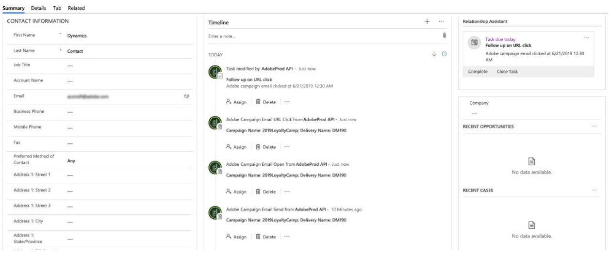

# Uso de Microsoft Dynamics 365 con la integración de Campaign Standard

Esta integración realiza varios trabajos:

* **Sincronización** de contacto: Los contactos se envían de Dynamics 365 a la Campaña (nota: sincronización unidireccional).
* **Sincronización** de entidad personalizada: Los registros de entidad personalizados se envían de Dynamics 365 a la Campaña (observe la sincronización unidireccional).  Consulte la página sobre entidades personalizadas para obtener más información.
* **Pantalla** de Evento: Algunos eventos de marketing por correo electrónico se envían de Campaña a Dynamics 365. Consulte la nota siguiente.
* **Eliminación** de contacto: El perfil de Campaña se agrega a la cola de eliminación relacionada con la privacidad cuando se elimina el contacto correspondiente en Dynamics 365.
* **Sincronización** de exclusión: Las opciones de exclusión se sincronizan entre Dynamics 365 y la Campaña según la configuración que seleccione el cliente durante la incorporación (es decir, Dynamics 365 para sincronizar Campañas, Campaña a la sincronización con Dynamics 365 o sincronización bidireccional).
* **Inicio de sesión único (SSO)**: Se puede acceder a los detalles de la integración en Unifi directamente desde la Campaña, mediante la autenticación IMS de Adobe.

>[!NOTE]
>
>Para la visualización **de** Eventos, se recuperará un máximo de 10.000 eventos cada vez que se ejecute el trabajo de salida en Unifi.

## Experiencia del usuario de Adobe Campaign Standard

Cuando se crea un contacto nuevo o se modifica en Dynamics 365, se sincroniza con la Campaña después de que se haya ejecutado la sincronización de Contactos.  Estos contactos estarán visibles en la pantalla Perfiles de la Campaña y se pueden dirigir a campañas de marketing.  Consulte la pantalla Perfiles que aparece a continuación.

Cuando se elimina un contacto en Dynamics 365, el perfil correspondiente en Campaña se agrega a la cola de eliminación del servicio de privacidad en la pantalla Solicitud de privacidad de la Campaña.  Para obtener más información sobre la ejecución de solicitudes de eliminación del sujeto de datos, según sea necesario para cumplir con las leyes de privacidad de datos aplicables en Campaña, consulte Cómo ejecutar solicitudes de eliminación con mandato legal en Adobe Campaign Standard.

Es importante tener en cuenta que, si tiene activado el proceso de dos pasos en la pantalla de propiedades, deberá confirmar manualmente la eliminación de cada registro en la pantalla de privacidad antes de que se elimine por fin.  Consulte la pantalla de proceso de 2 pasos a continuación:

Cuando se modifica un atributo de exclusión/lista negra en la Campaña, se reflejará en Dynamics 365 si ha seleccionado la configuración de exclusión bidireccional o de Campaña a Dynamics 365 y si tiene ese atributo concreto correctamente asignado.

Para acceder a los detalles de la integración mediante el inicio de sesión único, vaya al menú Navegación de Campaña y haga clic en Administración > Integración de Microsoft Dynamics 365.

Esta página contiene vínculos a documentación sobre la integración y directrices sobre cómo utilizar las funciones de acuerdo con sus posibles obligaciones legales. Haga clic en el icono del globo, que automáticamente lo enrutará e iniciará sesión en su instancia de Unifi, donde podrá administrar sus detalles de integración.

Puede ver un video de esta funcionalidad en el siguiente video.

>[!VIDEO](https://video.tv.adobe.com/v/29254)

>[!NOTE]
>
>Deberá enviar un ticket al Servicio de atención al cliente de Adobe (directamente o a través de su contacto de Adobe) para que el indicador de inicio de sesión único esté habilitado en la instancia de Campaña.

>[!NOTE]
>
>No verá el icono de integración de Microsoft Dynamics 365 en el panel de administración de forma predeterminada.  Usted (o su contacto de Adobe) deberá enviar un ticket para habilitar este indicador de función para su instancia de Campaña.
>
>Además, Unifi deberá habilitar a los usuarios para el acceso SSO antes de que puedan iniciar sesión correctamente mediante SSO desde la Campaña.

## Experiencia del usuario de Microsoft Dynamics 365

Para mostrar eventos, se envían los siguientes eventos de marketing por correo electrónico de Campaña a Dynamics 365 y se muestran en la vista de línea de tiempo de Dynamics 365 como actividades personalizadas:

* Envío de correo electrónico de Adobe Campaign

* Apertura de correo electrónico de Adobe Campaign

* Clic en URL de correo electrónico de Adobe Campaign

* Devolución de correo electrónico de Adobe Campaign

Para realizar la vista de la cronología de un contacto, vaya a la lista de contactos haciendo clic en el centro de ventas en el menú desplegable Dynamics 365.  A continuación, haga clic en Contactos en la barra de menús de la izquierda y seleccione un contacto.

>[!NOTE]
>
>La aplicación de Adobe Campaign para Dynamics 365 en AppSource deberá estar instalada en la instancia de Dynamics 365 para poder realizar la vista de estos eventos.

Debajo puede ver una instantánea de la pantalla Contacto para &quot;Usuario de Dynamics&quot;.  En la vista Línea de tiempo, verá que se ha enviado un correo electrónico al usuario de Dynamics asociado con el nombre de Campaña &quot;2019LoyaltyCamp&quot; y el nombre de Envío &quot;DM190&quot;.  El usuario de Dynamics abrió el correo electrónico y también hizo clic en una dirección URL del mismo; ambas acciones crearon eventos que también se muestran a continuación.  Si mira hacia la esquina derecha, verá la tarjeta del Asistente de relaciones (RA); actualmente, contiene una tarea para realizar un seguimiento de la dirección URL donde se hizo clic.

Consulte a continuación para ver un resumen de la vista de línea de tiempo para el usuario de Dynamics.

A continuación se muestra un primer plano de la tarjeta del Asistente de Relaciones (RA).  La aplicación AppSource contiene un flujo de trabajo que busca un evento de clics en URL de correo electrónico de Adobe.  Cuando se produce este evento, se crea una tarea y se establece una fecha de vencimiento.  Esto permite que la tarea aparezca en la tarjeta RA, lo que le proporciona una visibilidad adicional.  Existe un flujo de trabajo similar para los eventos de devolución de correo electrónico de Adobe, que agrega una tarea para reconciliar la dirección de correo electrónico no válida.  Estos flujos de trabajo pueden desactivarse en la solución.

Si hace clic en el asunto del evento de envío, verá un formulario similar al siguiente.  Los formularios para los eventos de apertura y devolución son similares.

El formulario para los eventos de clics en direcciones URL de correo electrónico agrega un atributo adicional para la dirección URL en la que se hizo clic:

A continuación se muestra una lista de los atributos y una descripción:

* Asunto: Asunto del evento; compuesto por el ID de Campaña y el ID de Envío del envío de correo electrónico

* Propietario: Usuario de la aplicación que se crea en los pasos posteriores al aprovisionamiento

* Sobre: El nombre del contacto

* Nombre de Campaña: El ID de Campaña en el Campaign Standard

* Nombre del Envío: ID de Envío en Campaign Standard

* Fecha de envío/apertura/clic/abono: Fecha y hora en que se creó el evento

* URL de seguimiento: Dirección URL en la que se hizo clic

* URL de Página espejo: Dirección URL de la página espejo del correo electrónico que se ha enviado/abierto/en el que se ha hecho clic/devuelto

Puede ver un vídeo de la URL de página espejo que se está utilizando en el siguiente vídeo.

>[!VIDEO](https://video.tv.adobe.com/v/29253)

>[!NOTE]
>
>Para la exclusión, cuando se modifica un atributo de exclusión en Dynamics 365, se reflejará en la Campaña si ha seleccionado la configuración de la exclusión bidireccional o de Dynamics 365 to-Campaña y si tiene ese atributo concreto asignado correctamente.

**Temas relacionados**

* Configurar Campaña para la integración de Campaña/Dynamics 365
* Configuración de Dynamics para la integración de Campaña/Dynamics 365
* Configurar Unifi para la integración de Campaña/Dynamics 365
* Obtenga información sobre cómo asignar recursos personalizados y entidades personalizadas