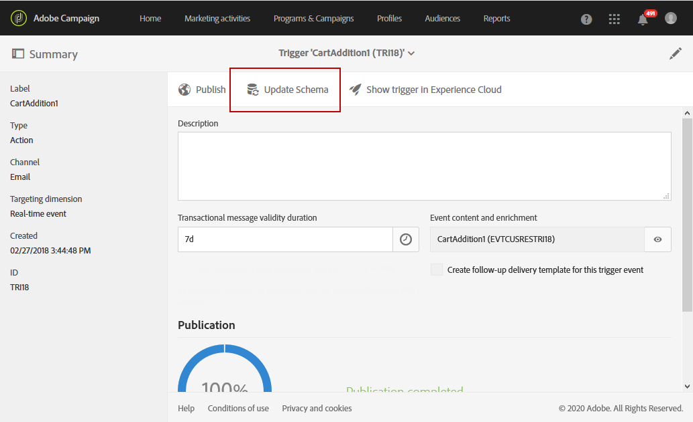

# Uso de activadores en Campaign{#using-triggers-in-campaign}

## Creación de un activador asignado en Campaign {#creating-a-mapped-trigger-in-campaign}

Debe asegurarse de definir los comportamientos que desea supervisar de antemano en Adobe Experience Cloud ( **[!UICONTROL Triggers]** servicio principal). Para obtener más información sobre esto, consulte la documentación [de](https://marketing.adobe.com/resources/help/en_US/mcloud/triggers.html)Adobe Experience Cloud. Tenga en cuenta que cuando define el activador, debe activar los alias. Para cada comportamiento (navegación/abandono de formulario, adición/eliminación de productos, sesión caducada, etc.), se debe agregar un nuevo activador en Adobe Experience Cloud.

Ahora tiene que crear un evento desencadenador en Adobe Campaign basado en un activador existente de Adobe Experience Cloud.

Puede ver este [vídeo](https://helpx.adobe.com/marketing-cloud/how-to/email-marketing.html#step-two) para ayudarle a comprender cómo se configuran los activadores en Adobe Campaign.

Los pasos para ponerlo en práctica son:

1. Haga clic en el **[!UICONTROL Adobe Campaign]** logotipo, en la esquina superior izquierda, luego seleccione **[!UICONTROL Marketing plans]** &gt; **[!UICONTROL Transactional messages]** &gt; **[!UICONTROL Experience Cloud Triggers]**.

   

1. Click the **[!UICONTROL Create]** button. El asistente de creación que se abre muestra la lista de todos los activadores definidos en Adobe Experience Cloud. La **[!UICONTROL Fired by Analytics]** columna muestra el número de eventos enviados por el activador de Adobe Experience Cloud a Campaign. Se trata de una asignación de activadores creados en la interfaz de Experience Cloud.

   

1. Seleccione el activador de Adobe Experience Cloud que desee utilizar y haga clic en **[!UICONTROL Next]**.
1. Configure las propiedades generales del activador. En este paso del asistente, especifique también el canal y la dimensión de objetivo que se utilizarán para el activador (consulte [Segmentación de dimensiones y recursos](../../automating/using/query.md#targeting-dimensions-and-resources)). A continuación, confirme la creación del activador.
1. Haga clic en el botón a la derecha del **[!UICONTROL Event content and enrichment]** campo para ver el contenido de la carga útil. Esta pantalla también le permite enriquecer los datos del evento con los datos de perfil almacenados en la base de datos de Adobe Campaign. El enriquecimiento se realiza del mismo modo que para un mensaje transaccional estándar.

   

1. En el **[!UICONTROL Transactional message validity duration]** campo, defina la duración durante la cual el mensaje seguirá siendo válido después de que Analytics envíe el evento. Si se define una duración de 2 días, el mensaje dejará de enviarse después de que haya pasado esa duración. Si pone varios mensajes en espera, esto garantiza que esos mensajes no se enviarán si los reanuda después de un período de tiempo determinado.

   

1. Si se define una puntuación de tendencia en Analytics (consulte la documentación [de](https://marketing.adobe.com/resources/help/en_US/insight/client/c_visitor_propensity.html)Experience Cloud), puede optar por no enviar el mensaje si el cliente tiene una alta probabilidad de volver al sitio web en un futuro próximo. El contenido de la puntuación y el umbral está disponible en el contenido de la carga útil para que pueda utilizar esos valores para personalizar el mensaje. Para utilizar esta opción, marque la casilla en la parte inferior de la pantalla. Los clientes con una alta probabilidad de volver al sitio en un futuro próximo no recibirán un mensaje.
1. Haga clic en el **[!UICONTROL Publish]** botón para empezar a publicar el evento desencadenador.
1. Si necesita realizar un cambio en el esquema de activación incluso después de publicar el evento de activación, haga clic en el **[!UICONTROL Update schema]** botón para recuperar los cambios más recientes.

   Tenga en cuenta que esta acción cancelará la publicación del activador y del mensaje transaccional; se le solicitará que vuelva a publicarlos posteriormente.

   

El **[!UICONTROL Show Trigger in Experience Cloud]** botón le permite ver la definición del activador en Adobe Experience Cloud.

Una vez publicado el evento, se crea automáticamente una plantilla transaccional vinculada al nuevo evento. Después debe modificar y publicar la plantilla que acaba de crear. Para obtener más información sobre esto, consulte la sección [Edición de la plantilla](../../start/using/about-templates.md) .

## Edición de la plantilla de mensaje transaccional {#editing-the-transactional-message-template}

Una vez creado y publicado el evento desencadenador, la plantilla transaccional correspondiente se crea automáticamente. Para obtener más información sobre esto, consulte la sección [Creación de un activador asignado en Campaign](#creating-a-mapped-trigger-in-campaign) .

Para que el evento active el envío de un mensaje transaccional, debe personalizar la plantilla, probarla y publicarla. Estos pasos son los mismos que para un mensaje transaccional estándar. For more on this, refer to the [Transactional template](../../channels/using/event-transactional-messages.md#personalizing-a-transactional-message) section.

>[!NOTE]
>
>Si cancela la publicación de la plantilla, se cancelará automáticamente la publicación del evento desencadenador.

Al editar contenido, puede agregar un campo de personalización basado en la información enviada por el activador de Analytics. Si enriquece los datos del evento con los datos de perfil de Adobe Campaign, puede personalizar el mensaje en función de esta información. Para personalizar el mensaje, seleccione **[!UICONTROL Transactional event]** &gt; **[!UICONTROL Event context]** y seleccione un campo.

## Acceso a los informes {#accessing-the-reports}

Para ver el informe de desencadenador dedicado en Adobe Campaign, abra el evento de activador que creó anteriormente y haga clic en **[!UICONTROL Show trigger report]**.

El informe muestra el número de eventos procesados en comparación con el número de eventos enviados por Analytics. También muestra una lista de todos los activadores recientes.

