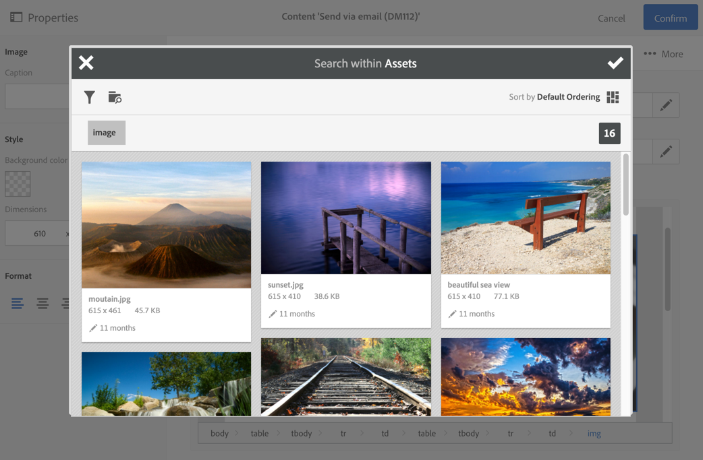

# Uso de Campaign y del servicio principal Assets{#working-with-campaign-and-assets-core-service}

La integración del servicio principal de Assets o Assets on Demand (según la configuración de su entorno de Adobe Experience Cloud) con Adobe Campaign le permite utilizar cualquier recurso compartido dentro de Adobe Experience Cloud en los correos electrónicos y las páginas de aterrizaje de Adobe Campaign.

La integración con el servicio principal de Assets está restringida a [administradores funcionales](../../administration/using/users-management.md#functional-administrators).

Los recursos compartidos desde Adobe Experience Cloud se pueden utilizar en los correos electrónicos y páginas de aterrizaje de la siguiente manera:

1. Al editar el contenido de un correo electrónico o de una página de aterrizaje, vaya a un bloque de imagen y, a continuación, seleccione **[!UICONTROL Image shared from Adobe Experience Cloud]** mediante el menú contextual.

   

1. En la ventana de selección que se abre, seleccione una imagen y, a continuación, confirme la selección.

   

Luego se inserta la imagen. Ahora la entrega se puede personalizar según sea necesario y se realiza.

**Temas relacionados:**

* [Assets y uso compartido](https://experienceleague.adobe.com/docs/core-services/interface/assets/experience-cloud-assets.html?lang=es)
* [Editor de contenido](../../designing/using/personalization.md#example-email-personalization)
