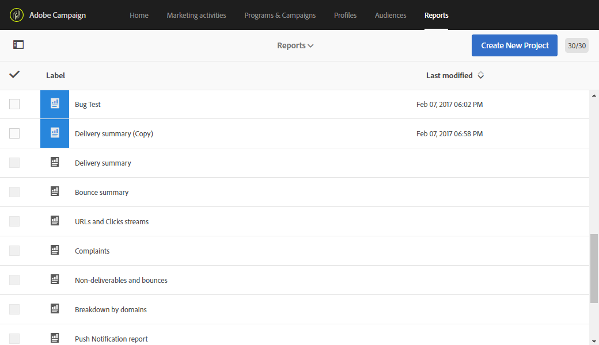

# Introducción a los informes dinámicos {#about-dynamic-reports}

El sistema de informes dinámico proporciona informes totalmente personalizables y en tiempo real. Añade acceso a los datos de perfil, lo que permite el análisis demográfico por dimensiones de perfil como sexo, ciudad y edad, además de datos funcionales de campaña de correo electrónico como aperturas y clics. Con la interfaz de arrastrar y soltar, puede explorar datos, determinar el rendimiento de sus campañas de correo electrónico en relación con los segmentos de clientes más importantes y medir su impacto en los destinatarios.

>[!NOTE]
>
>Solo los usuarios con derechos de administración o con unidades organizativas establecidas en **Todo** Puede crear o guardar un nuevo informe. Para obtener más información, consulte [esta sección](../../administration/using/users-management.md).

## Acceso a informes dinámicos {#accessing-dynamic-reports}

Se puede acceder a los informes:

* En la página de inicio, seleccionando **[!UICONTROL Reports]** en la barra superior o en la pestaña **[!UICONTROL Reports]** para acceder a los informes de todas las entregas.

  

* En cada programa, campaña y mensaje, desde el **Informes** haciendo clic en **Informes dinámicos** para ver únicamente los informes específicos de la entrega.

  

Algunos informes no pueden estar disponibles inmediatamente después de una entrega, según el tiempo que tarde en recopilar y procesar la información.

Los informes dinámicos se dividen en dos categorías:

* **Plantillas**, que se pueden modificar copiándolos con la variable **Guardar como** opción (**Proyecto > Guardar como..**) en la plantilla.
* **Informes personalizados** (identificado en azul), que se puede crear directamente haciendo clic en el **Crear nuevo proyecto** botón en el **Informes** página principal.

>[!NOTE]
>
>Los datos se filtran según las unidades organizativas.

## Acuerdo de uso de creación de informes dinámicos {#dynamic-reporting-usage-agreement}

El propósito del acuerdo de uso de creación de informes dinámicos es funcionar como un consentimiento emergente para el procesamiento de datos. De forma predeterminada, el acuerdo solo es visible y solo lo pueden aceptar o rechazar los usuarios con derechos de administración.

Hay tres opciones disponibles:

* **[!UICONTROL Ask me later]**: haciendo clic en **Preguntarme más tarde**, la ventana dejará de mostrarse durante 24 horas. Hasta que acepte o rechace el acuerdo, las dimensiones de perfil no aparecerán en sus informes y la información de identificación personal de sus clientes no se recopilará ni enviará.
* **[!UICONTROL Accept]**: Al aceptar este acuerdo, autoriza a Adobe Campaign a recopilar la información de identificación personal de sus clientes y a transferirla al centro de informes o datos.
* **[!UICONTROL Decline]**: Al rechazar el acuerdo, las dimensiones del perfil no aparecerán en los informes y la información de identificación personal de los clientes no se recopilará ni enviará. Tenga en cuenta que, en este caso, externalID se seguirá recopilando y utilizando para identificar a los usuarios finales.

La tabla siguiente muestra lo que sucede después de aceptar este acuerdo según su región.

|  | Creación de informes dinámicos | Conector de Microsoft Dynamics 365 |
|---|---|---|
| América y APAC (Asia-Pacífico) | **Función disponible**.  Toda la información de perfiles personalizados y lista para usar (es decir, ciudad, país/región, estado, sexo y segmentos según la edad) que se envía al centro de informes de EE. UU. Para obtener más información sobre las dimensiones de perfil, consulte [página](../../reporting/using/list-of-components.md) | **Función disponible**.  Todos los campos de perfiles personalizados y listos para usar y los campos de eventos de Adobe Campaign Standard se procesan en el centro de datos de EE. UU. |
| EMEA (Europa, Oriente Medio y África) | **Función disponible**.  Toda la información predeterminada (es decir, ciudad, país/región, estado, sexo y segmentos según la edad) y los perfiles personalizados enviados al centro de informes de EMEA. Para obtener más información sobre las dimensiones de perfil, consulte [página](../../reporting/using/list-of-components.md) | **Función disponible.**  Todos los campos de perfiles personalizados y listos para usar y los campos de eventos de Adobe Campaign Standard procesados en el centro de datos de EMEA.  **[!UICONTROL Control data]**que contiene los datos de registro de Adobe I/O y los ID de los eventos del cliente y el usuario final enviados y almacenados en el centro de datos de EE. UU. |

La tabla siguiente muestra lo que sucede después de rechazar este acuerdo según su región. Tenga en cuenta que aunque rechace este acuerdo, los informes sobre entregas y la integración con Microsoft Dynamics 365 seguirán estando disponibles.

| Región | Creación de informes dinámicos | Conector de Microsoft Dynamics 365 |
|---|---|---|
| América y APAC (Asia-Pacífico) | **Función disponible**.   No se inserta información de perfiles personalizados y lista para usar en el centro de informes de EE. UU. con la excepción de ExternalID. | **Función disponible**.  No se envían campos de perfil personalizados o listos para usar al centro de datos de EE. UU. con la excepción del ID externo y el ID de destinatario.  Todos los campos de evento de Adobe Campaign Standard procesados en el centro de datos de EE. UU., excepto el ID de página espejo.  Para obtener más información sobre la integración con Microsoft Dynamics 365, consulte esta sección [página](../../integrating/using/d365-acs-get-started.md). |
| EMEA (Europa, Oriente Medio y África) | **Función disponible**.  No se inserta información de perfiles personalizada y lista para usar en el centro de informes de EMEA, con la excepción de ExternalID. | **Función disponible.**  No se envían campos de perfil personalizados o listos para usar al centro de datos de EMEA, con la excepción del ID externo y el ID de destinatario.  Todos los campos de eventos de Adobe Campaign Standard procesados en el centro de datos de EMEA, excepto el ID de página espejo.   **[!UICONTROL Control data]**que contiene los datos de registro de Adobe I/O y los ID de los eventos del cliente y el usuario final enviados y almacenados en el centro de datos de EE. UU. Para obtener más información sobre la integración con Microsoft Dynamics 365, consulte esta sección [página](../../integrating/using/d365-acs-get-started.md). |

Esta opción no es final, siempre puede cambiarla seleccionando **[!UICONTROL Enable PII data to be transferred to US region to use reporting on Profile data]** in **[!UICONTROL Administration]** > **[!UICONTROL Application Settings]** > **[!UICONTROL Options]**.

El valor se puede cambiar en cualquier momento. El valor 1 corresponde a **[!UICONTROL Ask me later]**, 2 **[!UICONTROL Decline]** y 3 **[!UICONTROL Accept]**.

