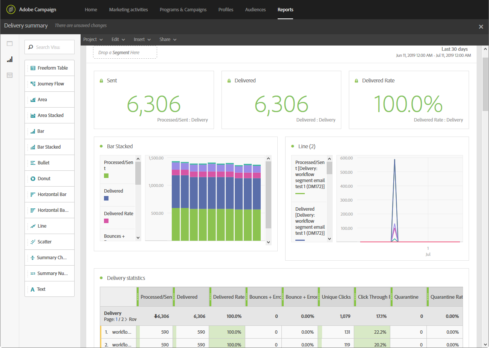

# Acerca de los informes dinámicos{#about-dynamic-reports}

>[!NOTE]
>
>Solo los usuarios con derechos de administración o con unidades organizativas establecidas en **Todo** pueden crear o guardar un nuevo informe. Para obtener más información, consulte [esta sección](../../administration/using/users-management.md).

Informes dinámicos proporciona informes totalmente personalizables y en tiempo real. Agrega acceso a los datos de perfil, permitiendo el análisis demográfico por dimensiones de perfil como sexo, ciudad y edad, además de datos funcionales de campañas de correo electrónico como aperturas y clics. Con la interfaz de arrastrar y soltar, puede explorar datos, determinar el rendimiento de las campañas de correo electrónico en relación con los segmentos de clientes más importantes y medir su impacto en los destinatarios.

Gracias a su menú de arrastrar y soltar y a las visualizaciones personalizables, la función de informes dinámicos le permite combinar dimensiones, métricas e intervalo de tiempo en cualquier combinación, con desgloses y comparaciones ilimitados.

**Temas relacionados:**

* [Lista de informes](../../reporting/using/defining-the-report-period.md)
* [Unidades organizativas](../../administration/using/organizational-units.md)
* [Vídeo de informes](https://helpx.adobe.com/campaign/kt/acs/using/acs-creating-a-dynamic-report-feature-video-use.html) dinámicos

## Acceso a informes dinámicos {#accessing-dynamic-reports}

Se puede acceder a los informes:

* En la página principal, seleccione la **[!UICONTROL Reports]** ficha en la barra superior o la **[!UICONTROL Reports]** tarjeta para acceder a los informes de todas las entregas.

   

* En cada programa, campaña y mensaje, desde el botón **Informes** , haga clic en Informes **** dinámicos para ver únicamente los informes específicos del envío.

   

Ciertos informes no pueden estar disponibles inmediatamente después de un envío, según el tiempo que tarde en recopilar y procesar la información.

Los informes dinámicos se dividen en dos categorías:

* **Plantillas**, que se pueden modificar copiándolas mediante la opción **Guardar como** (**Proyecto &gt; Guardar como...)**) en la plantilla.
* **Los informes** personalizados (identificados en azul), que se pueden crear directamente haciendo clic en el botón **Crear nuevo proyecto** en la página principal de **Informes** .

>[!NOTE]
>
>Los datos se filtran según las unidades organizativas.

## Acuerdo de uso de informes dinámicos {#dynamic-reporting-usage-agreement}

>[!NOTE]
>
>Estos cambios solo se aplican a partir de la versión de Campaign Standard 19.4.

El propósito del acuerdo de uso de informes dinámicos es funcionar como un consentimiento emergente para el procesamiento de datos. De forma predeterminada, el acuerdo solo es visible y solo pueden aceptarlo o rechazarlo los usuarios con derechos de administración.

Hay tres opciones disponibles:

* **[!UICONTROL Ask me later]**:: Al hacer clic en Preguntarme más tarde, la ventana dejará de mostrarse durante 24 horas.
* **[!UICONTROL Accept]**:: Al aceptar este acuerdo, autoriza a Adobe Campaign a recopilar la información de identificación personal de sus clientes y a transferirla al centro de datos o informes.
* **[!UICONTROL Decline]**:: Al rechazar el acuerdo, las dimensiones del perfil no aparecerán en los informes y la información de identificación personal de los clientes no se recopilará ni se enviará. Tenga en cuenta que en este caso, externalID se recopilará y se utilizará para identificar a los usuarios finales.

La siguiente tabla muestra lo que sucede después de aceptar este acuerdo según la región.

|  | Informes dinámicos | Conector de Microsoft Dynamics 365 |
|---|---|---|
| América y APAC (Asia Pacífico) | **Función disponible**.  Toda la información lista para usar (por ejemplo, ciudad, país o región, estado, género y segmentos según la edad) y la información de perfiles personalizados ingresaron al centro de informes de EE.UU. For more information on profile dimensions, refer to this [page](../../reporting/using/list-of-components-.md) | **Función disponible**.  Todos los campos de perfiles predeterminados y personalizados y los campos de eventos de Adobe Campaign Standard se procesan en el centro de datos de EE. UU. |
| EMEA (Europa, Oriente Medio y África) | **Función disponible**.  Toda la información lista para usar (por ejemplo, ciudad, país o región, estado, sexo y segmentos según la edad) y la información de perfiles personalizados se incorporaron al centro de informes de EMEA. For more information on profile dimensions, refer to this [page](../../reporting/using/list-of-components-.md) | **Función disponible.**  Todos los campos de perfiles predeterminados y personalizados y los campos de eventos de Adobe Campaign Standard se procesan en el centro de datos de EMEA. **[!UICONTROL Control data]** que contiene los datos de registro de E/S de Adobe y los ID de eventos de usuario final del cliente enviados y almacenados en el centro de datos de EE. UU. |

La siguiente tabla muestra lo que sucede después de rechazar este acuerdo en función de su región. Tenga en cuenta que, aunque rechace este acuerdo, los informes de entregas y la integración con Microsoft Dynamics 365 seguirán estando disponibles.

| Región | Informes dinámicos | Conector de Microsoft Dynamics 365 |
|---|---|---|
| América y APAC (Asia Pacífico) | **Función disponible**.   No se insertó información de perfiles personalizados ni lista para usar en el centro de informes de EE. UU., excepto ExternalID. | **Función disponible**.  No se han enviado al centro de datos de EE. UU. campos de perfil predeterminados o personalizados, a excepción de ID externa e ID de destinatario.  Todos los campos de eventos de Adobe Campaign Standard procesados en el centro de datos de EE. UU., excepto el código de segmento y el ID de página de reflejo. |
| EMEA (Europa, Oriente Medio y África) | **Función disponible**.  No se insertó información de perfiles personalizados ni lista para usar en el centro de informes de EMEA, con excepción de ExternalID. | **Función disponible.**  No se han enviado al centro de datos de EMEA campos de perfil predeterminados o personalizados con excepción de ID externa e ID de destinatario.  Todos los campos de eventos de Adobe Campaign Standard procesados en el centro de datos de EMEA, a excepción del código de segmento y el ID de página de reflejo. |

Esta opción no es definitiva, siempre puede cambiarla seleccionando **[!UICONTROL Enable PII data to be transferred to US region to use reporting on Profile data]** en **[!UICONTROL Administration]** &gt; **[!UICONTROL Application Settings]** &gt; **[!UICONTROL Options]**.

El valor se puede cambiar en cualquier momento. El valor 1 corresponde a **[!UICONTROL Ask me later]**, 2 **[!UICONTROL Decline]** y 3 **[!UICONTROL Accept]**.

