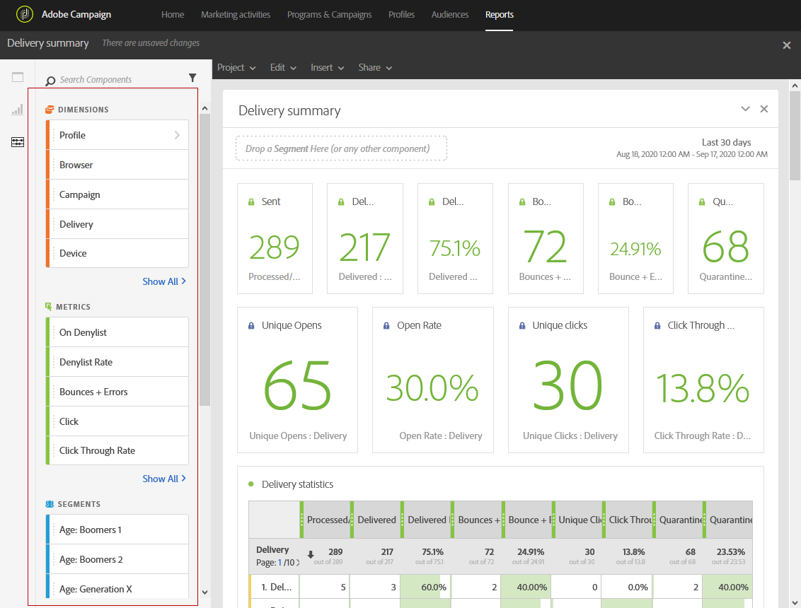

# Adición de componentes{#adding-components}

Los componentes ayudan a personalizar los informes con diferentes dimensiones, métricas y períodos de tiempo.

1. Haga clic en la **[!UICONTROL Components]** ficha para acceder a la lista de componentes.

   

1. Cada categoría presentada en la **[!UICONTROL Components]** ficha muestra los cinco elementos más utilizados, haga clic en el nombre de una categoría para acceder a su lista completa de componentes.

   La tabla de componentes se divide en cuatro categorías:

   * **Dimension**: Obtenga detalles del registro de envíos, como el explorador o dominio del destinatario, o el éxito de un envío.
   * **Métricas**: Obtenga detalles sobre el estado de un mensaje. Por ejemplo, si se entregó un mensaje y el usuario lo abrió.
   * **[!UICONTROL Segments]**:: Filtre los datos en función del intervalo de edad del destinatario. **[!UICONTROL Segments]** se pueden arrastrar y soltar directamente en una tabla improvisada o en la barra superior del panel. De forma predeterminada, el segmento ya está seleccionado, pero se puede cambiar si es necesario. **[!UICONTROL Exclude proof]**

      Esta categoría solo está disponible una vez que el administrador haya aprobado los términos y condiciones del Acuerdo de uso dinámico de Sistemas de informes que se mostrarán en pantalla. Si el administrador rechaza el acuerdo, los segmentos no estarán visibles en la **[!UICONTROL Components]** ficha y no se recopilarán datos.

   * **Hora**: Establezca un período de tiempo para la tabla.

1. Arrastre y suelte los componentes de un panel para filtrar los datos en inicio.

Puede arrastrar y soltar tantos componentes como sea necesario y compararlos entre sí.

**Temas relacionados:**

* [Lista de componentes](../../reporting/using/list-of-components-.md)
* [Lista de informes](../../reporting/using/defining-the-report-period.md)

