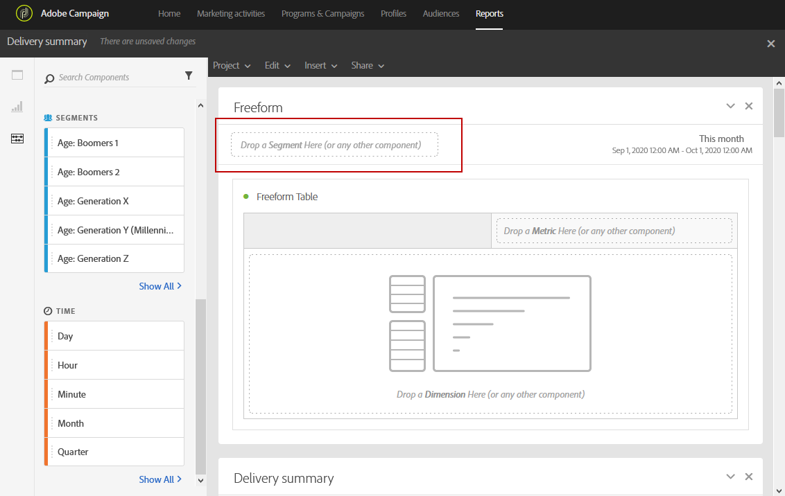

# Adding panels{#adding-panels}

## Adding a blank panel {#adding-a-blank-panel}

Para iniciar el informe, puede agregar un conjunto de paneles a una salida del cuadro o informe personalizado. Cada panel contiene diferentes conjuntos de datos y se compone de tablas y visualizaciones improvisadas.

Este panel permite crear los informes según sea necesario. Puede agregar tantos paneles como desee en los informes para filtrar los datos con diferentes períodos de tiempo.

1. Click the **Panels** icon. You can also add a panel by clicking the **Insert tab** and selecting **New Blank Panel**.

   

1. Drag and drop the **Blank Panel** into your dashboard.

   

Ahora puede agregar una tabla improvisada al panel para iniciar los datos de objetivo.

## Adding a freeform table {#adding-a-freeform-table}

Freeform tables allow you to create a table to analyze your data using the different metrics and dimensions available in the **Component** table.

Cada tabla y visualización se pueden cambiar de tamaño y se pueden mover para personalizar mejor el informe.

1. Click the **Panels** icon.

   

1. Drag and drop the **Freeform** item into your dashboard.

   You can also add a table by clicking the **Insert** tab and selecting **New Freeform** or by clicking **Add a freeform table** in an empty panel.

   

1. If needed, drag and drop **[!UICONTROL Segments]** from the **[!UICONTROL Components]** tab into the top bar to filter your report depending on your recipient's age range.

   

1. Drag and drop items from the **Components** tab into the columns and rows to build your table.

   

1. Click the **Settings** icon to change how the data is displayed in your columns.

   

   The **[!UICONTROL Column settings]** is composed of:

   * **[!UICONTROL Number]**: permite mostrar u ocultar los números de resumen de la columna.
   * **[!UICONTROL Percent]**: permite mostrar u ocultar porcentaje en la columna.
   * **[!UICONTROL Interpret zero as no value]**: permite mostrar u ocultar cuando el valor es igual a cero.
   * **[!UICONTROL Background]**: permite mostrar u ocultar la barra de progreso horizontal en las celdas.
   * **[!UICONTROL Include retries]**: permite incluir reintentos en el resultado. This is only available for **[!UICONTROL Sent]** and **[!UICONTROL Bounces + Errors]**.

1. Select one or multiple rows and click the **Visualize** icon. Se agrega una visualización para reflejar las filas seleccionadas.

   

Ahora puede agregar tantos componentes como necesite y agregar visualizaciones para dar representaciones gráficas de sus datos.
