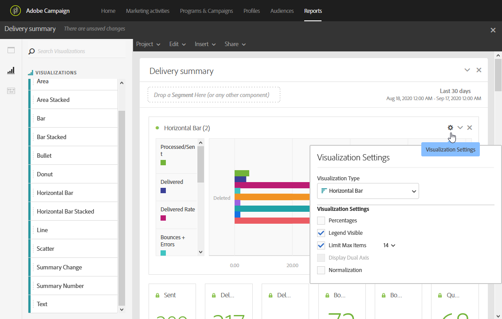

# Adición de visualizaciones{#adding-visualizations}

La pestaña **Visualizaciones** le permite arrastrar y soltar elementos de visualización, como área, anillo y gráfico. Las visualizaciones le proporcionan representaciones gráficas de los datos.

1. En la pestaña **[!UICONTROL Visualizations]**, arrastre y suelte un elemento de visualización en un panel.

   

1. Después de agregar una visualización al panel, los informes dinámicos detectan automáticamente los datos de la tabla de forma libre. Seleccione la configuración de la visualización.
1. Si tiene más de una tabla de forma libre, elija la fuente de datos disponible para agregar en el gráfico en la ventana **Configuración de Data Source**. Esta ventana también está disponible si hace clic en el punto de color situado junto al título de la visualización.

   

1. Haga clic en el botón de configuración **[!UICONTROL Visualization]** para cambiar directamente el tipo de gráfico o lo que se muestra en él, como:

   * **Porcentajes**: Muestra los valores en porcentaje.
   * **Eje Y delimitador a cero**: Fuerza al eje Y a comenzar por cero incluso si los valores superan el intervalo de cero.
   * **Leyenda visible**: permite ocultar la leyenda.
   * **Normalización**: Fuerza la coincidencia de los valores.
   * **Mostrar eje doble**: Agrega otro eje al gráfico.
   * **Límite máximo de elementos**: Limita el número de gráficos mostrados.
   * **Umbral**: permite establecer un umbral en el gráfico. Aparece como una línea de puntos negra.

   

Esta visualización le permite tener una vista más clara de los datos en los informes.
