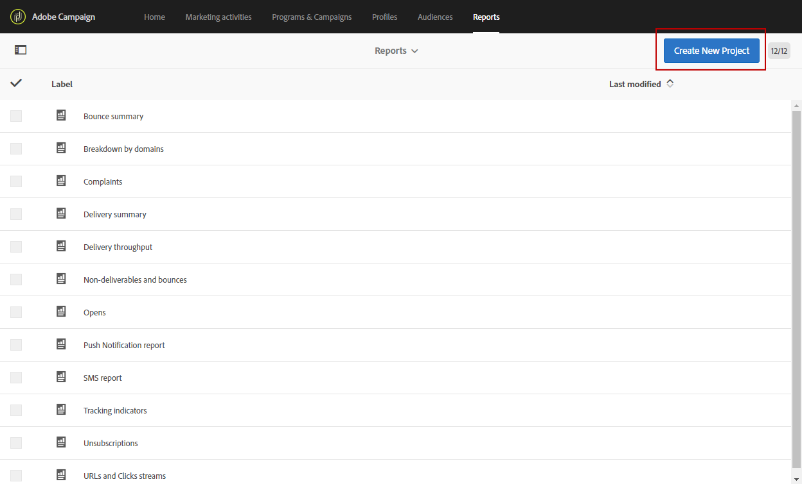

# Creación de una dimensión de perfil personalizada{#creating-a-custom-profile-dimension}

Los informes también se pueden crear y administrar en función de los datos de perfil personalizados creados durante la extensión de recursos personalizada de perfil.

En este ejemplo, queremos crear los programas **de** Lealtad de campo de perfil personalizado que se dividirán en tres niveles: oro, plata y bronce. Este perfil personalizado se ampliará para poder utilizarlo como dimensión de perfil personalizada en los informes dinámicos.

* [Paso 1: Crear un nuevo campo de perfil](../../reporting/using/creating-a-custom-profile-dimension.md#step-1--create-a-new-profile-field)
* [Paso 2: Ampliar los registros de envío con el campo de perfil](../../reporting/using/creating-a-custom-profile-dimension.md#step-2--extend-the-sending-logs-with-the-profile-field)
* [Paso 3: Creación de destinatarios de entrega inscritos en el programa de fidelidad](../../reporting/using/creating-a-custom-profile-dimension.md#step-3--create-a-delivery-targeting-recipients-enrolled-in-the-loyalty-program)
* [Paso 4: Crear un informe dinámico para filtrar destinatarios con la dimensión de perfil personalizado](../../reporting/using/creating-a-custom-profile-dimension.md#step-4--create-a-dynamic-report-to-filter-recipients-with-the-custom-profile-dimension)

## Paso 1: Crear un nuevo campo de perfil {#step-1--create-a-new-profile-field}

Primero necesitamos crear el nuevo programa **de** Lealtad de campo de perfil que asignará el nivel de lealtad a nuestros destinatarios: oro, plata o bronce.

>[!NOTE]
>
>Los recursos personalizados solo pueden ser administrados por un administrador.

Para ello:

1. En el menú avanzado, seleccione **[!UICONTROL Administration]** &gt; **[!UICONTROL Development]** &gt; **[!UICONTROL Custom resources]** y, a continuación, el recurso **[!UICONTROL Profile (profile)]** personalizado.

   

1. En la **[!UICONTROL Data structure]** ficha, en la **[!UICONTROL Fields]** categoría, haga clic en el **[!UICONTROL Add field]** botón.

   

1. Introduzca el **[!UICONTROL Label]** y **[!UICONTROL ID]** seleccione el recurso personalizado **[!UICONTROL Type]**. Aquí seleccionamos **[!UICONTROL Text]** ya que los destinatarios tendrán la opción entre oro, plata y bronce.

   

1. Haga clic en el  icono para definir el campo.

   

1. Aquí, necesitamos especificar los valores autorizados marcando **[!UICONTROL Specify a list of authorized valued]** y creando cada valor haciendo clic en **[!UICONTROL Create element]**.

   

1. Introduzca el **[!UICONTROL Label]** y **[!UICONTROL Value]** haga clic en **[!UICONTROL Add]**. Para este ejemplo, necesitamos crear el valor oro, plata y bronce. Haga clic **[!UICONTROL Confirm]** cuando termine.

   

1. Seleccione la **[!UICONTROL Screen definition]** ficha. En la **[!UICONTROL Detail screen configuration]** lista desplegable, marque **[!UICONTROL Add personalized fields]** para crear una nueva sección en nuestro perfil.

   

1. Haga clic en el **[!UICONTROL Add an element]** botón para crear la nueva sección. Seleccione el **[!UICONTROL Type]**: **[!UICONTROL Input field]**, **[!UICONTROL Value]** o **[!UICONTROL List]**, el campo que se agregará en esta nueva sección.

   

1. También puede agregar un título a la sección en el campo **[!UICONTROL Customize the title of the section where the fields will be displayed]**.

   Haga clic **[!UICONTROL Save]** cuando se haya completado la configuración.

   

1. En el menú avanzado, seleccione **[!UICONTROL Administration]** &gt; **[!UICONTROL Development]** &gt; **[!UICONTROL Publication]** para empezar a publicar el recurso personalizado.
1. Haga clic en **[!UICONTROL Prepare publication]** y, cuando termine la preparación, haga clic en el **[!UICONTROL Publish]** botón.

   

El nuevo campo de perfil ya está listo para ser utilizado y seleccionado por los destinatarios.

## Paso 2: Ampliar los registros de envío con el campo de perfil {#step-2--extend-the-sending-logs-with-the-profile-field}

Ahora que se ha creado el campo de perfil, necesitamos ampliar los registros de envío con nuestro campo de perfil para crear la dimensión de perfil personalizada asociada en los informes dinámicos.

Antes de ampliar el registro con nuestro campo de perfil, asegúrese de que la ventana PII haya sido aceptada para tener acceso a la **[!UICONTROL Sending logs extension]** ficha. Para obtener más información sobre esto, consulte esta [página](../../reporting/using/about-dynamic-reports.md#dynamic-reporting-usage-agreement).

>[!NOTE]
>
>Los registros solo pueden ampliarse con campos de perfil por parte del administrador.

1. En el menú avanzado, seleccione **[!UICONTROL Administration]** &gt; **[!UICONTROL Development]** &gt; **[!UICONTROL Custom resources]** y, a continuación, el recurso **[!UICONTROL Profile (profile)]** personalizado.
1. Abra la **[!UICONTROL Sending logs extension]** lista desplegable.
1. Haga clic en el **[!UICONTROL Create element]** botón.

   

1. Seleccione el campo creado anteriormente y haga clic en **[!UICONTROL Confirm]**.
1. Marque **[!UICONTROL Add this field in Dynamic reporting as a new dimension]** para crear la dimensión de perfil personalizada.

   

   Esta opción solo está disponible si se ha aceptado la ventana PII. Para obtener más información sobre esto, consulte esta [página](../../reporting/using/about-dynamic-reports.md#dynamic-reporting-usage-agreement).

1. Haga clic en **[!UICONTROL Add]** y guarde el recurso personalizado.
1. Como el recurso personalizado se modificó, debemos publicarlo para implementar los nuevos cambios.

   En el menú avanzado, seleccione **[!UICONTROL Administration]** &gt; **[!UICONTROL Development]** &gt; **[!UICONTROL Publication]** para empezar a publicar el recurso personalizado.

1. Haga clic en **[!UICONTROL Prepare publication]** y, cuando termine la preparación, haga clic en el **[!UICONTROL Publish]** botón.

   

Su perfil personalizado ya está disponible como dimensión de perfil personalizada en los informes.

Ahora que el campo se ha creado y que los registros de envío se han ampliado con este campo de perfil, puede empezar a dirigirse a los destinatarios de las entregas.

## Paso 3: Creación de destinatarios de entrega inscritos en el programa de fidelidad {#step-3--create-a-delivery-targeting-recipients-enrolled-in-the-loyalty-program}

Una vez publicado el campo de perfil, puede iniciar la entrega. En este ejemplo, queremos dirigirse a todos los destinatarios inscritos en el programa de fidelidad.

1. En la **[!UICONTROL Marketing activities]** ficha, haga clic en **[!UICONTROL Create]** y seleccione **[!UICONTROL Email]**.
1. Elija una **[!UICONTROL Email type]** y, a continuación, introduzca las propiedades del correo electrónico.
1. Para dirigirse al destinatario matriculado en el programa de fidelidad, arrastre y suelte la **[!UICONTROL Profiles (attributes)]** actividad.
1. Seleccione el campo creado anteriormente en la **[!UICONTROL Field]** lista desplegable.

   

1. Seleccione su **[!UICONTROL Filter conditions]**. Aquí, queremos dirigirse a destinatarios que formen parte de uno de los tres niveles del programa de fidelidad.

   

1. Haga clic en **[!UICONTROL Confirm]** y luego, cuando termine de filtrar, haga clic en **[!UICONTROL Next]**.
1. Defina y personalice el contenido del mensaje, el nombre del remitente y el asunto. Para obtener más información sobre la creación de correo electrónico, consulte esta [página](../../designing/using/overview.md).

   A continuación, haga clic en **[!UICONTROL Create]**.

1. Cuando esté listo, puede obtener una vista previa y enviar el mensaje. Para obtener más información sobre cómo preparar y enviar el mensaje, consulte esta [página](../../sending/using/preparing-the-send.md).

Una vez que el correo electrónico se haya enviado correctamente a los destinatarios seleccionados, puede empezar a filtrar los datos y realizar un seguimiento del éxito del envío con los informes.

## Paso 4: Crear un informe dinámico para filtrar destinatarios con la dimensión de perfil personalizado {#step-4--create-a-dynamic-report-to-filter-recipients-with-the-custom-profile-dimension}

Después de enviar el envío, puede desglosar los informes utilizando la dimensión de perfil personalizada de la **[!UICONTROL Profile]** tabla.

1. Desde la **[!UICONTROL Reports]** ficha, seleccione un informe listo para usar o haga clic en el **[!UICONTROL Create]** botón para iniciar uno desde cero.

   

1. En la **[!UICONTROL Dimensions]** categoría, haga clic en **[!UICONTROL Profile]** y, a continuación, arrastre y suelte la dimensión de perfil del programa **de** lealtad personalizada en la tabla improvisada.

   

1. Arrastre y suelte las métricas **[!UICONTROL Processed/Sent]** y **[!UICONTROL Open]** para empezar a filtrar los datos.

   

1. Arrastre y suelte una visualización en el espacio de trabajo si es necesario.

   

**Tema relacionado:**

* [Uso de datos de perfil personalizados para crear informes perspicaces](https://helpx.adobe.com/campaign/kb/simplify-campaign-management.html#Reportandshareinsightswithallstakeholders)
