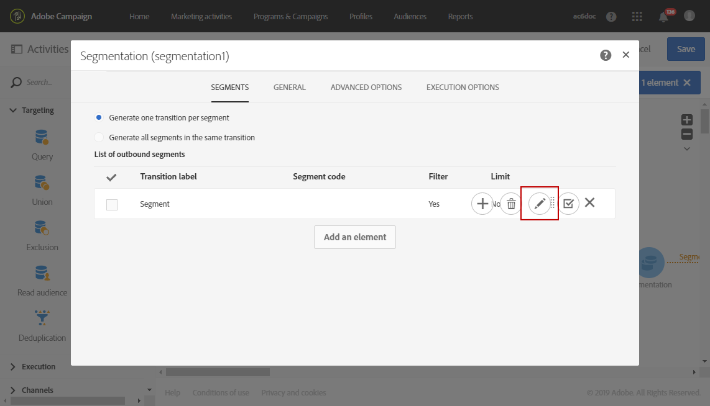
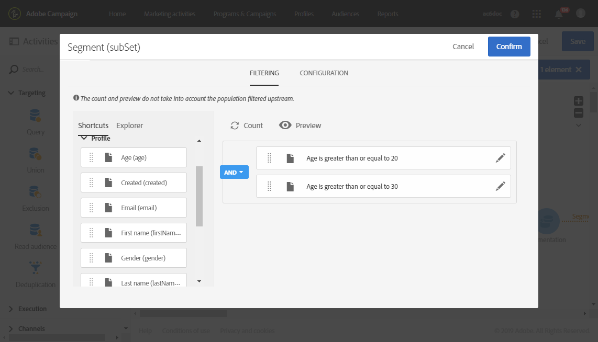

# Creación de un informe basado en segmentos de flujo de trabajo{#creating-a-report-workflow-segment}

>[!CAUTION]
> **[!UICONTROL Segment code]** solo puede dirigir envíos de correo electrónico y SMS.

Después de crear un flujo de trabajo y filtrar la población en diferentes audiencias de destino, puede medir la eficacia de las campañas de marketing en función de los segmentos definidos en este flujo de trabajo de objetivo.
Para segmentar estos segmentos en los informes:

* [Paso 1: Actualización del recurso personalizado de perfiles con segmentos](#step-1--update-profiles-custom-resource-segments)
* [Paso 2: Crear un flujo de trabajo con segmentos](#step-2--create-a-workflow-segments)
* [Paso 3: Crear un informe dinámico para filtrar segmentos](#step-3--create-a-dynamic-report-filter-segments)

>[!CAUTION]
>Se debe aceptar el acuerdo de uso de creación de informes dinámica para empezar a recopilar estos datos.
>
>Para obtener más información sobre este contrato, consulte esta [página](../../reporting/using/about-dynamic-reports.md#dynamic-reporting-usage-agreement).

## Paso 1: Actualización del recurso personalizado de perfiles con segmentos{#step-1--update-profiles-custom-resource-segments}

Antes de informar sobre el código de segmento, debe actualizar el recurso personalizado **[!UICONTROL Profiles]** para que se almacenen los códigos de segmento.

1. En el menú avanzado, en el logotipo de Adobe Campaign, seleccione **[!UICONTROL Administration]** > **[!UICONTROL Development]** > **[!UICONTROL Custom resources]** y, a continuación, seleccione el recurso **[!UICONTROL Profile (profile)]**.
1. En el menú **[!UICONTROL Sending logs extension]** de la pestaña **[!UICONTROL Data structure]**, marque **[!UICONTROL Add segment code]** para permitir el almacenamiento de los códigos de segmento de los flujos de trabajo de segmentación y para enviarlo a creación de informes dinámica.

   **[!UICONTROL Segment code]** estará disponible en la sección de dimensión **[!UICONTROL Profile]** del informe.

   

1. Guarde el recurso personalizado.

1. Ahora debe publicar el recurso personalizado.
En el menú avanzado, seleccione **[!UICONTROL Administration]** > **[!UICONTROL Development]** > **[!UICONTROL Publishing]**.

   

1. Haga clic en **[!UICONTROL Prepare publication]** y, cuando termine la preparación, haga clic en el botón **[!UICONTROL Publish]**. Para obtener más información sobre el recurso personalizado, consulte esta [página](../../developing/using/updating-the-database-structure.md).

Ahora puede empezar a crear el flujo de trabajo con códigos de segmento.

Tenga en cuenta que los códigos de segmento se recopilarán en cuanto habilite el código de segmento en **[!UICONTROL Sending logs extension]**.

## Paso 2: Crear un flujo de trabajo con segmentos {#step-2--create-a-workflow-segments}

>[!NOTE]
>Si la transición de entrada de la entrega de correo electrónico está vacía, el código de segmento de la transición anterior se añade de forma predeterminada.

Primero debe crear un flujo de trabajo con una población objetivo diferente. Aquí, queremos enviar un correo electrónico que se personalizará según la edad de nuestra audiencia: una entrega para perfiles de 20 a 30 años y otra para perfiles de entre 30 y 40 años.

1. Cree su flujo de trabajo. Para obtener más información sobre cómo crear su flujo de trabajo, consulte esta [página](../../automating/using/building-a-workflow.md).

1. Agregue una actividad **[!UICONTROL Query]** arrastrándola desde la paleta y soltándola en el área de trabajo.

1. Segmente perfiles de entre 20 y 40 años para posteriormente segmentarlos en poblaciones más específicas.

   

1. Agregue una actividad **[!UICONTROL Segmentation]** para dividir los resultados de la consulta en dos poblaciones objetivo. Para obtener más información sobre la segmentación, consulte esta [página](../../automating/using/segmentation.md).

1. Haga doble clic en la actividad **[!UICONTROL Segmentation]** para configurarla. Edite el primer segmento haciendo clic en **[!UICONTROL Edit properties]**.

   

1. Consulte los perfiles de entre 20 y 30 años y haga clic en **[!UICONTROL Confirm]** cuando haya terminado.

   

1. Haga clic en **[!UICONTROL Add an element]** para crear su segundo segmento y configurarlo como se describe en los pasos anteriores para dirigirse a perfiles de entre 30 y 40 años.

1. Edite **[!UICONTROL Segment code]** para cada población que se pasará a través del sistema de informes dinámico.

   >[!NOTE]
   >Este paso es obligatorio; de lo contrario, no podrá comprender sobre qué segmentos informar.

   

1. Arrastre y suelte una actividad **[!UICONTROL Email delivery]** después de sus segmentos.

   

1. Personalice las entregas según las diferentes poblaciones objetivo. Para obtener más información sobre la creación de correos electrónicos, consulte esta [página](../../designing/using/designing-content-in-adobe-campaign.md).

1. Guarde el flujo de trabajo.

1. Haga clic en **[!UICONTROL Start]** cuando el flujo de trabajo esté listo.

Ahora puede acceder a sus informes para rastrear los códigos de segmento.

## Paso 3: Crear un informe dinámico para filtrar segmentos {#step-3--create-a-dynamic-report-filter-segments}

Después de realizar las entregas con el flujo de trabajo, puede desglosar los informes utilizando los códigos de segmento del flujo de trabajo.

1. En la ficha **[!UICONTROL Reports]**, seleccione un informe predeterminado o haga clic en el botón **[!UICONTROL Create new project]** para iniciar uno desde cero.

   
1. Arrastre y suelte la dimensión **[!UICONTROL Delivery]** en la tabla de forma libre.

   

1. Arrastre y suelte distintas métricas en la tabla, como las métricas **[!UICONTROL Open]** y **[!UICONTROL Click]**, para empezar a filtrar los datos.
1. En la categoría **[!UICONTROL Dimensions]**, haga clic en la dimensión **[!UICONTROL Profile]** y, a continuación, arrastre y suelte la dimensión **[!UICONTROL Segment code]** en la entrega del flujo de trabajo para medir el éxito de su entrega de correo electrónico en función de las poblaciones objetivo.

   

1. Arrastre y suelte una visualización en el espacio de trabajo si es necesario.

   
