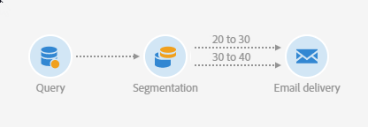

# Creación de un informe basado en segmentos de flujo de trabajo{#creating-a-report-workflow-segment}

Después de crear un flujo de trabajo y filtrar la población en una audiencia de objetivo diferente, puede medir la eficacia de las campañas de marketing en función de los segmentos definidos en este flujo de trabajo de objetivo.
Para destinatario de estos segmentos en los informes:

* [Paso 1: Actualizar recursos personalizados de Perfiles con segmentos](#step-1--update-profiles-custom-resource-segments)
* [Paso 2: Crear un flujo de trabajo con segmentos](#step-2--create-a-workflow-segments)
* [Paso 3: Crear un informe dinámico para filtrar segmentos](#step-3--create-a-dynamic-report-filter-segments)

>[!CAUTION]
>Se debe aceptar el acuerdo de uso de sistema de informes dinámico para recopilar estos datos en inicios.
>For more on this agreement, refer to this [page](../../reporting/using/about-dynamic-reports.md#dynamic-reporting-usage-agreement).

## Paso 1: Actualizar recursos personalizados de Perfiles con segmentos{#step-1--update-profiles-custom-resource-segments}

Antes de realizar el sistema de informes en el código de segmento, debe actualizar el recurso **[!UICONTROL Profiles]** personalizado para que los códigos de segmento se almacenen.

1. From the advanced menu, via the Adobe Campaign logo, select **[!UICONTROL Administration]** > **[!UICONTROL Development]** > **[!UICONTROL Custom resources]**, then select the **[!UICONTROL Profile (profile)]** resource.
1. En el **[!UICONTROL Sending logs extension]** menú de la **[!UICONTROL Data structure]** ficha, marque **[!UICONTROL Add segment code]** para permitir que el almacenamiento de los códigos de segmento se dirija a flujos de trabajo y enviarlo al sistema de informes dinámico.

   El **[!UICONTROL Segment code]** estará disponible en la sección de **[!UICONTROL Profile]** dimensiones del informe.

   

1. Guarde el recurso personalizado.

1. Ahora debe publicar el recurso personalizado.
En el menú avanzado, seleccione **[!UICONTROL Administration]** > **[!UICONTROL Development]** > **[!UICONTROL Publishing]**.

   

1. Haga clic en **[!UICONTROL Prepare publication]** y luego, cuando termine la preparación, haga clic en el **[!UICONTROL Publish]** botón. For more information on custom resource, refer to this [page](../../developing/using/updating-the-database-structure.md).

Ahora puede crear en inicio su flujo de trabajo con códigos de segmento.

Tenga en cuenta que los códigos de segmento se recopilarán en cuanto habilite el código de segmento en la **[!UICONTROL Sending logs extension]**.

## Paso 2: Crear un flujo de trabajo con segmentos {#step-2--create-a-workflow-segments}

>[!NOTE]
>Si la transición de entrada del envío de correo electrónico está vacía, el Código de segmento de la transición anterior se agregará de forma predeterminada.

En primer lugar, debe crear un flujo de trabajo con una población objetivo diferente. Aquí, queremos enviar un correo electrónico que será personalizado según la edad de nuestra audiencia: un envío para perfiles de entre 20 y 30 años y otro para perfiles de entre 30 y 40 años.

1. Cree su flujo de trabajo. For more details on how to create your workflow, refer to this [page](../../automating/using/building-a-workflow.md).

1. Add a **[!UICONTROL Query]** activity by dragging it from the palette and dropping it in the workspace.

1. Perfiles de destinatario de 20 a 40 años para luego segmentarlos en poblaciones más específicas.

   

1. Añada una **[!UICONTROL Segmentation]** actividad para dividir los resultados de su consulta en dos poblaciones objetivo. For more on segmentation, refer to this [page](../../automating/using/segmentation.md).

1. Doble haga clic en la **[!UICONTROL Segmentation]** actividad para configurarla. Para editar el primer segmento, haga clic en **[!UICONTROL Edit properties]**.

   

1. Perfiles de consulta entre los 20 y los 30 años y haga clic **[!UICONTROL Confirm]** cuando termine.

   

1. Haga clic en **[!UICONTROL Add an element]** para crear el segundo segmento y configúrelo como se describe en los pasos anteriores a perfiles de destinatario entre 30 y 40 años.

1. Edite **[!UICONTROL Segment code]** para cada población que se pasa a través de sistemas de informes dinámicos.

   >[!NOTE]
   >Este paso es obligatorio o, de lo contrario, no podrá comprender qué segmentos informar.

   

1. Drag and drop an **[!UICONTROL Email delivery]** activity after your segments.

   

1. Personalice sus envíos en función de las diferentes poblaciones objetivo. For more on email creation, refer to this [page](../../designing/using/designing-content-in-adobe-campaign.md).

1. Guarde el flujo de trabajo.

1. Haga clic **[!UICONTROL Start]** cuando el flujo de trabajo esté listo.

Ahora puede acceder a los informes para rastrear sus códigos de segmento.

## Paso 3: Crear un informe dinámico para filtrar segmentos {#step-3--create-a-dynamic-report-filter-segments}

Después de enviar envíos con el flujo de trabajo, puede desglosar los informes utilizando los códigos de segmento del flujo de trabajo.

1. Desde la **[!UICONTROL Reports]** ficha, seleccione un informe listo para usar o haga clic en el **[!UICONTROL Create new project]** botón para inicio desde cero.

   
1. Arrastre y suelte la **[!UICONTROL Delivery]** dimensión en la tabla improvisada.

   

1. Arrastre y suelte distintas métricas en la tabla, como las métricas **[!UICONTROL Open]** y **[!UICONTROL Click]** , para filtrar los datos en inicio.
1. En la **[!UICONTROL Dimensions]** categoría, haga clic en la **[!UICONTROL Profile]** dimensión y, a continuación, arrastre y suelte la **[!UICONTROL Segment code]** dimensión en el envío del flujo de trabajo para medir el éxito del envío de correo electrónico en función de las poblaciones objetivo.

   

1. Arrastre y suelte una visualización en el espacio de trabajo si es necesario.

   
