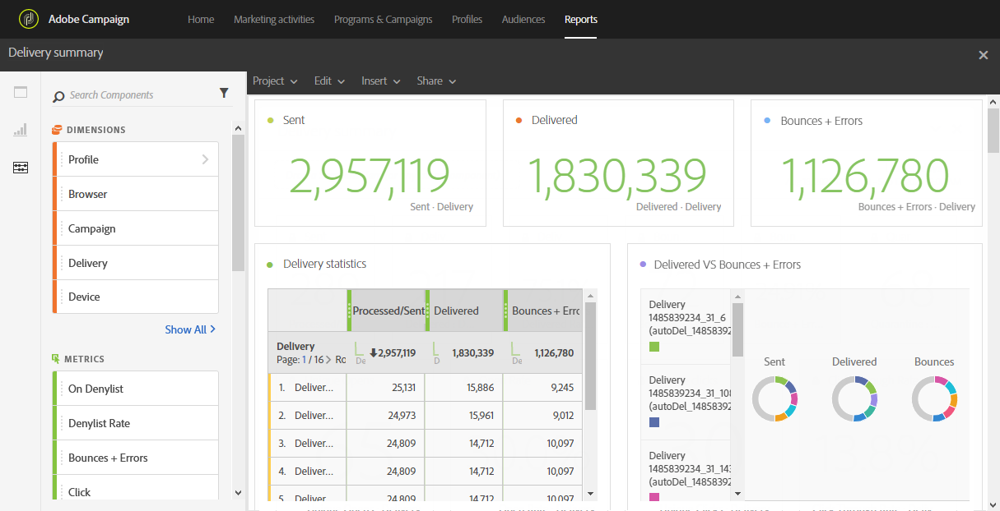

# Resumen de entregas{#delivery-summary}

La variable **[!UICONTROL Delivery summary]** detalla la información principal relativa a un correo electrónico o a varios correos electrónicos.

Cada tabla está representada por números de resumen y gráficos. Puede cambiar cómo se muestran los detalles en sus respectivos ajustes de visualización.

La variable **Estadísticas de entrega** contiene los datos disponibles para los correos electrónicos enviados, como:

* **[!UICONTROL Processed/sent]**: El número total de envíos para la entrega.
* **[!UICONTROL Delivered]**: Número de mensajes enviados correctamente, en relación con el número total de mensajes enviados. Los errores que se generan (devoluciones) se tienen en cuenta. Sin embargo, no se tienen en cuenta las quejas (declaraciones de correo no deseado) ni los mensajes de &quot;fuera de la oficina&quot;.
* **[!UICONTROL Bounces + Errors]**: Número de errores totales acumulados durante la entrega y el procesamiento automático de devoluciones en relación con la cantidad total de mensajes enviados.

La variable **Apertura y clics** contiene los datos disponibles para la actividad de destinatario de cada entrega, como:

* **Haga clic en**: Número de veces que se hizo clic en un contenido en una entrega.
* **Apertura**: Número de veces que se abrió un mensaje en una entrega.
* **Aperturas únicas**: El número de destinatarios que abrieron la entrega.
* **Clics únicos**: El número de destinatarios que hicieron clic en un contenido de una entrega.

La variable **Repartición de dominios** muestra el estado de las entregas según el dominio del destinatario.
