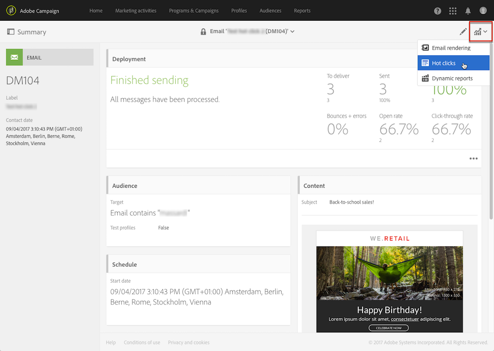

# Clics activos{#hot-clicks}

Se puede acceder a este informe desde el **[!UICONTROL Reports]** en cada envío o mensaje transaccional.

Presenta el contenido del mensaje (HTML o texto) con el porcentaje de clics en cada vínculo.

Si ha creado contenido dinámico para su envío, puede ver los porcentajes de cada condición que ha definido. Para obtener más información sobre la inserción de contenido condicional en una entrega, consulte [Definición del contenido dinámico](../../designing/using/personalization.md#defining-dynamic-content-in-an-email).

Por ejemplo, imaginemos que ha creado una entrega con las siguientes condiciones:

* El vínculo de la imagen principal es diferente si el destinatario es un hombre o una mujer.
* También ha agregado un vínculo a una oferta especial que solo es visible para los destinatarios mayores de 25 años.

Una vez enviado el mensaje, seleccione **[!UICONTROL Reports]** > **[!UICONTROL Hot clicks]** en el panel de envío.

De forma predeterminada, no se selecciona ningún perfil. Solo se muestran los clics de los destinatarios cuyo sexo es desconocido y de los destinatarios menores de 25 años o cuya edad es desconocida.

Para mostrar los clics de las mujeres, haga clic en **[!UICONTROL Change profile]** y seleccione un perfil de prueba femenino. Para mostrar los clics de los hombres, continúe de forma similar y seleccione un perfil de prueba masculino.

Para mostrar los clics de los destinatarios mayores de 25 años, haga clic en **[!UICONTROL Change profile]** y seleccione un perfil de prueba cuya fecha de nacimiento coincida con esta condición.

Para obtener más información sobre los perfiles de prueba, consulte [Acerca de los perfiles de prueba](../../audiences/using/managing-test-profiles.md).

>[!NOTE]
>
>El número de clics en un vínculo específico es un porcentaje del total de clics para todo el contenido condicional de una entrega. Por lo tanto, si ha definido contenido dinámico, el total de los porcentajes mostrados para un perfil de prueba específico puede no ser igual a 100.

Del mismo modo, para los envíos recurrentes y los mensajes transaccionales, puede seleccionar el perfil de prueba correspondiente al contenido dinámico que desea mostrar, pero también puede ver los porcentajes de clics según el envío de ejecución seleccionado.

Un envío de ejecución es un mensaje técnico no procesable y no funcional que se crea en los siguientes casos:

* Cada vez que se ejecuta o actualiza un envío recurrente.

  Por ejemplo, si el flujo de trabajo que administra este envío se ejecuta una vez al mes, habrá un envío de ejecución al mes. Además, cada vez que se actualiza el contenido del envío, se crea un envío de ejecución adicional.

  Para obtener más información sobre los envíos recurrentes de correo electrónico, consulte [Envío de correo electrónico](../../automating/using/email-delivery.md).

* De forma predeterminada, una vez al mes para los mensajes transaccionales y cada vez que se edita y vuelve a publicarse un mensaje transaccional.

  Para obtener más información sobre los mensajes transaccionales, consulte [Introducción a la mensajería transaccional](../../channels/using/getting-started-with-transactional-msg.md).

>[!NOTE]
>
>Dado que los ID de las direcciones URL rastreadas son diferentes para cada ejecución, los datos de clics activos no se pueden acumular para todas las entregas de ejecución de un mensaje determinado. Solo se puede mostrar para un envío de ejecución a la vez.

Una vez enviado el mensaje, seleccione **[!UICONTROL Reports]** > **[!UICONTROL Hot clicks]** en el panel de envío.

De forma predeterminada, se selecciona la última entrega de ejecución. Haga clic en **[!UICONTROL Change execution delivery]** para seleccionar otro.

Solo se muestran los porcentajes de clics de la ejecución de entrega seleccionada.
