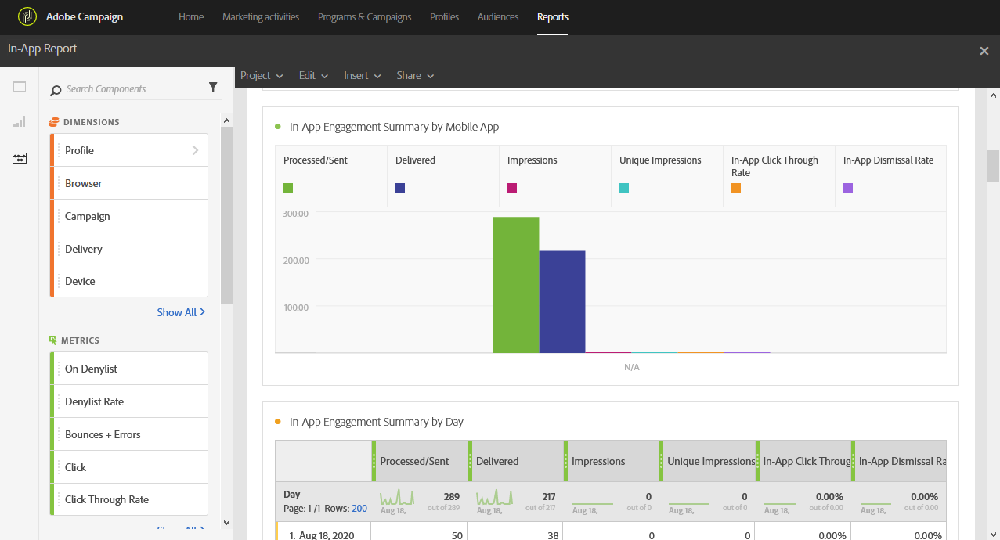

# Informe en la aplicación{#in-app-report}

>[!CAUTION]
>
>Tenga en cuenta que debe arrastrar y soltar el **[!UICONTROL Message type]** a las tablas para dividir los datos en función de sus tipos de envío, en este caso envíos en la aplicación.

La variable **En la aplicación** proporciona detalles relacionados con los envíos en la aplicación.

Cada tabla está representada por números de resumen y gráficos. Puede cambiar cómo se muestran los detalles en sus respectivos ajustes de visualización.

La primera tabla **Resumen de participación en la aplicación** se divide en tres categorías: por día, por aplicación móvil y por entrega. Contiene los datos disponibles para la reacción del destinatario a la entrega:

* **[!UICONTROL Processed/sent]**: Número total de envíos para la entrega en la aplicación.
* **[!UICONTROL Delivered]**: Número de mensajes en la aplicación enviados correctamente, en relación con el número total de mensajes enviados.
* **[!UICONTROL Impressions]**: Total de mensajes en la aplicación vistos por los destinatarios en función de si se cumplió el criterio de déclencheur.
* **[!UICONTROL Unique impressions]**: Número de impresiones por destinatario.
* **[!UICONTROL In-App click through rate]**: Porcentaje de usuarios que hicieron clic en Botón 1 o Botón 2 comparados con los usuarios que vieron el mensaje.
* **[!UICONTROL In-App dismissal rate]**: Porcentaje de mensajes en la aplicación que los destinatarios descartaron.

La segunda tabla **Clics y despidos en la aplicación** se divide en tres categorías: por día, por aplicación móvil y por entrega. Contiene los datos disponibles para el comportamiento del destinatario por envío:

* **[!UICONTROL In-App clicks]**: Número total de destinatarios que hicieron clic en el Botón 1 o en el Botón 2.
* **[!UICONTROL Unique In-App clicks]**: Número de veces que los destinatarios hicieron clic en el Botón 1 o en el Botón 2.
* **[!UICONTROL In-App dismissal]**: Número total de mensajes que los destinatarios descartaron haciendo clic en el botón cerrar o descartando automáticamente.
* **[!UICONTROL Unique In-App dismissal]**: Número de veces que los destinatarios descartaron un mensaje en la aplicación.
