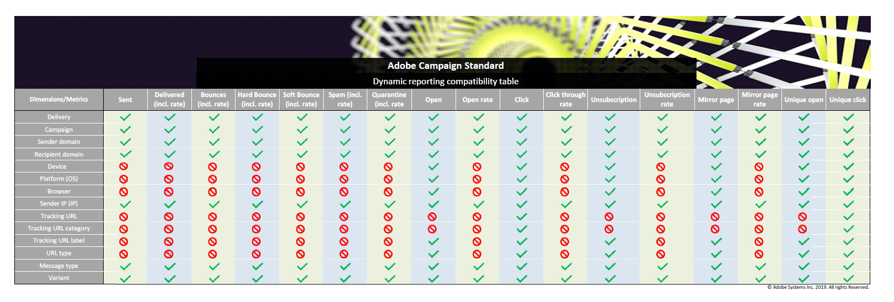

# Lista de componentes {#list-of-components}

Para obtener más información sobre la compatibilidad entre dimensiones y métricas, consulte esta [tabla](/help/reporting/using/assets/dynamic_report_compatibility.pdf). Si dos componentes no son compatibles, la celda mostrará el valor **None**.

## Dimensiones {#dimensions}

La siguiente tabla le proporciona la lista de dimensiones utilizadas en los informes y sus definiciones.

<table> 
 <thead> 
  <tr> 
   <th> Dimension  </th> 
   <th> Definición   </th> 
  </tr> 
 </thead> 
 <tbody> 
  <tr> 
   <td> Explorador  </td> 
   <td> Explorador desde el que se abrió o se hizo clic en el mensaje.  </td> 
  </tr> 
  <tr> 
   <td> Campaña  </td> 
   <td> Etiqueta e ID de su campaña.  </td> 
  </tr> 
  <tr> 
   <td> Ciudad  </td> 
   <td> Ciudad registrada en el perfil del destinatario.  </td> 
  </tr> 
  <tr> 
   <td> País o región  </td> 
   <td> País registrado en el perfil del destinatario.  </td> 
  </tr> 
  <tr> 
   <td> Entrega  </td> 
   <td> Etiqueta e ID de la entrega.  </td> 
  </tr> 
  <tr> 
   <td> Dispositivo  </td> 
   <td> Dispositivo desde el que se abrió, vio o hizo clic la notificación push/SMS/de correo electrónico.  </td> 
  </tr> 
  <tr> 
   <td> Motivo del error   </td> 
   <td> Tipos de errores que ocasionaron devoluciones para cada entrega; por ejemplo, usuario desconocido, dominio no válido o buzón lleno.  </td> 
  </tr> 
  <tr> 
   <td> Sexo  </td> 
   <td> Sexo del destinatario, como hombre o mujer. Si el campo de género está vacío en el perfil del destinatario, el valor será ninguno.  </td> 
  </tr> 
  <tr> 
   <td> Acciones de mensajes en la aplicación  </td> 
   <td> Acciones en el mensaje en la aplicación entregado, p. ej. acciones en el botón 1 o 2 o descartes.  </td> 
  </tr> 
  <tr> 
   <td> Tipo de mensaje  </td> 
   <td> Canal utilizado para el envío, como correo electrónico, SMS, notificación push o en la aplicación.  </td> 
  </tr> 
  <tr> 
   <td> Nombre de aplicación móvil  </td> 
   <td> Nombre de la aplicación móvil   </td> 
  </tr> 
  <tr> 
   <td> Plataforma  </td> 
   <td> Plataforma del dispositivo desde el que se abrió, vio o hizo clic en el mensaje.  </td> 
  </tr> 
  <tr> 
   <td> Perfil   </td> 
   <td> Reagrupa los campos de perfil personalizados y predefinidos creados durante la extensión de recursos de perfil; para obtener más información, consulte esta <a href="../../developing/using/key-steps-to-add-a-resource.md">página</a> o este <a href="../../reporting/using/creating-a-custom-profile-dimension.md">ejemplo</a>.  Tenga en cuenta que los datos de esta dimensión se recuperan en cuanto se publica el recurso personalizado vinculado al campo de perfil.  </td> 
  </tr> 
  <tr> 
   <td> Plataforma push  </td> 
   <td> Plataforma del dispositivo desde el que se abrió la notificación push, como iOS o Android.  </td> 
  </tr> 
  <tr> 
   <td> Dominio del destinatario   </td> 
   <td> Dominio utilizado para abrir el correo electrónico.  </td> 
  </tr> 
  <tr> 
   <td> Entrega recurrente  </td> 
   <td> Etiqueta e ID del envío recurrente.  </td> 
  </tr> 
  <tr> 
   <td> Dominio del remitente  </td> 
   <td> Dominio utilizado para enviar el correo electrónico.  </td> 
  </tr> 
  <tr> 
   <td> IP del remitente   </td> 
   <td> IP utilizada para enviar el correo electrónico.  </td> 
  </tr> 
  <tr> 
   <td> Estado   </td> 
   <td> Estado registrado en el perfil del destinatario.  </td> 
  </tr> 
  <tr> 
   <td> URL de seguimiento   </td> 
   <td> Dirección URL en la que el usuario hizo clic desde el mensaje.  </td> 
  </tr> 
  <tr> 
   <td> Categoría de URL de seguimiento   </td> 
   <td> Categoría asignada a la dirección URL de seguimiento.  </td> 
  </tr> 
  <tr> 
   <td> Etiqueta de URL de seguimiento   </td> 
   <td> Etiqueta asignada a la dirección URL, como una página espejo, póngase en contacto con nosotros o abra.  </td> 
  </tr> 
  <tr> 
   <td> Envío transaccional  </td> 
   <td> Etiqueta e ID del envío transaccional.  </td> 
  </tr> 
  <tr> 
   <td> Variante  </td> 
   <td> Variante del correo electrónico en el caso de la prueba A/B.  </td> 
  </tr> 
 </tbody> 
</table>

## Métricas {#metrics}

Las siguientes tablas proporcionan la lista de métricas utilizadas en los informes y sus definiciones según el tipo de envío.

### Métricas de correo electrónico y SMS {#email-and-sms-metrics}

<table> 
 <thead> 
  <tr> 
   <th> Métrica   </th> 
   <th> Definición   </th> 
  </tr> 
 </thead> 
 <tbody> 
  <tr> 
   <td> En la lista de bloqueados   </td> 
   <td> Número de destinatarios que han declarado un correo electrónico como correo no deseado.  </td> 
  </tr> 
  <tr> 
   <td> Tasa de Lista de bloqueados de  </td> 
   <td> Porcentaje de envíos marcados en el momento de la lista de bloqueados de la.  </td> 
  </tr> 
  <tr> 
   <td> Devoluciones + Errores  </td> 
   <td> Total de errores acumulados durante el envío y el procesamiento automático de devolución en relación con el número total de mensajes enviados.  </td> 
  </tr> 
  <tr> 
   <td> Devolución + Tasa de error   </td> 
   <td> Porcentaje de correos electrónicos que rebotaron en comparación con el correo electrónico enviado.  </td> 
  </tr> 
  <tr> 
   <td> Haga clic  </td> 
   <td> Número de veces que se hizo clic en un contenido en una entrega.  </td> 
  </tr> 
  <tr> 
   <td> Tasa de pulsaciones  </td> 
   <td> Porcentaje de clics en una entrega.  </td> 
  </tr> 
  <tr> 
   <td> Entrega  </td> 
   <td> Número de mensajes enviados correctamente en relación con el número total de mensajes enviados.  </td> 
  </tr> 
  <tr> 
   <td> Tasa de entrega   </td> 
   <td> Porcentaje de mensajes enviados correctamente.  </td> 
  </tr> 
  <tr> 
   <td> Rechazo duro  </td> 
   <td> Número total de errores permanentes, como una dirección de correo electrónico incorrecta.  </td> 
  </tr> 
  <tr> 
   <td> Tasa de devoluciones graves   </td> 
   <td> Porcentaje de envíos erróneos debido a errores permanentes.  </td> 
  </tr> 
  <tr> 
   <td> Página espejo  </td> 
   <td> Número de destinatarios que hicieron clic en el vínculo de la página espejo.  </td> 
  </tr> 
  <tr> 
   <td> Tasa de la página espejo   </td> 
   <td> Porcentaje de clics en el vínculo de la página espejo comparados con el total de mensajes de envío.  </td> 
  </tr> 
  <tr> 
   <td> Clics de ofertas  </td> 
   <td> Cantidad de veces que se hizo clic en una oferta en una entrega.  </td> 
  </tr> 
  <tr> 
   <td> Tasa de clics en ofertas  </td> 
   <td> Porcentaje de clics en una oferta.  </td> 
  </tr> 
  <tr> 
   <td> Apertura  </td> 
   <td> Número de veces que se abrió un mensaje en una entrega.  </td> 
  </tr> 
  <tr> 
   <td> Tasa de apertura  </td> 
   <td> Porcentaje de mensajes abiertos.  </td> 
  </tr> 
  <tr> 
   <td> Procesado/enviado  </td> 
   <td> Número total de envíos para el envío.  </td> 
  </tr> 
  <tr> 
   <td> Cuarentena  </td> 
   <td> Número de mensajes que rebotaron y que dieron como resultado la cuarentena de la dirección.  </td> 
  </tr> 
  <tr> 
   <td> Tasa de cuarentena  </td> 
   <td> Porcentaje de cuarentena comparado con los mensajes enviados.  </td> 
  </tr> 
  <tr> 
   <td> Rechazado  </td> 
   <td> Número de mensajes clasificados como correo no deseado por los servidores SMTP.  </td> 
  </tr> 
  <tr> 
   <td> Tasa de rechazados  </td> 
   <td> Porcentaje de mensajes marcados como rechazados.  </td> 
  </tr> 
  <tr> 
   <td> Devolución suave  </td> 
   <td> Número total de errores temporales, como una bandeja de entrada completa.  </td> 
  </tr> 
  <tr> 
   <td> Tasa de salida hacia otro sitio   </td> 
   <td> Porcentaje de envíos erróneos debido a un motivo temporal.  </td> 
  </tr> 
  <tr> 
   <td> Clics únicos  </td> 
   <td> Número de destinatarios que hicieron clic en un contenido de una entrega.  </td> 
  </tr> 
  <tr> 
   <td> Aperturas únicas  </td> 
   <td> Número de destinatarios que abrieron la entrega.  </td> 
  </tr> 
  <tr> 
   <td> Baja única  </td> 
   <td> Número de destinatarios que hicieron clic en el vínculo de baja de suscripción.  </td> 
  </tr> 
  <tr> 
   <td> Tasa de cancelación de suscripción  </td> 
   <td> Número de bajas únicas comparadas con los mensajes enviados.  </td> 
  </tr> 
  <tr> 
   <td> Canceló la suscripción  </td> 
   <td> Número de clics en el vínculo de baja de suscripción.  </td> 
  </tr> 
 </tbody> 
</table>

### Métricas de notificaciones push {#push-notification-metrics}

<table> 
 <thead> 
  <tr> 
   <th> Métrica   </th> 
   <th> Definición   </th> 
  </tr> 
 </thead> 
 <tbody> 
  <tr> 
   <td> Devoluciones + Errores  </td> 
   <td> Total de errores acumulados durante el envío en relación con el número total de mensajes enviados, por ejemplo, errores de MCPNS o del proveedor.  </td> 
  </tr> 
  <tr> 
   <td> Devolución + Tasa de error   </td> 
   <td> Porcentaje de notificaciones push que rebotaron en comparación con las notificaciones push enviadas.  </td> 
  </tr> 
  <tr> 
   <td> Haga clic  </td> 
   <td> Número de veces que el usuario ha enviado una notificación push al dispositivo y ha hecho clic en ella. El usuario deseaba ver la notificación, que luego se moverá al seguimiento de Apertura push, o descartarla.  </td> 
  </tr> 
  <tr> 
   <td> Tasa de pulsaciones  </td> 
   <td> Porcentaje de usuarios que interactuaron con la notificación push.  </td> 
  </tr> 
  <tr> 
   <td> Entrega  </td> 
   <td> Número de notificaciones push enviadas correctamente en relación con el número total de notificaciones push enviadas.  </td> 
  </tr> 
  <tr> 
   <td> Tasa de entrega   </td> 
   <td> Porcentaje de notificaciones push enviadas correctamente.  </td> 
  </tr> 
  <tr> 
   <td> Impresiones  </td> 
   <td> Número de veces que se ha enviado una notificación push al dispositivo y se ha dejado intacta en el centro de notificaciones. En la mayoría de los casos, el número de impresiones debe ser similar al número enviado. Esto garantiza que el dispositivo recibió el mensaje y retransmitió esa información al servidor.  </td> 
  </tr> 
  <tr> 
   <td> Procesado/enviado  </td> 
   <td> Número total de notificaciones push enviadas.  </td> 
  </tr> 
  <tr> 
   <td> Apertura  </td> 
   <td> Número total de notificaciones push enviadas al dispositivo y en las que los usuarios hicieron clic al abrir la aplicación. Esto es similar al clic push, excepto que una acción push/apertura no se activará si se descarta la notificación.  </td> 
  </tr> 
  <tr> 
   <td> Tasa de apertura  </td> 
   <td> Porcentaje de notificaciones push abiertas.  </td> 
  </tr> 
  <tr> 
   <td> Clics únicos  </td> 
   <td> Número de veces que un usuario único interactúa con la notificación push; por ejemplo, hace clic en la notificación o el botón.  </td> 
  </tr> 
  <tr> 
   <td> Impresiones únicas  </td> 
   <td> Número de impresiones por destinatario.  </td> 
  </tr> 
  <tr> 
   <td> Aperturas únicas  </td> 
   <td> Número de destinatarios que abrieron la entrega.  </td> 
  </tr> 
 </tbody> 
</table>

### Métricas en la aplicación {#in-app-metrics}

<table> 
 <thead> 
  <tr> 
   <th> Métrica   </th> 
   <th> Definición   </th> 
  </tr> 
 </thead> 
 <tbody> 
  <tr> 
   <td> Entrega  </td> 
   <td> Número total de mensajes en la aplicación entregados al dispositivo por el proveedor de servicios.  </td> 
  </tr> 
  <tr> 
   <td> Impresiones  </td> 
   <td> Total de mensajes en la aplicación vistos por los destinatarios según si se cumplió el criterio de déclencheur.  </td> 
  </tr> 
  <tr> 
   <td> Clics en la aplicación   </td> 
   <td> Número total de destinatarios que hicieron clic en el botón 1 o el botón 2.  </td> 
  </tr> 
  <tr> 
   <td> Tasa de clics en la aplicación   </td> 
   <td> Porcentaje de usuarios que hicieron clic en el botón 1 o en el botón 2 comparados con los usuarios que vieron el mensaje.  </td> 
  </tr> 
  <tr> 
   <td> Despido en la aplicación  </td> 
   <td> Número total de mensajes que los destinatarios descartaron al hacer clic en el botón Cerrar o descartar automáticamente.  </td> 
  </tr> 
  <tr> 
   <td> Tasa de despido en la aplicación   </td> 
   <td> Porcentaje de mensajes en la aplicación que los destinatarios descartaron.  </td> 
  </tr> 
  <tr> 
   <td> Procesado/enviado  </td> 
   <td> Número total de mensajes en la aplicación enviados desde Adobe Campaign como parte del proceso de envío enviado.  </td> 
  </tr> 
  <tr> 
   <td> Impresiones únicas  </td> 
   <td> Número de impresiones de un destinatario único.  </td> 
  </tr> 
  <tr> 
   <td> Clics únicos en la aplicación  </td> 
   <td> Número de veces que los destinatarios hicieron clic en el botón 1 o el botón 2.  </td> 
  </tr> 
  <tr> 
   <td> Descartes únicos en la aplicación  </td> 
   <td> Cantidad de veces que los destinatarios descartaron un mensaje en la aplicación.  </td> 
  </tr> 
 </tbody> 
</table>

## Segmentos {#segments}

La siguiente tabla le proporciona la lista de segmentos utilizados en los informes y sus definiciones.

<table> 
 <thead> 
  <tr> 
   <th> Segmento   </th> 
   <th> Definición   </th> 
  </tr> 
 </thead> 
 <tbody> 
  <tr> 
   <td> Edad: Boomers 1  </td> 
   <td> Destinatarios nacidos entre 1946 y 1954.  </td> 
  </tr> 
  <tr> 
   <td> Edad: Boomers 2  </td> 
   <td> Destinatarios nacidos entre 1955 y 1965.  </td> 
  </tr> 
  <tr> 
   <td> Edad: De 18 a 25 años  </td> 
   <td> Destinatarios de 18 a 25 años.  </td> 
  </tr> 
  <tr> 
   <td> Edad: De 26 a 30  </td> 
   <td> Destinatarios de 26 a 30 años.  </td> 
  </tr> 
  <tr> 
   <td> Edad: De 31 a 40  </td> 
   <td> Destinatarios de 31 a 40 años.  </td> 
  </tr> 
  <tr> 
   <td> Edad: De 41 a 50  </td> 
   <td> Destinatarios de 41 a 50 años.  </td> 
  </tr> 
  <tr> 
   <td> Edad: Generación X  </td> 
   <td> Destinatarios nacidos entre 1966 y 1976.  </td> 
  </tr> 
  <tr> 
   <td> Edad: Generación Y (Millennials)  </td> 
   <td> Destinatarios nacidos entre 1977 y 1994.  </td> 
  </tr> 
  <tr> 
   <td> Edad: Generación Z  </td> 
   <td> Destinatarios nacidos desde 1995 hasta la fecha.  </td> 
  </tr> 
  <tr> 
   <td> Edad: mayor de 50  </td> 
   <td> Destinatarios cuya edad es mayor de 50 años.  </td> 
  </tr> 
  <tr> 
   <td> Edad: Menos de 25  </td> 
   <td> Destinatarios cuya edad es menor de 25 años.  </td> 
  </tr> 
  <tr> 
   <td> Edad: Menos de 30  </td> 
   <td> Destinatarios cuya edad es menor de 30 años.  </td> 
  </tr> 
  <tr> 
   <td> Edad: Menos de 40  </td> 
   <td> Destinatarios cuya edad es menor de 40 años.  </td> 
  </tr> 
  <tr> 
   <td> Edad: Menos de 50  </td> 
   <td> Destinatarios cuya edad es menor de 50 años.  </td> 
  </tr> 
  <tr> 
   <td> Edad: Generación silenciosa  </td> 
   <td> Destinatarios nacidos en 1945 o antes.  </td> 
  </tr> 
  <tr> 
   <td> Todas las visitas  </td> 
   <td> Cada destinatario  </td> 
  </tr>
 </tbody> 
</table>
