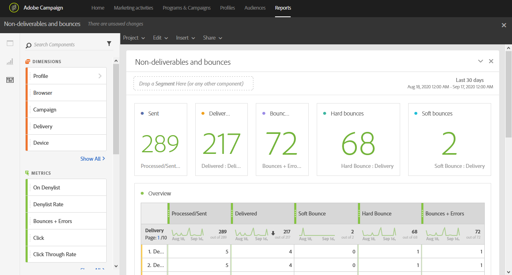

# Rechazos y no entregables{#non-deliverables-and-bounces}

El informe **[!UICONTROL Non-deliverables and bounces]** proporciona detalles sobre todos los errores encontrados durante un envío.

La tabla **[!UICONTROL Overview]** contiene los datos disponibles sobre los posibles errores que se pueden encontrar en cada envío, como:

* **Procesado/enviado**: Número de correos electrónicos enviados.
* **Enviado**: Número de correos electrónicos enviados.
* **Devolución** suave: Número total de errores temporales, como una bandeja de entrada completa.
* **Rebotes** duros: Número total de errores permanentes, como una dirección de correo electrónico incorrecta.
* **Devoluciones + Errores**: Número de mensajes que no se pudieron entregar.

La tabla **Desglose por dominio** lista las devoluciones por dominios de destinatarios.
