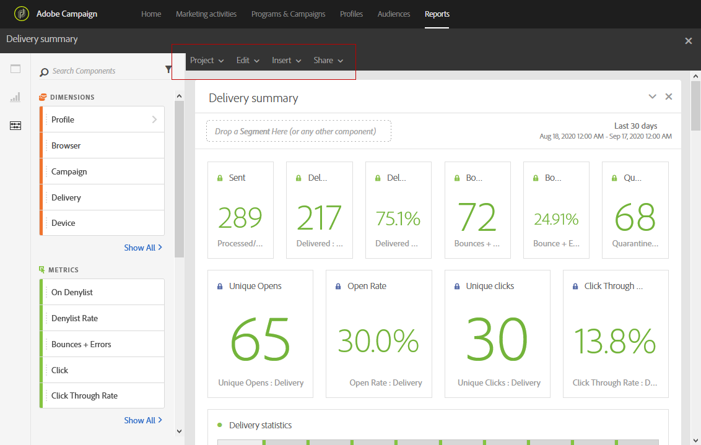
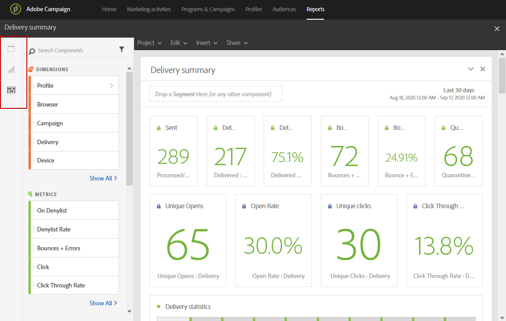
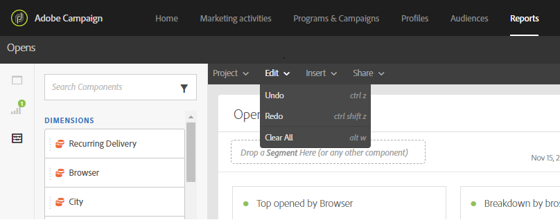
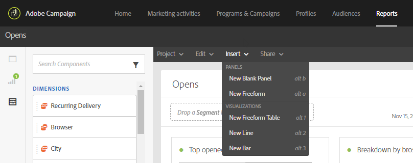

# Interfaz de informes{#reporting-interface}

La barra de herramientas superior permite, por ejemplo, modificar, guardar o imprimir el informe.

Utilice la ficha **Proyecto** para:

* **Abrir...**: abre un informe o una plantilla creados anteriormente.
* **Guardar como...**: duplica las plantillas para poder modificarlas.
* **Actualizar proyecto**: actualiza el informe en función de los nuevos datos y los cambios en los filtros.
* **Descargar CSV**: Exporta los informes a un archivo CSV.

La ficha **Editar** le permite:

* **Deshacer**: Cancela la última acción en el panel.
* **Borrar todo**: Elimina todos los paneles del tablero.

La tabla **Insert** le permite personalizar los informes al agregar gráficos y tablas al tablero:

* **Nuevo panel en blanco**: Agrega un nuevo panel en blanco al panel.
* **Nueva forma libre**: Agrega una nueva tabla de forma libre a tu panel.
* **Nueva línea**: Agrega un gráfico de líneas nuevo al panel.
* **Nueva barra**: Agrega un nuevo gráfico de barras al tablero.

**Temas relacionados:**

* [Adición de paneles](../../reporting/using/adding-panels.md)
* [Adición de visualizaciones](../../reporting/using/adding-visualizations.md)
* [Adición de componentes](../../reporting/using/adding-components.md)
* [Compartir informes automáticamente con las partes interesadas por correo electrónico](https://helpx.adobe.com/campaign/kb/simplify-campaign-management.html#Reportandshareinsightswithallstakeholders)

## Fichas {#tabs}

Las pestañas de la izquierda le permiten crear el informe y filtrar los datos según sea necesario.

Estas pestañas le proporcionan acceso a los siguientes elementos:

* **[!UICONTROL Panels]**: agregue un panel en blanco o una forma libre al informe para filtrar los datos. Para obtener más información, consulte la sección Añadir paneles
* **[!UICONTROL Visualizations]**: arrastre y suelte una selección de elementos de visualización para darle una dimensión gráfica al informe. Para obtener más información, consulte la sección Adición de visualizaciones.
* **[!UICONTROL Components]**: personalice los informes con diferentes dimensiones, métricas, segmentos y períodos de tiempo.

## Barra de herramientas {#toolbar}

La barra de herramientas se encuentra encima del espacio de trabajo. Se compone de diferentes pestañas y permite, por ejemplo, modificar, guardar, compartir o imprimir el informe.

**Temas relacionados:**

* [Adición de paneles](../../reporting/using/adding-panels.md)
* [Adición de visualizaciones](../../reporting/using/adding-visualizations.md)
* [Adición de componentes](../../reporting/using/adding-components.md)

### Pestaña Proyecto {#project-tab}

Utilice la ficha **Proyecto** para:

* **Abrir...**: abre un informe o una plantilla creados anteriormente.
* **Guardar como...**: duplica las plantillas para poder modificarlas.
* **Actualizar proyecto**: actualiza el informe en función de los nuevos datos y los cambios en los filtros.
* **Descargar CSV**: Exporta los informes a un archivo CSV.
* **[!UICONTROL Print]**: imprima el informe.

### Pestaña Editar {#edit-tab}

La ficha **Editar** le permite:

* **Deshacer**: Cancela la última acción en el panel.
* **Borrar todo**: Elimina todos los paneles del tablero.

### Pestaña Insertar {#insert-tab}

La ficha **Insertar** le permite personalizar los informes al agregar gráficos y tablas al tablero:

* **Nuevo panel en blanco**: Agrega un nuevo panel en blanco al panel.
* **Nueva forma libre**: Agrega una nueva tabla de forma libre a tu panel.
* **Nueva línea**: Agrega un gráfico de líneas nuevo al panel.
* **Nueva barra**: Agrega un nuevo gráfico de barras al tablero.

### Pestaña Compartir {#share-tab}

La ficha **[!UICONTROL Share]** le permite enviar los informes con los usuarios de Adobe Campaign mediante mensajes de correo electrónico únicos o recurrentes. Los usuarios objetivo recibirán un correo electrónico con el informe adjunto.

* **[!UICONTROL Send report now]**: envíe el informe a una lista de destinatarios seleccionados por correo electrónico con una sola toma.

   1. En la ventana **[!UICONTROL Send report]**, agregue una descripción si es necesario.

      

   1. Seleccione los destinatarios de la lista desplegable. Tenga en cuenta que no puede seleccionar usuarios fuera de la organización.
   1. Seleccione **[!UICONTROL Show scheduling options]** si desea enviar correos electrónicos recurrentes. Esto también se puede hacer seleccionando **[!UICONTROL Send Report on schedule]** en la ficha **[!UICONTROL Share]**.
   1. Haga clic en **[!UICONTROL Send now]**. Los destinatarios recibirán un correo electrónico con el informe adjunto.

* **[!UICONTROL Send report on schedule]**: programe el informe y envíe correos electrónicos recurrentes a los destinatarios.

   1. En la ventana **[!UICONTROL Send report]**, agregue una descripción si es necesario.
   1. Seleccione los destinatarios de la lista desplegable. Tenga en cuenta que no puede seleccionar usuarios fuera de la organización.

      

   1. Seleccione la fecha de inicio y finalización para configurar la validez del correo electrónico en los campos **[!UICONTROL Starting on]** y **[!UICONTROL Ending on]**.
   1. Elija la frecuencia con la que se enviará el correo electrónico.

      

   1. Haga clic en **[!UICONTROL Send on schedule]**, los destinatarios recibirán el correo electrónico recurrente según la frecuencia elegida.

* **[!UICONTROL Scheduled reports]**: busque y configure todo el informe programado.

   1. En la ventana **[!UICONTROL Scheduled reports]**, busque todos los informes enviados recurrentemente.

      

   1. Si necesita eliminar uno de los informes programados, seleccione el informe programado que desee eliminar y haga clic en **[!UICONTROL Delete the section]**.
   1. Para configurar o comprobar los informes programados, haga clic directamente en el informe que debe cambiar.
   1. Aparece la ventana **[!UICONTROL Edit scheduled report]**. Ahora puede cambiar los destinatarios o la frecuencia del correo electrónico si es necesario.

Los usuarios objetivo recibirán un correo electrónico con el informe adjunto directamente en sus bandejas de entrada. Los usuarios siempre pueden decidir dejar de recibir correos electrónicos recurrentes mediante un vínculo de baja de suscripción disponible en cada correo electrónico recurrente.

**Temas relacionados:**

* [Compartir informes automáticamente con las partes interesadas por correo electrónico](https://helpx.adobe.com/campaign/kb/simplify-campaign-management.html#Reportandshareinsightswithallstakeholders)
