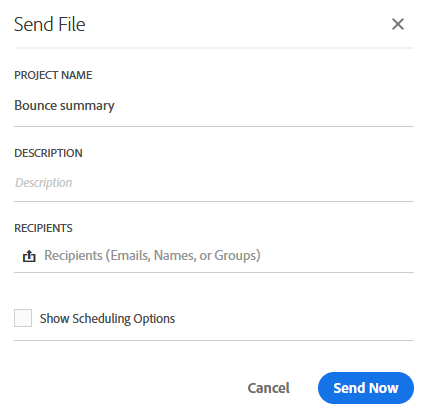

# Interfaz de informes{#reporting-interface}

La barra de herramientas superior permite, por ejemplo, modificar, guardar o imprimir el informe.

Utilice el **Proyecto** a:

* **Abrir...**: abre un informe creado anteriormente o una plantilla.
* **Guardar como...**: duplica las plantillas para poder modificarlas.
* **Actualizar proyecto**: actualiza el informe en función de los nuevos datos y los cambios en los filtros.
* **Descargar CSV**: exporta los informes a un archivo CSV.

El **Editar** La pestaña le permite:

* **Deshacer**: Cancela la última acción en el panel.
* **Borrar todo**: elimina todos los paneles del tablero.

El **Insertar** Esta tabla permite personalizar los informes añadiendo gráficos y tablas al tablero:

* **Nuevo panel en blanco**: agrega un nuevo panel en blanco al panel.
* **Nueva forma libre**: Agrega una nueva tabla de forma libre al panel.
* **Nueva línea**: Añade un nuevo gráfico de líneas al panel.
* **Nueva barra**: Añade un nuevo gráfico de barras al tablero.

**Temas relacionados:**

* [Adición de paneles](../../reporting/using/adding-panels.md)
* [Adición de visualizaciones](../../reporting/using/adding-visualizations.md)
* [Adición de componentes](../../reporting/using/adding-components.md)
* [Uso compartido de informes automáticamente con las partes interesadas por correo electrónico](https://helpx.adobe.com/campaign/kb/simplify-campaign-management.html#Reportandshareinsightswithallstakeholders)

## Fichas {#tabs}

Las pestañas de la izquierda le permiten crear el informe y filtrar los datos según sea necesario.

Estas pestañas le proporcionan acceso a los siguientes elementos:

* **[!UICONTROL Panels]**: agregue un panel en blanco o una forma libre al informe para filtrar los datos. Para obtener más información, consulte la sección Añadir paneles
* **[!UICONTROL Visualizations]**: arrastre y suelte una selección de elementos de visualización para darle una dimensión gráfica al informe. Para obtener más información, consulte la sección Adición de visualizaciones.
* **[!UICONTROL Components]**: personalice los informes con diferentes dimensiones, métricas, segmentos y periodos de tiempo.

## Barra de herramientas {#toolbar}

La barra de herramientas se encuentra encima del espacio de trabajo. Se compone de diferentes pestañas y permite, por ejemplo, modificar, guardar, compartir o imprimir el informe.

**Temas relacionados:**

* [Adición de paneles](../../reporting/using/adding-panels.md)
* [Adición de visualizaciones](../../reporting/using/adding-visualizations.md)
* [Adición de componentes](../../reporting/using/adding-components.md)

### Pestaña Proyecto {#project-tab}

Utilice el **Proyecto** a:

* **Abrir...**: abre un informe creado anteriormente o una plantilla.
* **Guardar como...**: duplica las plantillas para poder modificarlas.
* **Actualizar proyecto**: actualiza el informe en función de los nuevos datos y los cambios en los filtros.
* **Descargar CSV**: exporta los informes a un archivo CSV.
* **[!UICONTROL Print]**: imprima el informe.

### Pestaña Editar {#edit-tab}

El **Editar** La pestaña le permite:

* **Deshacer**: Cancela la última acción en el panel.
* **Borrar todo**: elimina todos los paneles del tablero.

### Pestaña Insertar {#insert-tab}

El **Insertar** La pestaña permite personalizar los informes añadiendo gráficos y tablas al tablero:

* **Nuevo panel en blanco**: agrega un nuevo panel en blanco al panel.
* **Nueva forma libre**: Agrega una nueva tabla de forma libre al panel.
* **Nueva línea**: Añade un nuevo gráfico de líneas al panel.
* **Nueva barra**: Añade un nuevo gráfico de barras al tablero.

### Pestaña Compartir {#share-tab}

El **[!UICONTROL Share]** Esta pestaña le permite enviar sus informes con los usuarios de Adobe Campaign a través de correos electrónicos únicos o recurrentes. Los usuarios objetivo recibirán un correo electrónico con el informe adjunto.

* **[!UICONTROL Send report now]**: envíe el informe a una lista de destinatarios seleccionados mediante un correo electrónico de una sola toma.

   1. En el **[!UICONTROL Send report]** , añada una descripción si es necesario.

      

   1. Seleccione los destinatarios de la lista desplegable. Tenga en cuenta que no puede seleccionar usuarios fuera de la organización.
   1. Marque **[!UICONTROL Show scheduling options]** si desea enviar correos electrónicos recurrentes. Esto también se puede hacer seleccionando **[!UICONTROL Send Report on schedule]** en el **[!UICONTROL Share]** pestaña.
   1. Haga clic en **[!UICONTROL Send now]**. Los destinatarios recibirán un correo electrónico con el informe adjunto.

* **[!UICONTROL Send report on schedule]**: Programe el informe y envíe correos electrónicos recurrentes a los destinatarios.

   1. En el **[!UICONTROL Send report]** , añada una descripción si es necesario.
   1. Seleccione los destinatarios de la lista desplegable. Tenga en cuenta que no puede seleccionar usuarios fuera de la organización.

      

   1. Seleccione la fecha de inicio y finalización para configurar la validez del correo electrónico en la **[!UICONTROL Starting on]** y **[!UICONTROL Ending on]** campos.
   1. Elija la frecuencia con la que se enviará el correo electrónico.

      

   1. Clic **[!UICONTROL Send on schedule]**, los destinatarios recibirán el correo electrónico recurrente en función de la frecuencia elegida.

* **[!UICONTROL Scheduled reports]**: busque y configure todos los informes programados.

   1. En el **[!UICONTROL Scheduled reports]** , busque todos los informes enviados recurrentes.

      

   1. Si necesita eliminar uno de los informes programados, seleccione el informe programado que desee eliminar y haga clic en **[!UICONTROL Delete the section]**.
   1. Para configurar o comprobar los informes programados, haga clic directamente en el informe que debe cambiar.
   1. El **[!UICONTROL Edit scheduled report]** aparece la ventana, ahora puede cambiar los destinatarios o la frecuencia del correo electrónico si es necesario.

Los usuarios objetivo recibirán un correo electrónico con el informe adjunto directamente en sus bandejas de entrada. Los usuarios siempre pueden decidir dejar de recibir correos electrónicos recurrentes mediante un vínculo de baja de suscripción disponible en cada correo electrónico recurrente.

**Temas relacionados:**

* [Uso compartido de informes automáticamente con las partes interesadas por correo electrónico](https://helpx.adobe.com/campaign/kb/simplify-campaign-management.html#Reportandshareinsightswithallstakeholders)
