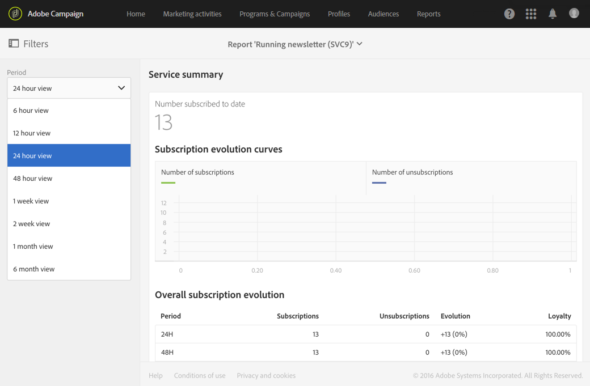

# Resumen del servicio{#service-summary}

El **[!UICONTROL Service summary]** detalla la evolución de las suscripciones y las bajas de suscripción de su servicio.
Solo se puede acceder a este informe desde la página de servicio a través del menú avanzado **[!UICONTROL Profiles & Audiences]** > **[!UICONTROL Services]**. Para obtener más información, consulte esta [página](../../audiences/using/monitoring-subscriptions.md#service-reports).

La visualización **[!UICONTROL Subscription evolution curves]** detalla el número de suscripciones y cancelaciones de suscripción en función de **[!UICONTROL Period]** que se haya elegido en la barra desplegable.

El **[!UICONTROL Overall subscription evolution]** le permite ver la evolución de sus suscriptores en diferentes períodos de tiempo.
