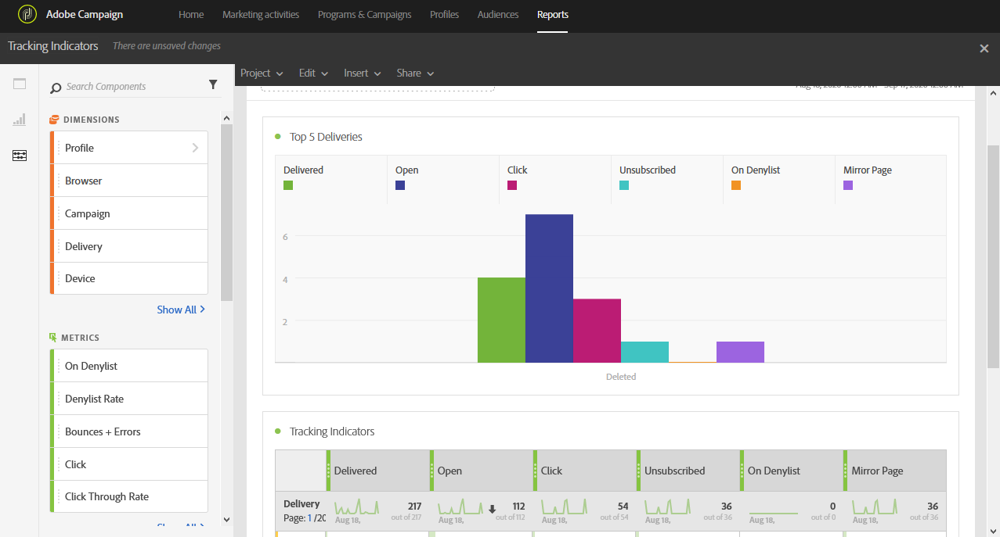

# Indicadores de seguimiento{#tracking-indicators}

El informe **[!UICONTROL Tracking indicators]** contiene los indicadores clave para el seguimiento del comportamiento después de recibir los mensajes de correo electrónico.

>[!NOTE]
>
>Para acceder a estos datos, se debe activar el seguimiento al preparar una entrega.

La tabla **[!UICONTROL Tracking indicators]** y el gráfico **Principales 5 envíos** contienen los datos disponibles para el seguimiento de correo electrónico, como:

* **[!UICONTROL Delivered]**: número de mensajes enviados correctamente. Los errores producidos (devoluciones) se tienen en cuenta. sin embargo, no se tienen en cuenta las quejas (declaraciones de correo no deseado) ni los mensajes enviados fuera de la oficina.
* **Abrir**: El número de veces que se abrió un mensaje en una entrega.
* **Clic**: El número de veces que se hizo clic en el contenido en una entrega.
* **Cancelación de la suscripción**: El número de clics en el vínculo de suscripción.
* **Correo no deseado:** Número de destinatarios que han declarado un correo electrónico como no deseado.
* **Página espejo**: El número de clics en el vínculo de la página espejo.
